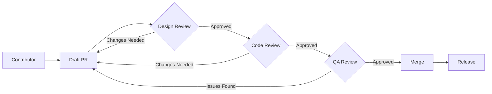

# 🧭 UI Design Pattern Reference Guide

## 📋 Quick Navigation for AI Assistants

**DOCUMENTATION MAP:**
- 🚀 [Core Philosophy](#1--core-philosophy) - Server-first atomic design principles
- 🏗️ [Component Architecture](#2--component-architecture) - Struct-based pattern system
- ⚙️ [Design Patterns](#3--design-patterns) - Server-driven composition with HTMX
- 🔒 [Security Patterns](#4--security-patterns) - CSRF, XSS, rate limiting
- 🌍 [Internationalization](#5--internationalization-i18n) - Multi-language support
- 🧪 [Testing Strategy](#6--testing-strategy) - Component to integration testing
- ⚡ [Performance](#7--performance-optimization) - Budgets and monitoring
- 🧠 [ViewModel Pattern](#8--viewmodel-pattern) - Type-safe data flow
- 🧱 [Naming Conventions](#9--naming--conventions) - Consistent file structure
- 🔁 [Component Lifecycle](#10--component-design-lifecycle) - Design to production
- 🧭 [Governance Model](#11--ui-review-flow--component-governance) - Review and versioning
- 🚀 [CI/CD Blueprint](#12--design-system-cicd-blueprint) - Automated validation
- 📚 [Advanced Patterns](#13--advanced-implementation-patterns) - Optimistic UI, SSE, modals

**TECH STACK:** `Go + Templ + HTMX + Alpine.js + Flowbite + TailwindCSS`  
**ARCHITECTURE:** Server-side rendered with progressive enhancement  
**COMPONENT PATTERN:** Struct-based props (type-safe Go parameters)

---

## Overview

> **Version:** 2.0  
> **Tech Stack:** Go + Templ + HTMX + Alpine.js + Flowbite + Tailwind CSS  
> **Purpose:** Define a unified, scalable, and progressive UI component architecture for server-rendered ERP interfaces  
> **Scope:** All templates under `web/` and related static assets

---

## 1. 🧩 Core Philosophy

Our UI is built on **Server-Driven Atomic Design** with **Progressive Enhancement** and **Struct-Based Component Props**.

| Principle | Description |
|-----------|-------------|
| **Server-First Rendering** | All pages render on the server via Templ; HTMX enhances with partial updates |
| **Atomic Design Hierarchy** | Components built from Atoms → Molecules → Organisms → Features → Pages |
| **Struct-Based Props** | Components accept typed Go structs, not flat parameters (type safety) |
| **Progressive Enhancement** | Works fully without JS, enhanced gracefully with HTMX & Alpine.js |
| **Scoped Interactivity** | Alpine handles visual/UI state only; business logic remains in Go |
| **Composable Layouts** | Pages use Templ layout composition with slots for header, sidebar, content |
| **Security by Default** | CSRF protection, XSS prevention, rate limiting built into patterns |

---

## 2. 🏗️ Component Architecture

### 2.1 Folder Hierarchy

```
web/
├── components/
│   ├── atoms/              # Basic building blocks
│   │   ├── buttons/
│   │   ├── inputs/
│   │   └── badges/
│   ├── molecules/          # Simple combinations
│   │   ├── forms/
│   │   └── cards/
│   ├── organisms/          # Complex components
│   │   ├── tables/
│   │   └── navigation/
│   ├── features/           # Domain-specific modules
│   │   ├── dashboard/
│   │   └── user-management/
│   └── foundations/        # Design tokens
│       ├── tokens/
│       └── themes/
├── layouts/                # Page shells
├── pages/                  # Route-level templates
├── domain/                 # Business logic components
└── static/
    ├── css/
    └── js/
        ├── utils/
        └── extensions/
```

**Composition Rules:**
- Always **compose upward**: organisms use molecules, molecules use atoms
- Never **reference downward**: atoms never import molecules
- Each level adds complexity and domain specificity

---

### 2.2 Struct-Based Component Pattern

**Core Principle:** Components accept **typed Go structs** instead of flat parameters for:
- ✅ Type safety and compile-time validation
- ✅ Better IDE autocomplete and refactoring
- ✅ Clear parameter grouping and defaults
- ✅ Easier evolution (add fields without breaking signatures)

**Example:**

```go
// ❌ OLD WAY (Flat parameters - avoid this)
templ ButtonPrimary(label string, href string, variant string, disabled bool)

// ✅ NEW WAY (Struct-based - use this)
// Real implementation from web/components/atoms/button.templ
type ButtonProps struct {
    // Content
    Text        string        `json:"text"`
    Icon        string        `json:"icon,omitempty"`
    IconPosition string       `json:"iconPosition,omitempty"` // "left" or "right"
    
    // Styling
    Variant     ButtonVariant `json:"variant"`
    Size        ButtonSize    `json:"size"`
    Pill        bool          `json:"pill,omitempty"`         // Rounded full
    Loading     bool          `json:"loading,omitempty"`
    
    // Behavior
    Type        string        `json:"type,omitempty"`         // "button", "submit", "reset"
    Disabled    bool          `json:"disabled,omitempty"`
    OnClick     string        `json:"onclick,omitempty"`      // Alpine.js click handler
    
    // HTMX attributes
    HxPost      string        `json:"hxPost,omitempty"`
    HxGet       string        `json:"hxGet,omitempty"`
    HxDelete    string        `json:"hxDelete,omitempty"`
    HxTarget    string        `json:"hxTarget,omitempty"`
    HxSwap      string        `json:"hxSwap,omitempty"`
    HxConfirm   string        `json:"hxConfirm,omitempty"`
    
    // HTML attributes
    ID          string        `json:"id,omitempty"`
    Class       string        `json:"class,omitempty"`
    AriaLabel   string        `json:"ariaLabel,omitempty"`
    DataTestID  string        `json:"dataTestId,omitempty"`
}

// Real button variants from implementation
type ButtonVariant string
const (
    ButtonPrimary   ButtonVariant = "primary"
    ButtonSecondary ButtonVariant = "secondary" 
    ButtonDark      ButtonVariant = "dark"
    ButtonLight     ButtonVariant = "light"
    ButtonGreen     ButtonVariant = "green"
    ButtonRed       ButtonVariant = "red"
    ButtonYellow    ButtonVariant = "yellow"
    ButtonPurple    ButtonVariant = "purple"
    ButtonOutline   ButtonVariant = "outline"
)

// Real implementation from web/components/atoms/button.templ
templ Button(props ButtonProps) {
    <button
        if props.ID != "" {
            id={ props.ID }
        }
        type={ getButtonType(props.Type) }
        class={ getButtonClasses(props) }
        if props.Disabled {
            disabled
        }
        if props.OnClick != "" {
            @click={ props.OnClick }
        }
        if props.HxPost != "" {
            hx-post={ props.HxPost }
        }
        if props.HxGet != "" {
            hx-get={ props.HxGet }
        }
        if props.HxTarget != "" {
            hx-target={ props.HxTarget }
        }
        if props.HxSwap != "" {
            hx-swap={ props.HxSwap }
        }
        if props.Loading {
            x-data="{ loading: true }"
            :disabled="loading"
        }
    >
        if props.Loading {
            <div class="flex items-center">
                @Spinner(SpinnerProps{Size: getButtonSpinnerSize(props.Size), Class: "me-2"})
                <span>Loading...</span>
            </div>
        } else {
            if props.Icon != "" && props.IconPosition != "right" {
                @Icon(IconProps{Name: props.Icon, Size: getIconSizeForButton(props.Size), Class: "me-2"})
            }
            if props.Text != "" {
                <span>{ props.Text }</span>
            }
            if props.Icon != "" && props.IconPosition == "right" {
                @Icon(IconProps{Name: props.Icon, Size: getIconSizeForButton(props.Size), Class: "ms-2"})
            }
        }
    </button>
}
```

**Usage:**
```go
// Real usage from web/layouts/app.templ
templ PageActionButton(action PageAction) {
    @atoms.Button(atoms.ButtonProps{
        Text:     action.Text,
        Icon:     action.Icon,
        Variant:  action.Variant,
        Size:     action.Size,
        OnClick:  action.OnClick,
        HxGet:    action.HxGet,
        HxPost:   action.HxPost,
        HxTarget: action.HxTarget,
        Disabled: action.Disabled,
    })
}

// Example from real implementation
templ SaveButton() {
    @Button(ButtonProps{
        Text:     "Save Changes",
        Variant:  ButtonPrimary,
        Size:     ButtonSizeMD,
        HxPost:   "/api/save",
        HxTarget: "#result",
        HxSwap:   "innerHTML",
        Loading:  false,
    })
}
```

---

### 2.3 Common Struct Patterns

```go
// Real Field props from web/components/molecules/field.templ
type FieldProps struct {
    // Field configuration
    Type        FieldType `json:"type"`
    Label       string    `json:"label,omitempty"`
    Name        string    `json:"name"`
    Value       string    `json:"value,omitempty"`
    Placeholder string    `json:"placeholder,omitempty"`
    HelpText    string    `json:"helpText,omitempty"`
    ErrorText   string    `json:"errorText,omitempty"`
    
    // Input-specific properties
    InputType   atoms.InputType    `json:"inputType,omitempty"`
    InputSize   atoms.InputSize    `json:"inputSize,omitempty"`
    InputState  atoms.InputState   `json:"inputState,omitempty"`
    
    // Select-specific properties
    Options     []atoms.SelectOption   `json:"options,omitempty"`
    OptGroups   []atoms.SelectOptGroup `json:"optGroups,omitempty"`
    Multiple    bool                   `json:"multiple,omitempty"`
    
    // Validation and state
    Required    bool   `json:"required,omitempty"`
    Disabled    bool   `json:"disabled,omitempty"`
    HasError    bool   `json:"hasError,omitempty"`
    HasSuccess  bool   `json:"hasSuccess,omitempty"`
    
    // HTMX attributes
    HxPost      string `json:"hxPost,omitempty"`
    HxGet       string `json:"hxGet,omitempty"`
    HxTarget    string `json:"hxTarget,omitempty"`
    HxSwap      string `json:"hxSwap,omitempty"`
    HxTrigger   string `json:"hxTrigger,omitempty"`
    
    // HTML attributes
    ID          string `json:"id,omitempty"`
    Class       string `json:"class,omitempty"`
    DataTestID  string `json:"dataTestId,omitempty"`
}

// Real DataTable props from web/components/organisms/table/types.go
type DataTableProps struct {
    // Table identification
    ID          string `json:"id"`
    Caption     string `json:"caption,omitempty"`
    AriaLabel   string `json:"ariaLabel,omitempty"`
    DataTestID  string `json:"dataTestId,omitempty"`
    
    // Data and structure
    Columns     []DataTableColumn `json:"columns"`
    Data        []map[string]interface{} `json:"data,omitempty"`
    DataUrl     string `json:"dataUrl,omitempty"` // For server-side data
    
    // Configuration
    Config      DataTableConfig `json:"config"`
    
    // Actions
    Actions     []RowAction  `json:"actions,omitempty"`
    BulkActions []BulkAction `json:"bulkActions,omitempty"`
    
    // Filtering
    ShowFilters bool              `json:"showFilters"`
    Filters     []DataTableFilter `json:"filters,omitempty"`
    
    // Styling
    Class       string `json:"class,omitempty"`
    Striped     bool   `json:"striped"`
    Hover       bool   `json:"hover"`
    Bordered    bool   `json:"bordered"`
}

type DataTableConfig struct {
    Paging     bool `json:"paging"`
    PageLength int  `json:"pageLength"`
    Searching  bool `json:"searching"`
    Ordering   bool `json:"ordering"`
    Info       bool `json:"info"`
    ServerSide bool `json:"serverSide"`
    Responsive bool `json:"responsive"`
    Sortable   bool `json:"sortable"`
}
```

---

## 3. ⚙️ Design Patterns

### 3.1 Server-Driven Atomic Composition

**Pattern:** Define UI in `.templ` components using Go structs for typed data. Keep logic outside templates.

```go
// Real implementation: web/components/atoms/input.templ
type InputProps struct {
    // Content
    Type        InputType     `json:"type"`
    ID          string        `json:"id,omitempty"`
    Name        string        `json:"name"`
    Value       string        `json:"value,omitempty"`
    Placeholder string        `json:"placeholder,omitempty"`
    
    // Styling
    Size        InputSize     `json:"size"`
    State       InputState    `json:"state"`
    Variant     InputVariant  `json:"variant"`
    
    // Validation
    Required    bool          `json:"required,omitempty"`
    Disabled    bool          `json:"disabled,omitempty"`
    ReadOnly    bool          `json:"readonly,omitempty"`
    
    // HTML attributes
    Class       string        `json:"class,omitempty"`
    AriaLabel   string        `json:"ariaLabel,omitempty"`
    DataTestID  string        `json:"dataTestId,omitempty"`
}

templ Input(props InputProps) {
    <input
        if props.ID != "" {
            id={ props.ID }
        }
        name={ props.Name }
        type={ string(props.Type) }
        value={ props.Value }
        if props.Placeholder != "" {
            placeholder={ props.Placeholder }
        }
        class={ getInputClasses(props) }
        if props.Required {
            required
        }
        if props.Disabled {
            disabled
        }
        if props.ReadOnly {
            readonly
        }
        if props.AriaLabel != "" {
            aria-label={ props.AriaLabel }
        }
        if props.DataTestID != "" {
            data-testid={ props.DataTestID }
        }
    />
}
```

---

### 3.2 Slot & Layout Composition

**Pattern:** Layouts define structure, pages inject content via slots using `templ.Component`.

```go
// Real implementation: web/layouts/app.templ
type AppLayoutProps struct {
    // Base layout props
    Base BaseLayoutProps `json:"base"`
    
    // User context
    User          *AppUser        `json:"user,omitempty"`
    Organization  *Organization   `json:"organization,omitempty"`
    
    // Navigation
    SidebarProps  sidebar.SidebarProps      `json:"sidebarProps"`
    HeaderProps   siteheader.SiteHeaderProps `json:"headerProps"`
    
    // Layout configuration
    SidebarOpen      bool            `json:"sidebarOpen"`
    SidebarCollapsed bool            `json:"sidebarCollapsed"`
    ShowBreadcrumbs  bool            `json:"showBreadcrumbs"`
    Breadcrumbs      []Breadcrumb    `json:"breadcrumbs,omitempty"`
    
    // Page context
    PageTitle    string          `json:"pageTitle"`
    PageSubtitle string          `json:"pageSubtitle,omitempty"`
    PageActions  []PageAction    `json:"pageActions,omitempty"`
    
    // Loading states
    IsLoading    bool            `json:"isLoading"`
    LoadingText  string          `json:"loadingText,omitempty"`
}

// Real AppLayout implementation
templ AppLayout(props AppLayoutProps, content templ.Component) {
    @BaseLayout(props.Base, AppLayoutContent(props, content))
}

templ AppLayoutContent(props AppLayoutProps, content templ.Component) {
    <div 
        class="min-h-screen bg-gray-50 dark:bg-gray-900"
        x-data="appLayout()"
        x-init="init()"
        :class="{ 'sidebar-open': sidebarOpen, 'sidebar-collapsed': sidebarCollapsed }"
    >
        <!-- Sidebar -->
        <aside 
            class="fixed inset-y-0 left-0 z-50 w-64 transform transition-transform duration-300 ease-in-out lg:translate-x-0 lg:static lg:inset-0"
            :class="{ '-translate-x-full': !sidebarOpen, 'translate-x-0': sidebarOpen }"
        >
            @sidebar.Sidebar(props.SidebarProps)
        </aside>
        
        <!-- Main Content Area -->
        <div class="lg:pl-64 flex flex-col min-h-screen">
            <!-- Site Header -->
            <header class="sticky top-0 z-30 bg-white dark:bg-gray-800 border-b border-gray-200 dark:border-gray-700">
                @siteheader.SiteHeader(props.HeaderProps)
            </header>
            
            <!-- Main Content -->
            <main class="flex-1 overflow-auto">
                <!-- Page Content -->
                <div class="p-4 sm:p-6 lg:p-8">
                    @content
                </div>
            </main>
        </div>
    </div>
}

// Real usage from web/pages/dashboard/index.templ
templ DashboardIndex(props DashboardIndexProps) {
    @layouts.AppLayout(layouts.AppLayoutProps{
        Base: layouts.BaseLayoutProps{
            Title:       "Dashboard",
            Description: "ERP Dashboard",
        },
        User:         props.User,
        Organization: props.Organization,
        SidebarProps: props.SidebarProps,
        HeaderProps:  props.HeaderProps,
        PageTitle:    "Dashboard",
        PageSubtitle: "Welcome to your ERP system",
    }, dashboardContent(props))
}

templ dashboardContent(props DashboardIndexProps) {
    <div class="space-y-6">
        @features.SummaryCards(props.SummaryCardsProps)
        @features.RecentActivity(props.RecentActivityProps)
        @features.QuickActions(props.QuickActionsProps)
    </div>
}
```

✅ Declarative and composable  
✅ Type-safe slot injection  
✅ Conditional layout sections

---

### 3.3 HTMX Partial Rendering

**Pattern:** Use HTMX to update fragments dynamically with server-rendered HTML.

```go
// Real implementation: web/components/organisms/table/table.templ
templ DataTable(props DataTableProps) {
    <div 
        class={ getDataTableWrapperClasses(props) }
        if props.ID != "" {
            id={ props.ID + "-wrapper" }
        }
        x-data={ getDataTableAlpineData(props) }
    >
        <!-- Table Header with Search and Actions -->
        @DataTableHeader(props)
        
        <!-- Table Container -->
        <div class="relative overflow-hidden bg-white shadow-md dark:bg-gray-800 sm:rounded-lg">
            <!-- Loading Indicator -->
            <div 
                class="htmx-indicator absolute inset-0 bg-white/75 dark:bg-gray-800/75 z-10 flex items-center justify-center"
                if props.ID != "" {
                    id={ props.ID + "-loading" }
                }
            >
                @atoms.Spinner(atoms.SpinnerProps{
                    Size: atoms.SpinnerSizeLG,
                    Class: "text-blue-600",
                })
            </div>
            
            <!-- Table Element -->
            <div class="overflow-x-auto">
                <table
                    if props.ID != "" {
                        id={ props.ID }
                    }
                    class={ getDataTableClasses(props) }
                    if props.Config.ServerSide && props.DataUrl != "" {
                        hx-get={ props.DataUrl }
                        hx-trigger="load, refreshTable from:body"
                        hx-target={ "closest .overflow-x-auto" }
                        hx-swap="innerHTML"
                        hx-indicator={ "#" + props.ID + "-loading" }
                    }
                >
                    @DataTableHead(props.Columns, props.Config.Sortable)
                    @DataTableBody(props.Data, props.Columns, props.Actions)
                </table>
            </div>
        </div>
    </div>
}

// Real usage from web/components/features/user-management/user-table.templ
templ UserTable(props UserTableProps) {
    @organisms.DataTable(organisms.DataTableProps{
        ID:       "user-table",
        Caption:  "User Management Table",
        Columns:  getUserTableColumns(),
        DataUrl:  "/api/users/table",
        Config: organisms.DataTableConfig{
            Paging:     true,
            PageLength: 25,
            Searching:  true,
            Ordering:   true,
            ServerSide: true,
            Responsive: true,
        },
        Actions: getUserTableActions(),
        ShowFilters: true,
    })
}
```

✅ Avoids JSON APIs  
✅ Keeps rendering consistent  
✅ Type-safe HTMX configuration

---

### 3.4 Alpine.js Scoped Interactivity

**Pattern:** Use Alpine for ephemeral visual state only (toggles, dropdowns, modals).

```go
// Real implementation: web/components/molecules/dropdown.templ
type DropdownProps struct {
    // Trigger configuration
    TriggerText     string             `json:"triggerText"`
    TriggerIcon     string             `json:"triggerIcon,omitempty"`
    TriggerVariant  atoms.ButtonVariant `json:"triggerVariant"`
    TriggerSize     atoms.ButtonSize    `json:"triggerSize"`
    
    // Dropdown configuration
    Items           []DropdownItem      `json:"items"`
    Placement       DropdownPlacement   `json:"placement"`
    
    // Search functionality
    Searchable      bool                `json:"searchable"`
    SearchPlaceholder string            `json:"searchPlaceholder,omitempty"`
    
    // Styling
    ID              string              `json:"id,omitempty"`
    Class           string              `json:"class,omitempty"`
    Width           DropdownWidth       `json:"width"`
}

type DropdownItem struct {
    ID          string `json:"id"`
    Label       string `json:"label"`
    Icon        string `json:"icon,omitempty"`
    Description string `json:"description,omitempty"`
    Href        string `json:"href,omitempty"`
    OnClick     string `json:"onClick,omitempty"`
    Disabled    bool   `json:"disabled,omitempty"`
    Separator   bool   `json:"separator,omitempty"`
}

templ Dropdown(props DropdownProps) {
    <div 
        x-data="dropdown()"
        x-init="init()"
        class="relative inline-block text-left"
        if props.ID != "" {
            id={ props.ID }
        }
    >
        <!-- Trigger Button -->
        <div>
            @atoms.Button(atoms.ButtonProps{
                Text:     props.TriggerText,
                Icon:     props.TriggerIcon,
                Variant:  props.TriggerVariant,
                Size:     props.TriggerSize,
                OnClick:  "toggle()",
                Class:    "dropdown-trigger",
            })
        </div>
        
        <!-- Dropdown Menu -->
        <div 
            x-show="open"
            x-transition:enter="transition ease-out duration-100"
            x-transition:enter-start="transform opacity-0 scale-95"
            x-transition:enter-end="transform opacity-100 scale-100"
            x-transition:leave="transition ease-in duration-75"
            x-transition:leave-start="transform opacity-100 scale-100"
            x-transition:leave-end="transform opacity-0 scale-95"
            class={ getDropdownMenuClasses(props) }
            @click.away="close()"
        >
            if props.Searchable {
                @DropdownSearch(props.SearchPlaceholder)
            }
            
            <div class="py-1" role="menu">
                for _, item := range props.Items {
                    @DropdownItem(item)
                }
            </div>
        </div>
    </div>
}
```

✅ No business logic  
✅ No async data handling  
✅ Purely visual state

---

### 3.5 Progressive Enhancement Pattern

**Pattern:** All forms must work with and without JavaScript.

```go
type UserFormProps struct {
    User       User
    Errors     map[string]string
    SubmitText string
    Enhanced   bool // Enable HTMX enhancement
}

templ UserForm(props UserFormProps) {
    <form 
        method="POST" 
        action="/users"
        if props.Enhanced {
            hx-post="/users"
            hx-target="#user-list"
            hx-swap="afterbegin"
            hx-indicator="#form-loading"
        }
    >
        @FormField(FormFieldProps{
            Name:  "name",
            Label: "Full Name",
            Value: props.User.Name,
            Error: props.Errors["name"],
            Required: true,
        })
        
        @FormField(FormFieldProps{
            Name:  "email",
            Label: "Email Address",
            Type:  "email",
            Value: props.User.Email,
            Error: props.Errors["email"],
            Required: true,
        })
        
        <button type="submit" class="btn btn-primary">
            if props.Enhanced {
                <span id="form-loading" class="htmx-indicator">
                    @Spinner(SpinnerProps{Size: "sm"})
                </span>
            }
            {props.SubmitText}
        </button>
    </form>
}
```

✅ Full accessibility  
✅ Graceful degradation  
✅ Works without JavaScript

---

### 3.6 Validation & Dual Path Feedback

**Pattern:** Use server-side validation with dual response paths (HTMX vs. standard POST).

```go
type ValidationError struct {
    Field   string
    Message string
}

type FormResponse struct {
    Success bool
    Errors  []ValidationError
    Message string
}

func (h *Handler) CreateUser(w http.ResponseWriter, r *http.Request) {
    ctx := r.Context()
    
    // Parse form
    if err := r.ParseForm(); err != nil {
        http.Error(w, "Invalid form data", http.StatusBadRequest)
        return
    }
    
    form := UserFormData{
        Name:  r.FormValue("name"),
        Email: r.FormValue("email"),
    }
    
    // Validate
    errors := h.validator.ValidateUser(form)
    
    // Dual path response
    isHTMX := r.Header.Get("HX-Request") == "true"
    
    if len(errors) > 0 {
        if isHTMX {
            w.Header().Set("HX-Reswap", "outerHTML")
            w.Header().Set("HX-Retarget", "#user-form")
            
            components.UserForm(UserFormProps{
                User:       form.ToUser(),
                Errors:     errorsToMap(errors),
                SubmitText: "Save User",
                Enhanced:   true,
            }).Render(ctx, w)
        } else {
            // Traditional redirect with flash message
            http.Redirect(w, r, "/users/new?errors="+encodeErrors(errors), http.StatusSeeOther)
        }
        return
    }
    
    // Success path
    user, err := h.service.CreateUser(ctx, form)
    if err != nil {
        http.Error(w, "Failed to create user", http.StatusInternalServerError)
        return
    }
    
    if isHTMX {
        w.Header().Set("HX-Trigger", "userCreated")
        components.UserTableRow(UserTableRowProps{
            User: user,
        }).Render(ctx, w)
    } else {
        http.Redirect(w, r, "/users/"+user.ID, http.StatusSeeOther)
    }
}
```

✅ Single validation source  
✅ Progressive enhancement  
✅ Consistent error handling

---

### 3.7 Event-Driven Communication (HTMX)

**Pattern:** Emit custom HTMX events to synchronize components.

```go
type ToastProps struct {
    Message  string
    Type     string // "success" | "error" | "warning"
    Duration int    // milliseconds
}

templ Toast(props ToastProps) {
    <div 
        id="toast"
        x-data="{ show: false, message: '', type: 'success' }"
        @show-toast.window="
            show = true;
            message = $event.detail.message;
            type = $event.detail.type;
            setTimeout(() => show = false, {strconv.Itoa(props.Duration)})
        "
        x-show="show"
        x-transition
        :class="'toast toast-' + type"
    >
        <span x-text="message"></span>
    </div>
}

templ UserCreateForm(props UserFormProps) {
    <form 
        hx-post="/users"
        hx-on::after-request="
            if (event.detail.successful) {
                window.dispatchEvent(new CustomEvent('show-toast', {
                    detail: { message: 'User created!', type: 'success' }
                }));
            }
        "
    >
        // Form fields...
    </form>
}
```

✅ Loose coupling  
✅ Reusable event bus  
✅ Cross-component communication

---

## 4. 🔒 Security Patterns

### 4.1 CSRF Protection

**Pattern:** Add CSRF tokens to all state-changing requests.

```go
type FormSecurityProps struct {
    CSRFToken string
}

templ SecureForm(props FormSecurityProps, content templ.Component) {
    <form method="POST">
        <input 
            type="hidden" 
            name="csrf_token" 
            value={props.CSRFToken}
        />
        @content
    </form>
}

// Middleware
func CSRFMiddleware(next http.Handler) http.Handler {
    return http.HandlerFunc(func(w http.ResponseWriter, r *http.Request) {
        if r.Method != "GET" && r.Method != "HEAD" {
            token := r.FormValue("csrf_token")
            if !validateCSRFToken(token, r) {
                http.Error(w, "Invalid CSRF token", http.StatusForbidden)
                return
            }
        }
        next.ServeHTTP(w, r)
    })
}
```

### 4.2 XSS Prevention

**Pattern:** Always use Templ's built-in escaping and sanitization.

```go
// ✅ SAFE: Templ automatically escapes
templ UserProfile(user User) {
    <h1>{user.Name}</h1>
    <p>{user.Bio}</p>
}

// ✅ SAFE: For URLs, use templ.SafeURL
templ UserLink(user User) {
    <a href={templ.SafeURL(user.ProfileURL)}>Profile</a>
}

// ⚠️ USE WITH CAUTION: For trusted HTML only
templ RichContent(html string) {
    <div>
        {templ.Raw(sanitizeHTML(html))} // Use DOMPurify or bluemonday
    </div>
}
```

### 4.3 Rate Limiting

**Pattern:** Rate limit HTMX endpoints to prevent abuse.

```go
type RateLimitedEndpointProps struct {
    Endpoint    string
    MaxRequests int
    Window      time.Duration
}

func RateLimitMiddleware(limiter *rate.Limiter) func(http.Handler) http.Handler {
    return func(next http.Handler) http.Handler {
        return http.HandlerFunc(func(w http.ResponseWriter, r *http.Request) {
            if !limiter.Allow() {
                w.Header().Set("HX-Trigger", "rateLimitExceeded")
                http.Error(w, "Rate limit exceeded", http.StatusTooManyRequests)
                return
            }
            next.ServeHTTP(w, r)
        })
    }
}
```

### 4.4 Content Security Policy

```go
func SecurityHeadersMiddleware(next http.Handler) http.Handler {
    return http.HandlerFunc(func(w http.ResponseWriter, r *http.Request) {
        w.Header().Set("Content-Security-Policy", 
            "default-src 'self'; "+
            "script-src 'self' 'unsafe-inline' https://cdn.jsdelivr.net; "+
            "style-src 'self' 'unsafe-inline' https://cdn.jsdelivr.net; "+
            "img-src 'self' data: https:;")
        w.Header().Set("X-Content-Type-Options", "nosniff")
        w.Header().Set("X-Frame-Options", "DENY")
        w.Header().Set("X-XSS-Protection", "1; mode=block")
        next.ServeHTTP(w, r)
    })
}
```

---

## 5. 🌍 Internationalization (i18n)

### 5.1 Translation Pattern

```go
type LocalizedString struct {
    Key     string
    Default string
    Args    map[string]interface{}
}

type I18nProps struct {
    Locale string
    Bundle *i18n.Bundle
}

func (p I18nProps) T(key string, args ...interface{}) string {
    localizer := i18n.NewLocalizer(p.Bundle, p.Locale)
    return localizer.MustLocalize(&i18n.LocalizeConfig{
        MessageID: key,
        TemplateData: args,
    })
}

templ UserGreeting(props I18nProps, user User) {
    <h1>{props.T("greeting.hello", map[string]interface{}{"Name": user.Name})}</h1>
    <p>{props.T("user.profile.description")}</p>
}
```

### 5.2 Language Selector Component

```go
type LanguageSelectorProps struct {
    CurrentLocale string
    Available     []Locale
}

type Locale struct {
    Code string
    Name string
    Flag string
}

templ LanguageSelector(props LanguageSelectorProps) {
    <div x-data="{ open: false }" class="relative">
        <button @click="open = !open" class="btn">
            
            {props.CurrentLocale}
        </button>
        <div x-show="open" @click.away="open = false" class="dropdown">
            for _, locale := range props.Available {
                <a href={"?locale=" + locale.Code} class="dropdown-item">
                    
                    {locale.Name}
                </a>
            }
        </div>
    </div>
}
```

---

## 6. 🧪 Testing Strategy

### 6.1 Component Unit Testing

```go
func TestButtonPrimary(t *testing.T) {
    tests := []struct {
        name     string
        props    ButtonPrimaryProps
        wantText string
        wantClass string
    }{
        {
            name: "primary button",
            props: ButtonPrimaryProps{
                Label:   "Click Me",
                Variant: "primary",
            },
            wantText: "Click Me",
            wantClass: "btn-primary",
        },
        {
            name: "disabled button",
            props: ButtonPrimaryProps{
                Label:    "Disabled",
                Variant:  "primary",
                Disabled: true,
            },
            wantClass: "opacity-50 cursor-not-allowed",
        },
    }
    
    for _, tt := range tests {
        t.Run(tt.name, func(t *testing.T) {
            var buf bytes.Buffer
            err := ButtonPrimary(tt.props).Render(context.Background(), &buf)
            require.NoError(t, err)
            
            html := buf.String()
            assert.Contains(t, html, tt.wantText)
            assert.Contains(t, html, tt.wantClass)
        })
    }
}
```

### 6.2 HTMX Integration Testing

```go
func TestUserListHTMX(t *testing.T) {
    handler := NewHandler(mockUserService)
    
    req := httptest.NewRequest("GET", "/api/users", nil)
    req.Header.Set("HX-Request", "true")
    w := httptest.NewRecorder()
    
    handler.UsersList(w, req)
    
    assert.Equal(t, http.StatusOK, w.Code)
    assert.Contains(t, w.Body.String(), "user-table")
    assert.NotContains(t, w.Body.String(), "<html>") // Partial only
}
```

### 6.3 End-to-End Testing with Playwright

```go
func TestUserFormSubmission(t *testing.T) {
    page := setupPlaywright(t)
    
    page.Goto("http://localhost:8080/users/new")
    page.Fill("input[name='name']", "John Doe")
    page.Fill("input[name='email']", "john@example.com")
    page.Click("button[type='submit']")
    
    // Wait for HTMX response
    page.WaitForSelector("#user-list .user-row", timeout: 5000)
    
    content := page.TextContent("#user-list .user-row")
    assert.Contains(t, content, "John Doe")
}
```

### 6.4 Visual Regression Testing

```yaml
# .github/workflows/visual-regression.yml
- name: Run Visual Tests
  uses: percy/exec-action@v0.3.1
  with:
    command: "go test -run TestVisualRegression"
  env:
    PERCY_TOKEN: ${{ secrets.PERCY_TOKEN }}
```

---

## 7. ⚡ Performance Optimization

### 7.1 Performance Budgets

```yaml
# lighthouse-budget.json
[
  {
    "resourceSizes": [
      { "resourceType": "document", "budget": 50 },
      { "resourceType": "stylesheet", "budget": 100 },
      { "resourceType": "script", "budget": 150 },
      { "resourceType": "image", "budget": 200 }
    ],
    "timings": [
      { "metric": "first-contentful-paint", "budget": 2000 },
      { "metric": "interactive", "budget": 3500 },
      { "metric": "largest-contentful-paint", "budget": 2500 }
    ]
  }
]
```

### 7.2 Component Caching

```go
type CachedComponentProps struct {
    Key      string
    TTL      time.Duration
    Content  templ.Component
}

var componentCache = cache.New(5*time.Minute, 10*time.Minute)

templ CachedComponent(props CachedComponentProps) {
    if cached, found := componentCache.Get(props.Key); found {
        {templ.Raw(cached.(string))}
    } else {
        <!-- Render and cache -->
        @renderAndCache(props)
    }
}

func renderAndCache(props CachedComponentProps) templ.Component {
    return templ.ComponentFunc(func(ctx context.Context, w io.Writer) error {
        var buf bytes.Buffer
        if err := props.Content.Render(ctx, &buf); err != nil {
            return err
        }
        html := buf.String()
        componentCache.Set(props.Key, html, props.TTL)
        _, err := w.Write([]byte(html))
        return err
    })
}
```

### 7.3 Lazy Loading Images

```go
type ImageProps struct {
    Src     string
    Alt     string
    Lazy    bool
    Sizes   string
}

templ Image(props ImageProps) {
    
}
```

### 7.4 Bundle Optimization

```javascript
// web/static/js/utils/bundle-analyzer.js
const analyzeBundle = () => {
    if (performance && performance.getEntriesByType) {
        const resources = performance.getEntriesByType('resource');
        const jsSize = resources
            .filter(r => r.name.endsWith('.js'))
            .reduce((sum, r) => sum + r.transferSize, 0);
        const cssSize = resources
            .filter(r => r.name.endsWith('.css'))
            .reduce((sum, r) => sum + r.transferSize, 0);
        
        console.log(`JS Bundle: ${(jsSize / 1024).toFixed(2)} KB`);
        console.log(`CSS Bundle: ${(cssSize / 1024).toFixed(2)} KB`);
        
        // Warn if exceeding budgets
        if (jsSize > 150 * 1024) console.warn('JS bundle exceeds budget!');
        if (cssSize > 100 * 1024) console.warn('CSS bundle exceeds budget!');
    }
};
```

---

## 8. 🧠 ViewModel Pattern

**Pattern:** Encapsulate UI data into typed Go structs (ViewModels) for type safety and separation of concerns.

```go
// Domain model (database/business logic)
type User struct {
    ID        string
    Email     string
    FirstName string
    LastName  string
    CreatedAt time.Time
    UpdatedAt time.Time
    Role      string
    Active    bool
}

// ViewModel (UI-specific representation)
type UserViewModel struct {
    ID          string
    DisplayName string
    Email       string
    AvatarURL   string
    StatusBadge StatusBadgeProps
    JoinedDate  string
    Actions     []ActionButtonProps
}

// Mapper: Domain → ViewModel
func ToUserViewModel(user User) UserViewModel {
    return UserViewModel{
        ID:          user.ID,
        DisplayName: user.FirstName + " " + user.LastName,
        Email:       user.Email,
        AvatarURL:   generateAvatarURL(user),
        StatusBadge: StatusBadgeProps{
            Label:   statusLabel(user.Active),
            Variant: statusVariant(user.Active),
        },
        JoinedDate: user.CreatedAt.Format("Jan 2, 2006"),
        Actions: []ActionButtonProps{
            {Label: "Edit", Icon: "edit", Href: "/users/" + user.ID + "/edit"},
            {Label: "Delete", Icon: "trash", Variant: "danger", HxDelete: "/users/" + user.ID},
        },
    }
}

// Page-level ViewModel
type DashboardViewModel struct {
    Title          string
    User           UserViewModel
    Stats          []StatCardProps
    RecentActivity []ActivityItemProps
    Notifications  []NotificationProps
    QuickActions   []QuickActionProps
}

// Handler using ViewModel
func (h *Handler) Dashboard(w http.ResponseWriter, r *http.Request) {
    ctx := r.Context()
    user := getCurrentUser(ctx)
    
    vm := DashboardViewModel{
        Title: "Dashboard - " + user.FirstName,
        User:  ToUserViewModel(user),
        Stats: []StatCardProps{
            {Label: "Total Users", Value: "1,234", Trend: "+12%", Icon: "users"},
            {Label: "Revenue", Value: "$45.2K", Trend: "+8%", Icon: "dollar"},
            {Label: "Active Orders", Value: "89", Trend: "-3%", Icon: "shopping-cart", TrendDown: true},
        },
        RecentActivity: h.service.GetRecentActivity(ctx, 10),
        Notifications:  h.service.GetUnreadNotifications(ctx, user.ID),
    }
    
    pages.Dashboard(vm).Render(ctx, w)
}
```

**Benefits:**
- ✅ Prevents logic bloat in templates
- ✅ Keeps templates pure and declarative
- ✅ Easy to test (pure functions)
- ✅ Clear separation: Domain ↔ UI
- ✅ Type-safe data flow

---

## 9. 🧱 Naming & Conventions

| Level | Example | Naming Rule | File Location |
|-------|---------|-------------|---------------|
| **Atom** | `button-primary.templ` | Singular, hyphenated | `components/atoms/buttons/` |
| **Molecule** | `form-field.templ` | Hyphenated compound | `components/molecules/forms/` |
| **Organism** | `user-table.templ` | Structural noun | `components/organisms/tables/` |
| **Feature** | `dashboard-summary.templ` | Domain + noun | `components/features/dashboard/` |
| **Page** | `index.templ` | Matches route | `pages/dashboard/` |
| **Layout** | `app.templ` | Contextual name | `layouts/` |

**Props Struct Naming:**
```go
// Pattern: [ComponentName]Props
type ButtonPrimaryProps struct { ... }
type FormFieldProps struct { ... }
type UserTableProps struct { ... }
type DashboardViewModel struct { ... } // Page-level VMs
```

**File Structure Example:**
```
components/atoms/buttons/
├── primary.templ          # ButtonPrimary component
├── secondary.templ        # ButtonSecondary component
├── props.go               # ButtonPrimaryProps, ButtonSecondaryProps
└── README.md              # Usage documentation
```

---

## 10. 🔄 Component Design Lifecycle

### Lifecycle Overview

```
🎨 Design → 🧱 Implement → 🔍 Validate → ⚗️ Integrate → 🚀 Release
```

### Stage 1: 🎨 Design (UX & Tokens)

| Task | Description |
|------|-------------|
| 🧩 Identify Component Level | Atom, Molecule, Organism, or Feature? |
| 🖋️ Define Design Tokens | Colors, spacing, typography from `/foundations/tokens/` |
| 🧱 Build Prototype | Figma or Flowbite Playground |
| 📚 Document Variants | All states: hover, active, error, disabled |
| 🔡 Define Accessibility | ARIA roles, focus states, keyboard navigation |
| 🏗️ Design Props Structure | Plan the Go struct fields needed |

**Deliverables:**
- Figma reference or prototype link
- Token references (color, spacing, typography)
- Accessibility requirements document
- Props struct draft

---

### Stage 2: 🧱 Implementation (Templ + Go)

| Task | Description |
|------|-------------|
| 📁 Create file structure | `components/[level]/[category]/[name].templ` |
| 🧬 Define Props struct | Create typed Go struct in `props.go` |
| 🏗️ Implement component | Use semantic HTML + Tailwind utilities |
| ⚡ Add progressive enhancement | HTMX + Alpine.js where needed |
| 🧾 Add documentation header | Props, usage example, accessibility notes |

**Example Implementation:**

```go
// components/atoms/buttons/props.go
package buttons

type ButtonPrimaryProps struct {
    Label    string
    Variant  string  // "primary" | "secondary" | "danger"
    Size     string  // "sm" | "md" | "lg"
    Disabled bool
    Loading  bool
    Icon     string
    HxAttrs  HTMXAttrs
}

// components/atoms/buttons/primary.templ
package buttons

// ButtonPrimary - Primary action button component
//
// Props:
//   - Label: Button text
//   - Variant: Visual style (primary, secondary, danger)
//   - Size: Button size (sm, md, lg)
//   - Disabled: Disable button interaction
//   - Loading: Show loading spinner
//   - Icon: Optional icon class
//   - HxAttrs: HTMX attributes for dynamic behavior
//
// Usage:
//   @ButtonPrimary(ButtonPrimaryProps{
//       Label: "Save Changes",
//       Variant: "primary",
//       Size: "md",
//   })
//
// Accessibility:
//   - Uses semantic <button> element
//   - Proper ARIA attributes when disabled
//   - Keyboard accessible (Enter/Space)
//   - Loading state communicated to screen readers
templ ButtonPrimary(props ButtonPrimaryProps) {
    <button
        type="button"
        class={buttonClasses(props)}
        if props.Disabled || props.Loading {
            disabled
            aria-disabled="true"
        }
        if props.HxAttrs.Post != "" {
            hx-post={props.HxAttrs.Post}
            hx-target={props.HxAttrs.Target}
            hx-swap={props.HxAttrs.Swap}
        }
    >
        if props.Loading {
            @Spinner(SpinnerProps{Size: "sm", Class: "mr-2"})
            <span class="sr-only">Loading...</span>
        }
        if props.Icon != "" && !props.Loading {
            <i class={props.Icon + " mr-2"}></i>
        }
        {props.Label}
    </button>
}
```

**Quality Checklist:**
- ✅ Compiles via `templ generate`
- ✅ Renders without JavaScript
- ✅ Props struct is well-documented
- ✅ Follows atomic design level placement
- ✅ Uses design tokens (not hardcoded values)

---

### Stage 3: 🔍 Validation (Quality Gate)

| Check | Tool / Method |
|-------|---------------|
| ✅ Templ Validation | `templ generate` + `go vet` |
| ✅ Type Safety | `go build ./...` |
| ✅ Accessibility | Lighthouse / axe DevTools |
| ✅ Responsiveness | Manual test on all breakpoints |
| ✅ Theme Support | Test light/dark mode |
| ✅ Progressive Enhancement | Disable JS → verify functionality |
| ✅ Cross-browser | Test Chrome, Firefox, Safari |
| ✅ Props Documentation | All fields documented |

**Pass Criteria:**
- All automated checks pass (CI/CD)
- Manual QA approval
- Accessibility score ≥ 90
- No console errors

---

### Stage 4: ⚗️ Integration (Composition & Features)

| Task | Description |
|------|-------------|
| 🔗 Compose higher-level components | Use in molecules/organisms |
| 🌐 Test in page context | Integrate with real data |
| 🧩 Wire HTMX endpoints | Add server handlers |
| ⚙️ Add ViewModels | Create typed data structures |
| 🧠 Test interactivity | Verify HTMX + Alpine.js |
| 📸 Visual regression test | Capture screenshots for baseline |

**Example Integration:**

```go
// components/molecules/forms/field.templ
type FormFieldProps struct {
    Name     string
    Label    string
    Type     string
    Value    string
    Error    string
    Required bool
}

templ FormField(props FormFieldProps) {
    <div class="form-field mb-4">
        <label for={props.Name} class="block mb-2 font-medium">
            {props.Label}
            if props.Required {
                <span class="text-red-500">*</span>
            }
        </label>
        
        @Input(InputProps{
            ID:       props.Name,
            Name:     props.Name,
            Type:     props.Type,
            Value:    props.Value,
            Required: props.Required,
            Error:    props.Error != "",
        })
        
        if props.Error != "" {
            @ErrorMessage(ErrorMessageProps{
                Message: props.Error,
            })
        }
    </div>
}
```

**Integration Tests:**

```go
func TestFormFieldIntegration(t *testing.T) {
    props := FormFieldProps{
        Name:     "email",
        Label:    "Email Address",
        Type:     "email",
        Required: true,
        Error:    "Invalid email",
    }
    
    var buf bytes.Buffer
    err := FormField(props).Render(context.Background(), &buf)
    require.NoError(t, err)
    
    html := buf.String()
    assert.Contains(t, html, "Email Address")
    assert.Contains(t, html, "text-red-500") // Required indicator
    assert.Contains(t, html, "Invalid email")
}
```

---

### Stage 5: 🚀 Release (Documentation & Versioning)

| Task | Description |
|------|-------------|
| 📝 Create component README | Usage examples, props reference |
| 📘 Update design guide | Add entry to this document |
| 🔢 Version increment | Follow semantic versioning |
| 📦 Update changelog | Document new component |
| 🚀 Merge & tag | Create Git tag for release |
| 📢 Announce | Notify team via Slack/email |

**Component README Template:**

```markdown
# ButtonPrimary

Primary action button component for call-to-action interactions.

## Props

| Prop | Type | Required | Default | Description |
|------|------|----------|---------|-------------|
| Label | string | ✅ | - | Button text |
| Variant | string | ❌ | "primary" | Visual style |
| Size | string | ❌ | "md" | Button size |
| Disabled | bool | ❌ | false | Disable interaction |
| Loading | bool | ❌ | false | Show loading state |
| Icon | string | ❌ | "" | Icon class (optional) |
| HxAttrs | HTMXAttrs | ❌ | {} | HTMX configuration |

## Usage

### Basic Button
\`\`\`go
@ButtonPrimary(ButtonPrimaryProps{
    Label: "Save",
})
\`\`\`

### With HTMX
\`\`\`go
@ButtonPrimary(ButtonPrimaryProps{
    Label: "Submit",
    Variant: "primary",
    HxAttrs: HTMXAttrs{
        Post: "/api/submit",
        Target: "#result",
    },
})
\`\`\`

### Loading State
\`\`\`go
@ButtonPrimary(ButtonPrimaryProps{
    Label: "Processing",
    Loading: true,
})
\`\`\`

## Accessibility

- Uses semantic `<button>` element
- Proper `aria-disabled` when disabled
- Loading state announced to screen readers
- Keyboard accessible (Enter/Space)

## Visual Examples


```

**Changelog Entry:**

```markdown
## [2.3.0] - 2025-10-05

### Added
- **ButtonPrimary**: New primary button component with HTMX support
  - Variants: primary, secondary, danger
  - Sizes: sm, md, lg
  - Loading state with spinner
  - Full accessibility compliance
- **FormField**: Molecule combining Input + Label + ErrorMessage
  - Integrated validation display
  - Required field indicators

### Changed
- **Input**: Added error state styling
- **Spinner**: Now accepts custom size prop

### Fixed
- **Dropdown**: Fixed z-index stacking issue
- **Modal**: Improved focus trap behavior
```


---

## 11. 🧭 UI Review Flow & Component Governance

### 11.1 Pull Request Structure

**PR Title Format:**
```txt
feat(ui): add [ComponentName] [atom|molecule|organism|feature]
fix(ui): correct [ComponentName] accessibility issue
docs(ui): update [ComponentName] usage examples
```

**PR Template:**

```markdown
## Summary
Brief description of the component and its purpose.

## Type of Change
- [ ] New Component (atom/molecule/organism/feature)
- [ ] Enhancement (existing component improvement)
- [ ] Bug Fix (functional or visual issue)
- [ ] Documentation Only

## Component Details
- **Level**: Atom / Molecule / Organism / Feature
- **Location**: `components/[level]/[category]/[name].templ`
- **Props Struct**: `[ComponentName]Props`

## Related Issues
Closes #[ISSUE_ID]

## Checklist
- [ ] Templ compiles without errors (`templ generate`)
- [ ] Go code passes vet (`go vet ./...`)
- [ ] Props struct fully documented
- [ ] Component README created/updated
- [ ] Accessibility validated (Lighthouse score ≥ 90)
- [ ] Works without JavaScript
- [ ] HTMX behavior verified (if applicable)
- [ ] Visual regression tests added/updated
- [ ] Screenshots/GIFs attached
- [ ] Design system guide updated

## Screenshots
[Attach component screenshots showing all variants/states]

## Testing
Describe how the component was tested:
- [ ] Unit tests added
- [ ] Integration tests added
- [ ] Manual testing completed
- [ ] Cross-browser testing done

## Breaking Changes
List any breaking changes and migration path (if applicable).
```

---

### 11.2 Review Roles & Workflow



| Role | Responsibility | Focus Areas |
|------|----------------|-------------|
| **Contributor** | Build and document component | Implementation, props design |
| **Design Reviewer** | Visual consistency | Figma parity, token usage, accessibility |
| **Frontend Reviewer** | Code quality | Templ patterns, HTMX usage, Alpine.js |
| **Backend Reviewer** | Integration | ViewModel design, handler patterns |
| **QA Reviewer** | Quality assurance | Responsiveness, progressive enhancement, UX |
| **Maintainer** | Final approval | Version bump, changelog, docs |

---

### 11.3 Versioning Strategy (SemVer)

| Version Type | Trigger | Example | Impact |
|--------------|---------|---------|--------|
| **MAJOR (X.0.0)** | Breaking API change (props struct change) | `v3.0.0` | Requires migration |
| **MINOR (x.Y.0)** | New component or non-breaking enhancement | `v2.6.0` | Safe upgrade |
| **PATCH (x.y.Z)** | Bug fix or small correction | `v2.5.1` | Immediate hotfix |
| **DESIGN TAG** | Visual-only change (CSS/tokens) | `v2.5.1-design.1` | No code impact |

**Tagging Commands:**
```bash
# Major release (breaking changes)
git tag -a v3.0.0 -m "feat(ui)!: restructure button props API"

# Minor release (new features)
git tag -a v2.6.0 -m "feat(ui): add modal organism with HTMX support"

# Patch release (bug fixes)
git tag -a v2.5.1 -m "fix(ui): correct dropdown z-index stacking"

# Push tags
git push origin --tags
```

---

### 11.4 Deprecation Policy

| Stage | Action | Duration |
|-------|--------|----------|
| **⚠️ Deprecated** | Mark as deprecated in docs + code comments | 1 minor version |
| **🚧 Migration Period** | Provide migration guide + warnings | 2 minor versions |
| **⛔ Removed** | Delete component + update dependents | Next major version |

**Deprecation Example:**

```templ
// DEPRECATED: Use ButtonPrimary with variant="secondary" instead
// This component will be removed in v3.0.0
// Migration: ButtonSecondary(props) → ButtonPrimary(ButtonPrimaryProps{Variant: "secondary", ...})
templ ButtonSecondary(label string) {
    @ButtonPrimary(ButtonPrimaryProps{
        Label: label,
        Variant: "secondary",
    })
}
```

---

### 11.5 Component Status Labels

```go
// Component maturity labels (in docs and code comments)
const (
    StatusExperimental  = "🧪 Experimental"  // May change significantly
    StatusBeta          = "🚧 Beta"          // Stable API, minor changes possible
    StatusStable        = "✅ Stable"        // Production-ready, versioned
    StatusDeprecated    = "⚠️ Deprecated"    // Scheduled for removal
    StatusLegacy        = "📦 Legacy"        // Maintained but not recommended
)
```

**Usage in Documentation:**

```markdown
# ButtonPrimary (✅ Stable)

Production-ready primary button component.

**Status**: Stable since v2.0.0  
**Last Updated**: 2025-10-05

---

# ModalExperimental (🧪 Experimental)

**⚠️ WARNING**: API may change in future versions.  
**Status**: Experimental  
**Stabilization Target**: v2.7.0
```


---

## 12. 🚀 Design System CI/CD Blueprint

### 12.1 Pipeline Overview

```yaml
# .github/workflows/ui-pipeline.yml
name: UI Component Pipeline

on:
  pull_request:
    branches: [main, develop]
    paths:
      - 'web/components/**'
      - 'web/layouts/**'
      - 'web/pages/**'

jobs:
  validate:
    runs-on: ubuntu-latest
    steps:
      - uses: actions/checkout@v4
      
      - name: Setup Go
        uses: actions/setup-go@v5
        with:
          go-version: '1.23'
      
      - name: Install Templ
        run: go install github.com/a-h/templ/cmd/templ@latest
      
      - name: Generate Templ Components
        run: templ generate ./web/...
      
      - name: Validate Go Code
        run: |
          go mod tidy
          go vet ./...
          go build ./...
      
      - name: Run Tests
        run: go test -v -race -coverprofile=coverage.txt ./...
      
      - name: Upload Coverage
        uses: codecov/codecov-action@v3
        with:
          files: ./coverage.txt

  lint:
    runs-on: ubuntu-latest
    steps:
      - uses: actions/checkout@v4
      
      - name: Lint Go Code
        uses: golangci/golangci-lint-action@v3
        with:
          version: latest
      
      - name: Setup Node.js
        uses: actions/setup-node@v4
        with:
          node-version: '20'
      
      - name: Install Dependencies
        run: npm ci
      
      - name: Lint JavaScript
        run: npx eslint "web/static/js/**/*.js"
      
      - name: Lint CSS
        run: npx stylelint "web/static/css/**/*.css"

  accessibility:
    runs-on: ubuntu-latest
    needs: [validate]
    steps:
      - uses: actions/checkout@v4
      
      - name: Build Application
        run: |
          go build -o server ./cmd/server
      
      - name: Start Server
        run: ./server &
        env:
          PORT: 8080
      
      - name: Wait for Server
        run: npx wait-on http://localhost:8080
      
      - name: Run Lighthouse CI
        uses: treosh/lighthouse-ci-action@v10
        with:
          urls: |
            http://localhost:8080/
            http://localhost:8080/dashboard
            http://localhost:8080/users
          budgetPath: ./lighthouse-budget.json
          uploadArtifacts: true
          temporaryPublicStorage: true

  preview:
    runs-on: ubuntu-latest
    needs: [validate, lint]
    steps:
      - uses: actions/checkout@v4
      
      - name: Deploy Preview
        uses: netlify/actions/cli@master
        with:
          args: deploy --dir=./web --alias=${{ github.head_ref }}
        env:
          NETLIFY_AUTH_TOKEN: ${{ secrets.NETLIFY_AUTH_TOKEN }}
          NETLIFY_SITE_ID: ${{ secrets.NETLIFY_SITE_ID }}
      
      - name: Comment PR with Preview URL
        uses: actions/github-script@v7
        with:
          script: |
            github.rest.issues.createComment({
              issue_number: context.issue.number,
              owner: context.repo.owner,
              repo: context.repo.repo,
              body: '🚀 Preview deployed: https://${{ github.head_ref }}--yoursite.netlify.app'
            })

  visual-regression:
    runs-on: ubuntu-latest
    needs: [preview]
    steps:
      - uses: actions/checkout@v4
      
      - name: Run Percy Visual Tests
        uses: percy/exec-action@v0.3.1
        with:
          command: "go test -run TestVisualRegression"
        env:
          PERCY_TOKEN: ${{ secrets.PERCY_TOKEN }}
```

---

### 12.2 Automated Releases

```yaml
# .github/workflows/release.yml
name: Release UI Components

on:
  push:
    branches: [main]
    paths:
      - 'web/components/**'
      - 'web/layouts/**'

jobs:
  release:
    runs-on: ubuntu-latest
    steps:
      - uses: actions/checkout@v4
        with:
          fetch-depth: 0
      
      - name: Setup Go
        uses: actions/setup-go@v5
        with:
          go-version: '1.23'
      
      - name: Conventional Changelog
        id: changelog
        uses: TriPSs/conventional-changelog-action@v5
        with:
          github-token: ${{ secrets.GITHUB_TOKEN }}
          version-file: './version.txt'
          git-message: 'chore(release): {version}'
          preset: 'conventionalcommits'
      
      - name: Create GitHub Release
        if: ${{ steps.changelog.outputs.skipped == 'false' }}
        uses: actions/create-release@v1
        env:
          GITHUB_TOKEN: ${{ secrets.GITHUB_TOKEN }}
        with:
          tag_name: ${{ steps.changelog.outputs.tag }}
          release_name: ${{ steps.changelog.outputs.tag }}
          body: ${{ steps.changelog.outputs.clean_changelog }}
```

---

### 12.3 Performance Monitoring

```javascript
// web/static/js/utils/performance-monitor.js
class PerformanceMonitor {
    constructor() {
        this.metrics = {
            fcp: null,  // First Contentful Paint
            lcp: null,  // Largest Contentful Paint
            fid: null,  // First Input Delay
            cls: null,  // Cumulative Layout Shift
            ttfb: null  // Time to First Byte
        };
        
        this.init();
    }
    
    init() {
        // Monitor Web Vitals
        if ('PerformanceObserver' in window) {
            // LCP
            new PerformanceObserver((list) => {
                const entries = list.getEntries();
                const lastEntry = entries[entries.length - 1];
                this.metrics.lcp = lastEntry.renderTime || lastEntry.loadTime;
                this.report();
            }).observe({ entryTypes: ['largest-contentful-paint'] });
            
            // FID
            new PerformanceObserver((list) => {
                const entries = list.getEntries();
                entries.forEach((entry) => {
                    if (entry.name === 'first-input') {
                        this.metrics.fid = entry.processingStart - entry.startTime;
                        this.report();
                    }
                });
            }).observe({ entryTypes: ['first-input'] });
            
            // CLS
            let clsScore = 0;
            new PerformanceObserver((list) => {
                list.getEntries().forEach((entry) => {
                    if (!entry.hadRecentInput) {
                        clsScore += entry.value;
                        this.metrics.cls = clsScore;
                        this.report();
                    }
                });
            }).observe({ entryTypes: ['layout-shift'] });
        }
        
        // TTFB and FCP from Navigation Timing
        window.addEventListener('load', () => {
            const navTiming = performance.getEntriesByType('navigation')[0];
            if (navTiming) {
                this.metrics.ttfb = navTiming.responseStart - navTiming.requestStart;
                this.metrics.fcp = performance.getEntriesByName('first-contentful-paint')[0]?.startTime;
                this.report();
            }
        });
    }
    
    report() {
        // Send to analytics endpoint
        if (this.shouldReport()) {
            fetch('/api/analytics/performance', {
                method: 'POST',
                headers: { 'Content-Type': 'application/json' },
                body: JSON.stringify({
                    metrics: this.metrics,
                    url: window.location.href,
                    userAgent: navigator.userAgent,
                    timestamp: Date.now()
                })
            }).catch(console.error);
        }
    }
    
    shouldReport() {
        // Report only when we have meaningful data
        return this.metrics.lcp !== null && this.metrics.fcp !== null;
    }
}

// Initialize on page load
if (document.readyState === 'loading') {
    document.addEventListener('DOMContentLoaded', () => new PerformanceMonitor());
} else {
    new PerformanceMonitor();
}
```


---

## 13. 📚 Advanced Implementation Patterns

### 13.1 Optimistic UI Updates

**Pattern:** Show immediate feedback while waiting for server confirmation.

```templ
type OptimisticButtonProps struct {
    Label          string
    SuccessMessage string
    HxAttrs        HTMXAttrs
}

templ OptimisticButton(props OptimisticButtonProps) {
    <button
        hx-post={props.HxAttrs.Post}
        hx-target={props.HxAttrs.Target}
        hx-swap="none"
        @click="
            $el.classList.add('opacity-50', 'pointer-events-none');
            $el.querySelector('span').textContent = 'Processing...';
        "
        hx-on::after-request="
            if (event.detail.successful) {
                $el.querySelector('span').textContent = '{props.SuccessMessage}';
                $el.classList.remove('opacity-50', 'pointer-events-none');
                $el.classList.add('bg-green-500');
                setTimeout(() => $el.classList.remove('bg-green-500'), 2000);
            } else {
                $el.classList.remove('opacity-50', 'pointer-events-none');
                $el.querySelector('span').textContent = '{props.Label}';
            }
        "
        class="btn btn-primary transition-all duration-200"
    >
        <span>{props.Label}</span>
    </button>
}
```

---

### 13.2 Server-Sent Events (SSE) Pattern

**Pattern:** Real-time updates using HTMX SSE extension.

```templ
// Server handler for SSE
func (h *Handler) NotificationStream(w http.ResponseWriter, r *http.Request) {
    w.Header().Set("Content-Type", "text/event-stream")
    w.Header().Set("Cache-Control", "no-cache")
    w.Header().Set("Connection", "keep-alive")
    
    ctx := r.Context()
    userID := getCurrentUser(ctx).ID
    
    // Subscribe to notification channel
    notifChan := h.notificationService.Subscribe(userID)
    defer h.notificationService.Unsubscribe(userID)
    
    flusher, ok := w.(http.Flusher)
    if !ok {
        http.Error(w, "Streaming unsupported", http.StatusInternalServerError)
        return
    }
    
    for {
        select {
        case <-ctx.Done():
            return
        case notif := <-notifChan:
            // Render notification component
            var buf bytes.Buffer
            components.NotificationItem(NotificationItemProps{
                ID:        notif.ID,
                Title:     notif.Title,
                Message:   notif.Message,
                Timestamp: notif.CreatedAt,
                Type:      notif.Type,
            }).Render(ctx, &buf)
            
            // Send SSE event
            fmt.Fprintf(w, "event: notification\n")
            fmt.Fprintf(w, "data: %s\n\n", buf.String())
            flusher.Flush()
        }
    }
}

// Template with SSE
type NotificationFeedProps struct {
    InitialNotifications []NotificationItemProps
    StreamURL            string
}

templ NotificationFeed(props NotificationFeedProps) {
    <div 
        id="notification-feed"
        hx-ext="sse"
        sse-connect={props.StreamURL}
        sse-swap="notification"
        hx-swap="afterbegin"
        class="space-y-2"
    >
        for _, notif := range props.InitialNotifications {
            @NotificationItem(notif)
        }
    </div>
}
```

---

### 13.3 Infinite Scroll Pattern

**Pattern:** Load more content as user scrolls.

```templ
type InfiniteScrollProps struct {
    Items       []templ.Component
    NextPageURL string
    HasMore     bool
}

templ InfiniteScrollList(props InfiniteScrollProps) {
    <div id="scroll-container" class="space-y-4">
        for _, item := range props.Items {
            @item
        }
        
        if props.HasMore {
            <div 
                hx-get={props.NextPageURL}
                hx-trigger="revealed"
                hx-swap="afterend"
                hx-indicator="#loading-spinner"
                class="load-more-trigger"
            >
                <div id="loading-spinner" class="htmx-indicator">
                    @Spinner(SpinnerProps{Size: "md"})
                    <span class="ml-2">Loading more...</span>
                </div>
            </div>
        } else {
            <div class="text-center text-gray-500 py-4">
                No more items to load
            </div>
        }
    </div>
}

// Handler
func (h *Handler) LoadMoreItems(w http.ResponseWriter, r *http.Request) {
    ctx := r.Context()
    page := parsePageParam(r)
    
    items := h.service.GetItems(ctx, page, 20)
    hasMore := len(items) == 20
    
    var components []templ.Component
    for _, item := range items {
        components = append(components, ItemCard(ItemCardProps{Item: item}))
    }
    
    InfiniteScrollList(InfiniteScrollProps{
        Items:       components,
        NextPageURL: fmt.Sprintf("/api/items?page=%d", page+1),
        HasMore:     hasMore,
    }).Render(ctx, w)
}
```

---

### 13.4 Multi-Step Form Wizard Pattern

**Pattern:** Server-managed wizard state with HTMX navigation.

```templ
type WizardStep struct {
    ID          string
    Title       string
    Description string
    Content     templ.Component
    NextURL     string
    PrevURL     string
    CanSkip     bool
}

type WizardProps struct {
    CurrentStep int
    TotalSteps  int
    Steps       []WizardStep
    Data        map[string]interface{}
}

templ Wizard(props WizardProps) {
    <div class="wizard-container" x-data="{ currentStep: {strconv.Itoa(props.CurrentStep)} }">
        <!-- Progress Bar -->
        <div class="wizard-progress mb-8">
            <div class="flex justify-between mb-2">
                for i, step := range props.Steps {
                    <div class="flex flex-col items-center flex-1">
                        <div 
                            class={stepIndicatorClass(i+1, props.CurrentStep)}
                        >
                            {strconv.Itoa(i+1)}
                        </div>
                        <span class="text-sm mt-2">{step.Title}</span>
                    </div>
                }
            </div>
            <div class="progress-bar">
                <div 
                    class="progress-bar-fill"
                    style={fmt.Sprintf("width: %d%%", (props.CurrentStep*100)/props.TotalSteps)}
                ></div>
            </div>
        </div>
        
        <!-- Step Content -->
        <div id="wizard-content" class="wizard-step-content">
            @props.Steps[props.CurrentStep-1].Content
        </div>
        
        <!-- Navigation -->
        <div class="wizard-navigation flex justify-between mt-6">
            if props.CurrentStep > 1 {
                <button
                    hx-get={props.Steps[props.CurrentStep-1].PrevURL}
                    hx-target="#wizard-content"
                    hx-swap="innerHTML"
                    class="btn btn-secondary"
                >
                    Previous
                </button>
            } else {
                <div></div>
            }
            
            <div class="flex gap-2">
                if props.Steps[props.CurrentStep-1].CanSkip {
                    <button
                        hx-get={props.Steps[props.CurrentStep-1].NextURL + "?skip=true"}
                        hx-target="#wizard-content"
                        hx-swap="innerHTML"
                        class="btn btn-ghost"
                    >
                        Skip
                    </button>
                }
                
                if props.CurrentStep < props.TotalSteps {
                    <button
                        hx-post={props.Steps[props.CurrentStep-1].NextURL}
                        hx-target="#wizard-content"
                        hx-swap="innerHTML"
                        class="btn btn-primary"
                    >
                        Next
                    </button>
                } else {
                    <button
                        hx-post={props.Steps[props.CurrentStep-1].NextURL}
                        hx-target="#wizard-content"
                        hx-swap="innerHTML"
                        class="btn btn-success"
                    >
                        Complete
                    </button>
                }
            </div>
        </div>
    </div>
}

func stepIndicatorClass(step, current int) string {
    base := "w-10 h-10 rounded-full flex items-center justify-center font-bold transition-colors"
    if step < current {
        return base + " bg-green-500 text-white"
    } else if step == current {
        return base + " bg-blue-500 text-white ring-4 ring-blue-200"
    }
    return base + " bg-gray-200 text-gray-600"
}
```

---

### 13.5 Modal Management Pattern

**Pattern:** Centralized modal system with focus trapping and accessibility.

```templ
type ModalProps struct {
    ID          string
    Title       string
    Content     templ.Component
    Footer      templ.Component
    Size        string // "sm" | "md" | "lg" | "xl" | "full"
    Dismissible bool
    ShowClose   bool
}

templ Modal(props ModalProps) {
    <div
        id={props.ID}
        x-data="{ 
            open: false,
            focusTrap: null,
            init() {
                this.$watch('open', value => {
                    if (value) {
                        document.body.style.overflow = 'hidden';
                        this.$nextTick(() => this.trapFocus());
                    } else {
                        document.body.style.overflow = '';
                        this.releaseFocus();
                    }
                });
            },
            trapFocus() {
                const focusable = this.$el.querySelectorAll(
                    'button, [href], input, select, textarea, [tabindex]:not([tabindex=\"-1\"])'
                );
                const first = focusable[0];
                const last = focusable[focusable.length - 1];
                
                this.focusTrap = (e) => {
                    if (e.key === 'Tab') {
                        if (e.shiftKey && document.activeElement === first) {
                            e.preventDefault();
                            last.focus();
                        } else if (!e.shiftKey && document.activeElement === last) {
                            e.preventDefault();
                            first.focus();
                        }
                    } else if (e.key === 'Escape' && {strconv.FormatBool(props.Dismissible)}) {
                        this.open = false;
                    }
                };
                
                document.addEventListener('keydown', this.focusTrap);
                first?.focus();
            },
            releaseFocus() {
                if (this.focusTrap) {
                    document.removeEventListener('keydown', this.focusTrap);
                }
            }
        }"
        @open-modal.window="if ($event.detail.id === '{props.ID}') open = true"
        @close-modal.window="if ($event.detail.id === '{props.ID}') open = false"
        x-show="open"
        x-cloak
        class="modal-overlay fixed inset-0 z-50 flex items-center justify-center"
        role="dialog"
        aria-modal="true"
        aria-labelledby={props.ID + "-title"}
    >
        <!-- Backdrop -->
        <div 
            class="modal-backdrop fixed inset-0 bg-black bg-opacity-50"
            @click={fmt.Sprintf("if (%v) open = false", props.Dismissible)}
            x-show="open"
            x-transition:enter="transition-opacity duration-300"
            x-transition:enter-start="opacity-0"
            x-transition:enter-end="opacity-100"
            x-transition:leave="transition-opacity duration-200"
            x-transition:leave-start="opacity-100"
            x-transition:leave-end="opacity-0"
        ></div>
        
        <!-- Modal Content -->
        <div 
            class={modalSizeClass(props.Size) + " modal-content bg-white rounded-lg shadow-xl relative z-10"}
            x-show="open"
            x-transition:enter="transition-all duration-300"
            x-transition:enter-start="opacity-0 scale-90"
            x-transition:enter-end="opacity-100 scale-100"
            x-transition:leave="transition-all duration-200"
            x-transition:leave-start="opacity-100 scale-100"
            x-transition:leave-end="opacity-0 scale-90"
            @click.stop
        >
            <!-- Header -->
            <div class="modal-header flex items-center justify-between p-4 border-b">
                <h3 id={props.ID + "-title"} class="text-xl font-semibold">
                    {props.Title}
                </h3>
                if props.ShowClose {
                    <button
                        @click="open = false"
                        class="text-gray-400 hover:text-gray-600 transition-colors"
                        aria-label="Close modal"
                    >
                        <svg class="w-6 h-6" fill="none" stroke="currentColor" viewBox="0 0 24 24">
                            <path stroke-linecap="round" stroke-linejoin="round" stroke-width="2" d="M6 18L18 6M6 6l12 12"></path>
                        </svg>
                    </button>
                }
            </div>
            
            <!-- Body -->
            <div class="modal-body p-6">
                @props.Content
            </div>
            
            <!-- Footer -->
            if props.Footer != nil {
                <div class="modal-footer p-4 border-t">
                    @props.Footer
                </div>
            }
        </div>
    </div>
}

func modalSizeClass(size string) string {
    sizes := map[string]string{
        "sm":   "max-w-sm w-full mx-4",
        "md":   "max-w-md w-full mx-4",
        "lg":   "max-w-lg w-full mx-4",
        "xl":   "max-w-xl w-full mx-4",
        "2xl":  "max-w-2xl w-full mx-4",
        "full": "max-w-full w-full h-full m-0",
    }
    if class, ok := sizes[size]; ok {
        return class
    }
    return sizes["md"]
}

// Modal trigger button
type ModalTriggerProps struct {
    ModalID string
    Label   string
    Variant string
}

templ ModalTrigger(props ModalTriggerProps) {
    <button
        @click="$dispatch('open-modal', { id: '{props.ModalID}' })"
        class={buttonClasses(ButtonPrimaryProps{Variant: props.Variant})}
    >
        {props.Label}
    </button>
}

// Usage example
templ UserDeleteConfirmation() {
    @Modal(ModalProps{
        ID:          "delete-user-modal",
        Title:       "Confirm Deletion",
        Size:        "md",
        Dismissible: true,
        ShowClose:   true,
        Content:     deleteModalContent(),
        Footer:      deleteModalFooter(),
    })
}

templ deleteModalContent() {
    <p class="text-gray-700">
        Are you sure you want to delete this user? This action cannot be undone.
    </p>
}

templ deleteModalFooter() {
    <div class="flex gap-2 justify-end">
        <button
            @click="$dispatch('close-modal', { id: 'delete-user-modal' })"
            class="btn btn-secondary"
        >
            Cancel
        </button>
        <button
            hx-delete="/api/users/123"
            hx-confirm="false"
            @click="$dispatch('close-modal', { id: 'delete-user-modal' })"
            class="btn btn-danger"
        >
            Delete
        </button>
    </div>
}
```

---

### 13.6 Toast Notification Queue

**Pattern:** Queue and display multiple toast notifications.

```templ
type ToastSystemProps struct {
    Position string // "top-right" | "top-left" | "bottom-right" | "bottom-left" | "top-center"
}

templ ToastSystem(props ToastSystemProps) {
    <div
        id="toast-container"
        x-data="{
            toasts: [],
            add(toast) {
                const id = Date.now();
                this.toasts.push({ ...toast, id });
                if (toast.duration !== 0) {
                    setTimeout(() => this.remove(id), toast.duration || 3000);
                }
            },
            remove(id) {
                this.toasts = this.toasts.filter(t => t.id !== id);
            }
        }"
        @show-toast.window="add($event.detail)"
        class={toastPositionClass(props.Position)}
    >
        <template x-for="toast in toasts" :key="toast.id">
            <div
                x-show="true"
                x-transition:enter="transition-all duration-300"
                x-transition:enter-start="opacity-0 translate-y-2"
                x-transition:enter-end="opacity-100 translate-y-0"
                x-transition:leave="transition-all duration-200"
                x-transition:leave-start="opacity-100"
                x-transition:leave-end="opacity-0"
                :class="'toast toast-' + toast.type"
                class="mb-2 p-4 rounded-lg shadow-lg flex items-center justify-between min-w-[300px]"
                role="alert"
            >
                <div class="flex items-center gap-3">
                    <span x-show="toast.type === 'success'" class="text-green-500">
                        <svg class="w-6 h-6" fill="currentColor" viewBox="0 0 20 20">
                            <path fill-rule="evenodd" d="M10 18a8 8 0 100-16 8 8 0 000 16zm3.707-9.293a1 1 0 00-1.414-1.414L9 10.586 7.707 9.293a1 1 0 00-1.414 1.414l2 2a1 1 0 001.414 0l4-4z" clip-rule="evenodd"></path>
                        </svg>
                    </span>
                    <span x-show="toast.type === 'error'" class="text-red-500">
                        <svg class="w-6 h-6" fill="currentColor" viewBox="0 0 20 20">
                            <path fill-rule="evenodd" d="M10 18a8 8 0 100-16 8 8 0 000 16zM8.707 7.293a1 1 0 00-1.414 1.414L8.586 10l-1.293 1.293a1 1 0 101.414 1.414L10 11.414l1.293 1.293a1 1 0 001.414-1.414L11.414 10l1.293-1.293a1 1 0 00-1.414-1.414L10 8.586 8.707 7.293z" clip-rule="evenodd"></path>
                        </svg>
                    </span>
                    <span x-show="toast.type === 'warning'" class="text-yellow-500">
                        <svg class="w-6 h-6" fill="currentColor" viewBox="0 0 20 20">
                            <path fill-rule="evenodd" d="M8.257 3.099c.765-1.36 2.722-1.36 3.486 0l5.58 9.92c.75 1.334-.213 2.98-1.742 2.98H4.42c-1.53 0-2.493-1.646-1.743-2.98l5.58-9.92zM11 13a1 1 0 11-2 0 1 1 0 012 0zm-1-8a1 1 0 00-1 1v3a1 1 0 002 0V6a1 1 0 00-1-1z" clip-rule="evenodd"></path>
                        </svg>
                    </span>
                    <span x-show="toast.type === 'info'" class="text-blue-500">
                        <svg class="w-6 h-6" fill="currentColor" viewBox="0 0 20 20">
                            <path fill-rule="evenodd" d="M18 10a8 8 0 11-16 0 8 8 0 0116 0zm-7-4a1 1 0 11-2 0 1 1 0 012 0zM9 9a1 1 0 000 2v3a1 1 0 001 1h1a1 1 0 100-2v-3a1 1 0 00-1-1H9z" clip-rule="evenodd"></path>
                        </svg>
                    </span>
                    <div>
                        <p x-text="toast.title" class="font-semibold"></p>
                        <p x-text="toast.message" class="text-sm opacity-90"></p>
                    </div>
                </div>
                <button
                    @click="remove(toast.id)"
                    class="ml-4 text-white hover:opacity-75"
                    aria-label="Close notification"
                >
                    ×
                </button>
            </div>
        </template>
    </div>
}

func toastPositionClass(position string) string {
    positions := map[string]string{
        "top-right":    "fixed top-4 right-4 z-50",
        "top-left":     "fixed top-4 left-4 z-50",
        "bottom-right": "fixed bottom-4 right-4 z-50",
        "bottom-left":  "fixed bottom-4 left-4 z-50",
        "top-center":   "fixed top-4 left-1/2 transform -translate-x-1/2 z-50",
    }
    if class, ok := positions[position]; ok {
        return class
    }
    return positions["top-right"]
}

// JavaScript helper to trigger toasts
// web/static/js/utils/toast.js
window.showToast = function(type, title, message, duration = 3000) {
    window.dispatchEvent(new CustomEvent('show-toast', {
        detail: { type, title, message, duration }
    }));
};

// Usage in HTMX responses
// Handler can trigger via HX-Trigger header
func (h *Handler) SaveUser(w http.ResponseWriter, r *http.Request) {
    // ... save logic ...
    
    w.Header().Set("HX-Trigger", `{
        "show-toast": {
            "type": "success",
            "title": "Success",
            "message": "User saved successfully"
        }
    }`)
    
    // Render updated component
    components.UserCard(userProps).Render(r.Context(), w)
}
```

---

### 13.7 Dynamic Field Groups

**Pattern:** Add/remove form fields dynamically while maintaining server validation.

```templ
```
type DynamicFieldGroupProps struct {
    Name       string
    Label      string
    Fields     []FormFieldProps
    MinFields  int
    MaxFields  int
    AddLabel   string
    RemoveLabel string
}

templ DynamicFieldGroup(props DynamicFieldGroupProps) {
    <div
        x-data="{
            fields: {strconv.Itoa(len(props.Fields))},
            minFields: {strconv.Itoa(props.MinFields)},
            maxFields: {strconv.Itoa(props.MaxFields)},
            canAdd() { return this.fields < this.maxFields; },
            canRemove() { return this.fields > this.minFields; }
        }"
        class="dynamic-field-group"
    >
        <div class="flex items-center justify-between mb-4">
            <label class="block font-medium text-gray-700">
                {props.Label}
            </label>
            <button
                @click="
                    if (canAdd()) {
                        htmx.ajax('GET', '/api/fields/{props.Name}/add?index=' + fields, {
                            target: '#fields-container-{props.Name}',
                            swap: 'beforeend'
                        });
                        fields++;
                    }
                "
                :disabled="!canAdd()"
                x-bind:class="canAdd() ? 'btn-primary' : 'btn-disabled'"
                class="btn btn-sm"
                type="button"
            >
                + {props.AddLabel}
            </button>
        </div>
        
        <div id={"fields-container-" + props.Name} class="space-y-4">
            for i, field := range props.Fields {
                @DynamicField(DynamicFieldProps{
                    Index:       i,
                    Field:       field,
                    GroupName:   props.Name,
                    RemoveLabel: props.RemoveLabel,
                })
            }
        </div>
    </div>
}

type DynamicFieldProps struct {
    Index       int
    Field       FormFieldProps
    GroupName   string
    RemoveLabel string
}

templ DynamicField(props DynamicFieldProps) {
    <div class="dynamic-field flex gap-2 items-start" id={"field-" + props.GroupName + "-" + strconv.Itoa(props.Index)}>
        <div class="flex-1">
            @FormField(FormFieldProps{
                Name:     fmt.Sprintf("%s[%d]", props.GroupName, props.Index),
                Label:    props.Field.Label,
                Type:     props.Field.Type,
                Value:    props.Field.Value,
                Required: props.Field.Required,
                Error:    props.Field.Error,
            })
        </div>
        <button
            @click="
                if ($root.canRemove()) {
                    $el.closest('.dynamic-field').remove();
                    $root.fields--;
                }
            "
            :disabled="!$root.canRemove()"
            class="btn btn-sm btn-danger mt-8"
            type="button"
            aria-label={props.RemoveLabel}
        >
            <svg class="w-4 h-4" fill="none" stroke="currentColor" viewBox="0 0 24 24">
                <path stroke-linecap="round" stroke-linejoin="round" stroke-width="2" d="M6 18L18 6M6 6l12 12"></path>
            </svg>
        </button>
    </div>
}

// Handler for adding new fields
func (h *Handler) AddField(w http.ResponseWriter, r *http.Request) {
    groupName := chi.URLParam(r, "name")
    index, _ := strconv.Atoi(r.URL.Query().Get("index"))
    
    components.DynamicField(DynamicFieldProps{
        Index:       index,
        GroupName:   groupName,
        RemoveLabel: "Remove",
        Field: FormFieldProps{
            Label: fmt.Sprintf("Field %d", index+1),
            Type:  "text",
        },
    }).Render(r.Context(), w)
}
```


---

## 14. 📊 Component Examples & Best Practices Summary

### 14.1 Complete Component Example

Here's a full example showing all best practices in action:

```templ
// components/organisms/user-table/props.go
package user_table

import "time"

// UserTableProps defines the configuration for the user table organism
type UserTableProps struct {
    Users      []UserRowData
    Sortable   bool
    Filterable bool
    Paginated  bool
    CurrentPage int
    TotalPages  int
    HxAttrs     HTMXAttrs
}

type UserRowData struct {
    ID          string
    DisplayName string
    Email       string
    Role        string
    Status      UserStatus
    JoinedDate  time.Time
    Actions     []ActionButtonProps
}

type UserStatus struct {
    Label   string
    Variant string // "success" | "warning" | "danger"
}

type HTMXAttrs struct {
    Get     string
    Post    string
    Target  string
    Swap    string
    Trigger string
}

type ActionButtonProps struct {
    Label   string
    Icon    string
    Variant string
    Href    string
    HxAttrs HTMXAttrs
}

// components/organisms/user-table/table.templ
package user_table

import "fmt"
import "github.com/niiniyare/erp/web/components/atoms/buttons"
import "github.com/niiniyare/erp/web/components/atoms/badges"

// UserTable - User management table with sorting, filtering, and pagination
//
// Props:
//   - Users: List of user data to display
//   - Sortable: Enable column sorting
//   - Filterable: Enable search/filter functionality
//   - Paginated: Enable pagination controls
//   - CurrentPage: Active page number
//   - TotalPages: Total number of pages
//   - HxAttrs: HTMX configuration for dynamic updates
//
// Usage:
//   @UserTable(UserTableProps{
//       Users: users,
//       Sortable: true,
//       Filterable: true,
//       Paginated: true,
//       CurrentPage: 1,
//       TotalPages: 10,
//   })
//
// Accessibility:
//   - Semantic table markup
//   - ARIA labels for sortable columns
//   - Keyboard navigation support
//   - Screen reader announcements for updates
//
// Status: ✅ Stable (v2.1.0)
templ UserTable(props UserTableProps) {
    <div class="user-table-container">
        if props.Filterable {
            @tableFilters()
        }
        
        <div 
            id="user-table"
            class="overflow-x-auto"
            if props.HxAttrs.Get != "" {
                hx-get={props.HxAttrs.Get}
                hx-trigger={props.HxAttrs.Trigger}
                hx-target={props.HxAttrs.Target}
                hx-swap={props.HxAttrs.Swap}
            }
        >
            <table class="min-w-full divide-y divide-gray-200" role="table">
                <thead class="bg-gray-50">
                    <tr>
                        <th scope="col" class="table-header">
                            if props.Sortable {
                                <button 
                                    hx-get="/api/users?sort=name"
                                    hx-target="#user-table"
                                    class="sort-button"
                                    aria-label="Sort by name"
                                >
                                    Name
                                    <span class="sort-icon">↕</span>
                                </button>
                            } else {
                                Name
                            }
                        </th>
                        <th scope="col" class="table-header">Email</th>
                        <th scope="col" class="table-header">Role</th>
                        <th scope="col" class="table-header">Status</th>
                        <th scope="col" class="table-header">Joined</th>
                        <th scope="col" class="table-header">Actions</th>
                    </tr>
                </thead>
                <tbody class="bg-white divide-y divide-gray-200">
                    for _, user := range props.Users {
                        @userTableRow(user)
                    }
                </tbody>
            </table>
        </div>
        
        if props.Paginated {
            @tablePagination(props.CurrentPage, props.TotalPages)
        }
    </div>
}

templ tableFilters() {
    <div class="mb-4 flex gap-4">
        <input
            type="search"
            name="search"
            placeholder="Search users..."
            hx-get="/api/users"
            hx-trigger="keyup changed delay:500ms"
            hx-target="#user-table"
            class="input input-search flex-1"
            aria-label="Search users"
        />
        <select
            name="role"
            hx-get="/api/users"
            hx-trigger="change"
            hx-target="#user-table"
            class="select"
            aria-label="Filter by role"
        >
            <option value="">All Roles</option>
            <option value="admin">Admin</option>
            <option value="user">User</option>
            <option value="guest">Guest</option>
        </select>
    </div>
}

templ userTableRow(user UserRowData) {
    <tr class="hover:bg-gray-50 transition-colors" id={"user-row-" + user.ID}>
        <td class="table-cell font-medium">{user.DisplayName}</td>
        <td class="table-cell">{user.Email}</td>
        <td class="table-cell">{user.Role}</td>
        <td class="table-cell">
            @badges.Badge(badges.BadgeProps{
                Label:   user.Status.Label,
                Variant: user.Status.Variant,
            })
        </td>
        <td class="table-cell">{user.JoinedDate.Format("Jan 2, 2006")}</td>
        <td class="table-cell">
            <div class="flex gap-2">
                for _, action := range user.Actions {
                    @buttons.ButtonPrimary(buttons.ButtonPrimaryProps{
                        Label:   action.Label,
                        Variant: action.Variant,
                        Size:    "sm",
                        Icon:    action.Icon,
                        HxAttrs: action.HxAttrs,
                    })
                }
            </div>
        </td>
    </tr>
}

templ tablePagination(current, total int) {
    <div class="flex items-center justify-between mt-4">
        <span class="text-sm text-gray-700">
            Page {fmt.Sprintf("%d", current)} of {fmt.Sprintf("%d", total)}
        </span>
        <div class="flex gap-2">
            <button
                hx-get={fmt.Sprintf("/api/users?page=%d", current-1)}
                hx-target="#user-table"
                class="btn btn-secondary btn-sm"
                if current <= 1 {
                    disabled
                }
            >
                Previous
            </button>
            <button
                hx-get={fmt.Sprintf("/api/users?page=%d", current+1)}
                hx-target="#user-table"
                class="btn btn-secondary btn-sm"
                if current >= total {
                    disabled
                }
            >
                Next
            </button>
        </div>
    </div>
}

// components/organisms/user-table/README.md
/*
# UserTable Organism

Production-ready user management table with sorting, filtering, and pagination.

## Props Structure

See `props.go` for complete type definitions.

## Usage Examples

### Basic Table
```go
@UserTable(UserTableProps{
    Users: []UserRowData{
        {
            ID: "1",
            DisplayName: "John Doe",
            Email: "john@example.com",
            Role: "Admin",
            Status: UserStatus{Label: "Active", Variant: "success"},
            JoinedDate: time.Now(),
            Actions: []ActionButtonProps{
                {Label: "Edit", Icon: "edit", Variant: "secondary"},
            },
        },
    },
})
```

### With HTMX Dynamic Loading
```go
@UserTable(UserTableProps{
    Users: initialUsers,
    Sortable: true,
    Filterable: true,
    Paginated: true,
    HxAttrs: HTMXAttrs{
        Get: "/api/users",
        Trigger: "load",
        Target: "#user-table",
        Swap: "innerHTML",
    },
})
```

## Testing

```go
func TestUserTable(t *testing.T) {
    users := []UserRowData{
        {ID: "1", DisplayName: "Test User", Email: "test@example.com"},
    }
    
    props := UserTableProps{
        Users: users,
        Sortable: true,
    }
    
    var buf bytes.Buffer
    err := UserTable(props).Render(context.Background(), &buf)
    require.NoError(t, err)
    
    html := buf.String()
    assert.Contains(t, html, "Test User")
    assert.Contains(t, html, "test@example.com")
}
```

## Accessibility Checklist
- [x] Semantic table markup
- [x] ARIA labels on interactive elements
- [x] Keyboard navigation support
- [x] Screen reader announcements
- [x] Focus indicators
- [x] Color contrast WCAG AA compliant

## Version History
- v2.1.0: Added pagination support
- v2.0.0: Restructured to use struct-based props
- v1.5.0: Added filtering functionality
- v1.0.0: Initial release

---

### 14.2 Best Practices Checklist

**✅ COMPONENT QUALITY GATES**

**Structure & Organization:**
- [ ] Component placed in correct atomic level folder
- [ ] Props defined in separate `props.go` file
- [ ] README.md created with usage examples
- [ ] Component documented with header comment

**Type Safety:**
- [ ] All props use typed Go structs
- [ ] No primitive obsession (use structured types)
- [ ] Helper functions for complex logic
- [ ] Validation functions for props where needed

**Progressive Enhancement:**
- [ ] Works without JavaScript enabled
- [ ] HTMX attributes optional, not required
- [ ] Fallback behavior implemented
- [ ] Form submissions work via standard POST

**Accessibility:**
- [ ] Semantic HTML elements used
- [ ] ARIA attributes where appropriate
- [ ] Keyboard navigation works
- [ ] Focus management implemented
- [ ] Color contrast meets WCAG AA
- [ ] Screen reader tested

**Security:**
- [ ] CSRF tokens in state-changing forms
- [ ] XSS prevention via Templ escaping
- [ ] Input validation on server side
- [ ] Rate limiting on HTMX endpoints
- [ ] Content Security Policy compliant

**Performance:**
- [ ] No unnecessary re-renders
- [ ] Images lazy loaded where appropriate
- [ ] CSS classes pre-computed
- [ ] Bundle size within budget
- [ ] Lighthouse score ≥ 90

**Testing:**
- [ ] Unit tests for component rendering
- [ ] Integration tests for HTMX interactions
- [ ] Visual regression tests added
- [ ] Accessibility audit passed

**Documentation:**
- [ ] Props structure fully documented
- [ ] Usage examples provided
- [ ] Accessibility notes included
- [ ] Version history maintained

---

## 15. 🎓 Quick Reference Guide

### Component Hierarchy Reminder

```txt
Atoms (buttons, inputs, badges)
  ↓ compose into
Molecules (form fields, cards)
  ↓ compose into
Organisms (tables, navigation)
  ↓ compose into
Features (dashboard, user management)
  ↓ compose into
Pages (routes)
```
```
```
### Common Struct Patterns

```go
// Basic component props
type ComponentProps struct {
    // Visual
    Variant string
    Size    string
    
    // Content
    Label   string
    Content templ.Component
    
    // State
    Disabled bool
    Loading  bool
    
    // Interactivity
    HxAttrs HTMXAttrs
}

// HTMX configuration
type HTMXAttrs struct {
    Get     string
    Post    string
    Target  string
    Swap    string
    Trigger string
}

// Page ViewModel
type PageViewModel struct {
    Title       string
    User        UserViewModel
    Content     []templ.Component
    Breadcrumbs []BreadcrumbItem
}
```

### HTMX Patterns Quick Reference

```templ
// Load on page load
hx-get="/api/data"
hx-trigger="load"
hx-target="#container"
hx-swap="innerHTML"

// Form submission
hx-post="/api/submit"
hx-target="#result"
hx-swap="outerHTML"
hx-indicator="#spinner"

// Polling
hx-get="/api/status"
hx-trigger="every 5s"

// Infinite scroll
hx-get="/api/items?page=2"
hx-trigger="revealed"
hx-swap="afterend"

// SSE streaming
hx-ext="sse"
sse-connect="/api/stream"
sse-swap="message"
```

### Alpine.js Patterns Quick Reference

```go
// Local component state
x-data="{ open: false }"
@click="open = !open"
x-show="open"

// Global store
Alpine.store('app', {
    theme: 'light',
    setTheme(t) { this.theme = t }
})

// Event handling
@click="handleClick()"
@click.away="close()"
@keydown.escape="close()"

// Transitions
x-transition
x-transition:enter="transition-opacity duration-300"
x-transition:enter-start="opacity-0"
```

### Common Commands

```bash
# Development
templ generate --watch
go run ./cmd/server

# Testing
go test ./...
go test -v -race ./web/components/...

# Linting
templ fmt ./web
go vet ./...
golangci-lint run

# Building
templ generate
go build -o server ./cmd/server

# Production
./server -port=8080 -env=production
```

### File Naming Convention

```txt
component-name/
├── component-name.templ    # Main component
├── props.go                # Type definitions
├── helpers.go              # Helper functions
├── component-name_test.go  # Tests
└── README.md               # Documentation
```

### Error Handling Pattern

```go
func (h *Handler) HandleRequest(w http.ResponseWriter, r *http.Request) {
    ctx := r.Context()
    
    // Parse and validate
    data, err := h.parseRequest(r)
    if err != nil {
        h.handleError(w, r, err)
        return
    }
    
    // Execute business logic
    result, err := h.service.Execute(ctx, data)
    if err != nil {
        h.handleError(w, r, err)
        return
    }
    
    // Render response
    isHTMX := r.Header.Get("HX-Request") == "true"
    if isHTMX {
        components.Result(resultProps(result)).Render(ctx, w)
    } else {
        http.Redirect(w, r, "/success", http.StatusSeeOther)
    }
}

func (h *Handler) handleError(w http.ResponseWriter, r *http.Request, err error) {
    isHTMX := r.Header.Get("HX-Request") == "true"
    
    if isHTMX {
        w.Header().Set("HX-Trigger", `{"show-toast": {"type": "error", "message": "` + err.Error() + `"}}`)
        w.WriteHeader(http.StatusBadRequest)
    } else {
        http.Error(w, err.Error(), http.StatusBadRequest)
    }
}
```

---

## 16. 🚀 Getting Started Checklist

### For New Projects

##### **Phase 1: Setup (Week 1)**
- [ ] Install Go 1.23+
- [ ] Install Templ CLI: `go install github.com/a-h/templ/cmd/templ@latest`
- [ ] Setup project structure following folder hierarchy
- [ ] Configure Tailwind CSS
- [ ] Add HTMX and Alpine.js CDN links
- [ ] Create base layout template

##### **Phase 2: Foundation (Week 2)**
- [ ] Define design tokens (`foundations/tokens/`)
- [ ] Create basic atoms (buttons, inputs, badges)
- [ ] Implement base molecules (form fields, cards)
- [ ] Setup CI/CD pipeline
- [ ] Configure accessibility testing

##### **Phase 3: Components (Week 3-4)**
- [ ] Build organisms (tables, navigation)
- [ ] Create feature modules
- [ ] Implement page templates
- [ ] Add HTMX interactions
- [ ] Setup validation system

##### **Phase 4: Polish (Week 5+)**
- [ ] Add comprehensive tests
- [ ] Optimize performance
- [ ] Implement i18n if needed
- [ ] Create component documentation
- [ ] Deploy preview environment

### For Existing Projects

##### **Migration Strategy:**
1. **Audit:** Review current components
2. **Prioritize:** Identify high-value components to migrate
3. **Prototype:** Build 2-3 components following new patterns
4. **Validate:** Test with real data and users
5. **Rollout:** Gradual migration with feature flags
6. **Deprecate:** Remove old components incrementally

###### **Key Migration Patterns:**
```go
// Old: Flat parameters
templ OldButton(text string, url string, primary bool)

// New: Struct-based
type ButtonProps struct {
    Label   string
    Href    string
    Variant string
}
templ Button(props ButtonProps)

// Migration wrapper (temporary)
templ OldButton(text string, url string, primary bool) {
    @Button(ButtonProps{
        Label: text,
        Href: url,
        Variant: if primary { "primary" } else { "secondary" },
    })
}
```

---

## 17. 📚 Additional Resources

### Official Documentation
- **Templ:** https://templ.guide
- **HTMX:** https://htmx.org/docs/
- **Alpine.js:** https://alpinejs.dev
- **Flowbite:** https://flowbite.com/docs/
- **Tailwind CSS:** https://tailwindcss.com/docs

### Community Resources
- **Templ Examples:** https://github.com/a-h/templ/tree/main/examples
- **HTMX Examples:** https://htmx.org/examples/
- **Alpine.js Playground:** https://alpinejs.dev/playground

### Tools & Extensions
- **VS Code Templ Extension:** Search "templ" in VS Code marketplace
- **Tailwind CSS IntelliSense:** Auto-complete for Tailwind classes
- **HTMX DevTools:** Browser extension for debugging

### Books & Articles
- "Hypermedia Systems" - Carson Gross
- "Refactoring UI" - Adam Wathan & Steve Schoger
- "Atomic Design" - Brad Frost

### Video Tutorials
- Templ Introduction: Search YouTube for "Templ Go tutorial"
- HTMX Crash Course: https://htmx.org/essays/
- Alpine.js Fundamentals: Official Alpine.js screencasts

---

## 18. 🎯 Summary & Next Steps

This enhanced guide provides:

✅ **Struct-Based Component Architecture** - Type-safe, composable patterns  
✅ **Progressive Enhancement** - Works without JS, enhanced with HTMX/Alpine  
✅ **Security by Default** - CSRF, XSS, rate limiting built-in  
✅ **Complete Testing Strategy** - Unit, integration, visual, E2E  
✅ **CI/CD Blueprint** - Automated validation and deployment  
✅ **Internationalization Support** - Multi-language patterns  
✅ **Advanced Patterns** - SSE, optimistic UI, modals, wizards  
✅ **Performance Optimization** - Budgets, caching, monitoring  
✅ **Comprehensive Governance** - Review process, versioning, deprecation

### Key Improvements from Original Documentation:

1. **Struct-Based Props Pattern** throughout (your preferred approach)
2. **Security Patterns** section (CSRF, XSS, rate limiting, CSP)
3. **Internationalization (i18n)** complete implementation
4. **Expanded Testing Strategy** with all test types
5. **Performance Optimization** with budgets and monitoring
6. **Advanced Patterns** (SSE, optimistic UI, modals, wizards, etc.)
7. **Complete Component Example** showing all best practices
8. **Quick Reference Guide** for daily development
9. **Getting Started Checklist** for new and existing projects
10. **Migration Strategy** from old patterns

### What's Next?

**Immediate Actions:**
1. Review the struct-based prop patterns
2. Implement security middleware
3. Setup CI/CD pipeline
4. Create your first component following the full lifecycle

**Long-term Goals:**
1. Build complete component library
2. Establish governance board
3. Create internal training materials
4. Measure and optimize performance
5. Build component playground/storybook

**Continuous Improvement:**
- Gather feedback from team
- Track component usage metrics
- Iterate on patterns based on real-world usage
- Update documentation as patterns evolve

---

**Documentation Version:** 2.0.0  
**Last Updated:** 2025-10-05  
**Maintainer:** Design Systems Team  
**License:** MIT  
**Status:** ✅ Production Ready

---

