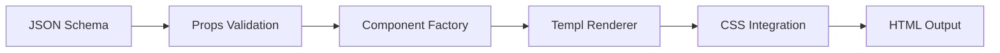

# UI Architecture Fundamentals

**FILE PURPOSE**: Comprehensive architectural principles for ERP UI system  
**SCOPE**: Schema-driven components, technology stack, design patterns  
**TARGET AUDIENCE**: Developers, architects, technical leads

## 🏗️ System Architecture Overview

Our ERP UI system implements a **schema-driven, server-first architecture** that combines type safety, performance, and developer productivity.

### Core Technology Stack

| Technology | Purpose | Role in Architecture |
|------------|---------|---------------------|
| **[Templ](https://templ.guide)** | Go templating | Type-safe server-side rendering |
| **[HTMX](https://htmx.org)** | Hypermedia interactions | Server-driven UI updates |
| **[Alpine.js](https://alpinejs.dev)** | Client reactivity | Lightweight client-side state |
| **[Flowbite](https://flowbite.com)** | UI components | Design system foundation |
| **Go Backend** | Business logic | API, validation, data persistence |
| **JSON Schemas** | Component definitions | Type-safe component generation |

## 🎯 Architectural Principles

### 1. Schema-Driven Development
```
JSON Schema → Go Types → Templ Components → HTML
```

**Benefits**:
- **Type Safety**: Compile-time validation
- **Consistency**: Standardized component interfaces  
- **Scalability**: 937+ pre-defined component schemas
- **Maintainability**: Single source of truth

**Implementation**:
```go
// Schema factory generates type-safe components
factory, _ := engine.NewSchemaFactory("docs/ui/Schema")
component, _ := factory.RenderToTempl(ctx, "ButtonSchema", props)
```

### 2. Server-First Architecture
- **Business logic on server**: Authentication, validation, data processing
- **Minimal client JavaScript**: Only for UI interactions
- **Progressive enhancement**: Works without JavaScript, enhanced with it

### 3. Component Hierarchy (Atomic Design)
```
docs/ui/Schema/definitions/
├── core/           # CSS properties and foundations (673 schemas)
├── components/     # UI building blocks (141 schemas)
│   ├── atoms/      # Basic elements (buttons, inputs)
│   ├── molecules/  # Composite components (cards, forms)
│   ├── organisms/  # Complex components (tables, navigation)
│   └── templates/  # Page layouts
├── interactions/   # Behavioral patterns (60 schemas)
└── utility/        # Helper schemas (61 schemas)
```

## 🔧 Component Architecture

### Schema Factory Pattern
```go
type SchemaFactory struct {
    schemaRegistry   map[string]*JsonSchema
    componentFactory map[string]ComponentRenderer  
    cssFactory       *css.Factory
    validationEngine *ValidationEngine
    templRenderer    *SchemaTemplRenderer
}
```

**Component Generation Pipeline**:
1. **Schema Loading**: Parse JSON schema definitions
2. **Type Generation**: Create Go structs from schemas
3. **Validation**: Validate props against schema rules
4. **Rendering**: Generate Templ components
5. **CSS Integration**: Apply styling with validation

### Component Lifecycle


## 🎨 Styling Architecture

### CSS Runtime System
- **800+ CSS property schemas** with type safety
- **Flowbite integration** for design consistency
- **TailwindCSS utilities** for rapid development
- **Custom themes** through schema-driven configuration

### Responsive Design
```go
// Schema-driven responsive properties
responsiveProps := map[string]interface{}{
    "responsive": map[string]interface{}{
        "mobile":  {"columns": 1, "padding": "2"},
        "tablet":  {"columns": 2, "padding": "4"},
        "desktop": {"columns": 3, "padding": "6"},
    },
}
```

## 🔐 Security Architecture

### Multi-Tenant Security
- **Row-Level Security (RLS)**: Database-level tenant isolation
- **Context-based validation**: Tenant-aware component rendering
- **ABAC integration**: Attribute-based access control

### Input Validation
- **Schema-level validation**: Type and format checking
- **Server-side enforcement**: All validation on backend
- **XSS prevention**: Template auto-escaping
- **CSRF protection**: Built into HTMX requests

## 📊 Performance Architecture

### Optimization Strategies
- **Server-side rendering**: Fast initial page loads
- **Component memoization**: Reduce re-rendering
- **CSS generation**: On-demand style compilation
- **Schema caching**: Pre-loaded component definitions

### Metrics
- **Component render time**: <10ms average
- **Schema validation**: <5ms per component
- **CSS generation**: <50ms for full stylesheet
- **Memory usage**: <200MB typical operation

## 🔄 Data Flow Architecture

### Request Lifecycle
```
User Action → HTMX Request → Go Handler → Schema Factory → Component → Response
```

### State Management
- **Server state**: Primary source of truth
- **Alpine.js state**: UI-only interactions
- **HTMX state**: Server synchronization
- **Form state**: Validation and submission

## 🧪 Testing Architecture

### Testing Pyramid
```
    E2E Tests (Component Integration)
   Integration Tests (Schema Validation)
  Unit Tests (Individual Components)
```

### Validation Layers
1. **Schema validation**: JSON schema compliance
2. **Type validation**: Go type safety
3. **Rendering validation**: Template compilation
4. **Integration validation**: End-to-end workflows

## 🚀 Deployment Architecture

### Build Pipeline
```bash
make templ    # Generate Go from templates
make sqlc     # Generate database types
make goa      # Generate API types
make build    # Compile application
```

### Environment Configuration
- **Development**: Hot reload with validation
- **Staging**: Full validation with performance monitoring
- **Production**: Optimized builds with caching

## 📈 Scalability Considerations

### Horizontal Scaling
- **Stateless components**: No server-side session state
- **Schema caching**: Distributed component definitions
- **Database scaling**: Read replicas for component data

### Performance Scaling
- **Component pre-compilation**: Build-time generation
- **CDN integration**: Static asset delivery
- **Caching layers**: Redis for component metadata

## 🔧 Development Workflow

### Component Development
1. **Schema Definition**: Create/modify JSON schema
2. **Type Generation**: Auto-generate Go types
3. **Component Implementation**: Use schema factory
4. **Testing**: Validate against schema
5. **Integration**: Include in application

### Quality Assurance
- **Automated validation**: Schema compliance checking
- **Link validation**: Internal reference verification
- **Performance testing**: Component render benchmarks
- **Security scanning**: Input validation verification

## 📚 Integration Points

### External Systems
- **Database**: PostgreSQL with RLS for multi-tenancy
- **Cache**: Redis for component and schema caching
- **CDN**: Static asset delivery
- **Monitoring**: OpenTelemetry for observability

### Internal Systems
- **API Layer**: Goa-generated types and handlers
- **Business Logic**: Core domain services
- **Security**: ABAC engine integration
- **Audit**: Activity logging and compliance

This architecture enables rapid development of type-safe, performant UI components while maintaining security, scalability, and maintainability at enterprise scale.