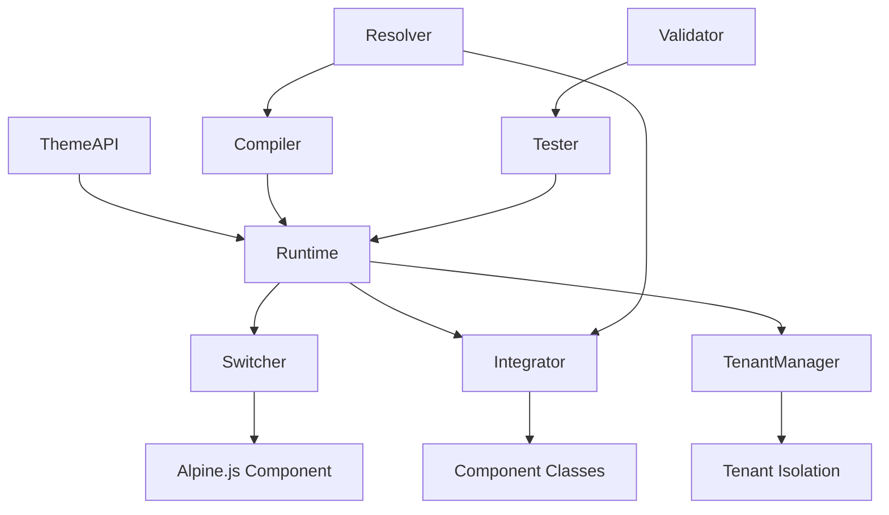

# Theme Package

A comprehensive theme integration system for the Ruun design system, providing runtime theme management, compilation, validation, testing, and multi-tenant support.

## Features

### 🎨 Runtime Theme Management
- Dynamic theme switching without page reloads
- Dark mode support with system preference detection
- Theme validation and fallback mechanisms
- Intelligent caching for performance optimization
- Multi-level cache invalidation

### 🔧 Enhanced CSS Compilation
- Advanced token resolution with nested references
- Utility class generation (Tailwind-like)
- Component-specific CSS classes
- Responsive design utilities
- Animation and transition support
- CSS minification and optimization
- Tree shaking for unused styles

### ✅ Comprehensive Validation & Testing
- Theme structure validation
- Token reference validation
- Color contrast checking (WCAG compliance)
- Performance testing and benchmarking
- Visual regression testing capabilities
- Accessibility compliance testing
- Custom validation rules

### 🌐 Multi-Tenant Support
- Complete tenant isolation
- Tenant-specific theme customization
- Branding overrides and custom CSS
- Permission-based theme access
- Bulk tenant management
- Tenant theme inheritance

### 🎛️ Frontend Integration
- Alpine.js component for theme switching
- Reactive UI updates
- Local storage persistence
- Loading states and error handling
- System theme detection
- Export/import functionality

### 📊 Performance Optimization
- Multi-level caching strategy
- Lazy loading of theme resources
- Compilation result caching
- Token resolution optimization
- Bundle size optimization
- Memory usage monitoring

## Quick Start

### Basic Usage

```go
package main

import (
    "log"
    "github.com/niiniyare/ruun/pkg/theme"
)

func main() {
    // Create theme API
    api := ruun.NewThemeAPI("./themes")
    
    // Create runtime
    runtime := theme.NewRuntime(api, nil)
    
    // Switch to a theme
    err := runtime.SetTheme("my-theme")
    if err != nil {
        log.Fatal(err)
    }
    
    // Get compiled CSS
    css, err := runtime.GetThemeCSS()
    if err != nil {
        log.Fatal(err)
    }
    
    // Use CSS in your application
    fmt.Printf("Generated CSS: %s", css)
}
```

### Theme Switching with Persistence

```go
// Create theme switcher
storage := theme.NewSimpleThemeStorage()
switcher := theme.NewThemeSwitcher(runtime, storage, nil)

// Switch theme for user
result, err := switcher.SwitchTheme("dark-mode", "user123")
if err != nil {
    log.Fatal(err)
}

// Generate Alpine.js component
alpineComponent := switcher.GenerateAlpineJSComponent()
```

### Component Integration

```go
// Create component integrator
integrator := theme.NewComponentIntegrator(runtime, resolver, nil)

// Get component classes
buttonClasses := integrator.GetButtonClasses("primary", "lg")
// Returns: "button button-primary button-lg"

// Generate component styles
config := &theme.ComponentStyleConfig{
    Component: "button",
    Variant:   "primary",
    Size:      "md",
    State:     "hover",
}

styleResult, err := integrator.GenerateComponentStyle(ctx, config)
// Returns: className, inline CSS, variables, etc.
```

### Multi-Tenant Support

```go
// Setup tenant manager
tenantStorage := theme.NewSimpleTenantStorage()
tenantManager := theme.NewTenantThemeManager(runtime, tenantStorage, nil)

// Configure tenant
tenantConfig := &theme.TenantConfig{
    TenantID:       "acme-corp",
    DefaultTheme:   "corporate",
    EnableDarkMode: true,
    BrandingOverrides: &theme.BrandingOverrides{
        PrimaryColor: "#ff6b35",
        LogoURL:      "/acme/logo.png",
    },
}

err := tenantManager.ConfigureTenant("acme-corp", tenantConfig)
```

## Frontend Integration

### Alpine.js Theme Switcher

```html
<!-- Theme switcher component -->
<div x-data="themeSwitcher()">
    <!-- Theme selector -->
    <select x-model="currentTheme" x-on:change="switchTheme($event.target.value)">
        <template x-for="theme in availableThemes">
            <option :value="theme.id" x-text="theme.name"></option>
        </template>
    </select>

    <!-- Dark mode toggle -->
    <button x-on:click="toggleDarkMode()" 
            x-text="darkMode ? 'Light Mode' : 'Dark Mode'">
    </button>

    <!-- Loading state -->
    <div x-show="isLoading">Switching theme...</div>

    <!-- Error display -->
    <div x-show="error" x-text="error"></div>
</div>
```

### JavaScript API

```javascript
// Switch theme
await window.themeSwitcher.switchTheme('dark-mode');

// Toggle dark mode
await window.themeSwitcher.toggleDarkMode();

// Get current theme info
const themeInfo = window.themeSwitcher.getCurrentTheme();

// Listen for theme changes
window.addEventListener('themeChanged', (event) => {
    console.log('Theme changed:', event.detail);
});
```

## Architecture

### Core Components

```
pkg/theme/
├── runtime.go          # Core theme runtime
├── compiler.go         # Enhanced CSS compilation
├── resolver.go         # Token reference resolution
├── validator.go        # Theme validation
├── testing.go          # Comprehensive testing
├── switcher.go         # Theme switching service
├── integration.go      # Component integration
├── tenant.go           # Multi-tenant support
├── examples.go         # Usage examples
└── README.md           # This documentation
```

### Component Relationships



### Data Flow

1. **Theme Loading**: Themes are loaded from JSON files via ThemeAPI
2. **Token Resolution**: Design tokens are resolved recursively
3. **CSS Compilation**: Enhanced compiler generates optimized CSS
4. **Runtime Management**: Runtime manages theme state and caching
5. **Component Integration**: Components receive appropriate classes/styles
6. **Frontend Updates**: Alpine.js components reactively update UI

## Configuration

### Runtime Configuration

```go
config := &theme.RuntimeConfig{
    EnableCaching:     true,
    CacheTTL:          30 * time.Minute,
    EnableDarkMode:    true,
    PreloadThemes:     []string{"default", "dark"},
    FallbackTheme:     "default",
    AutoDarkMode:      true,
    ValidateTokens:    true,
    MaxCacheSize:      1000,
    EnableHotReload:   true, // Development only
}
```

### Compiler Configuration

```go
config := &theme.CompilerConfig{
    Minify:              true,
    UseCustomProperties: true,
    UseTailwindClasses:  true,
    UseComponentClasses: true,
    PurgeUnusedCSS:      true,
    OptimizeVariables:   true,
    EnableDarkMode:      true,
    EnableResponsive:    true,
    EnableAnimations:    true,
    UsedComponents:      []string{"button", "input", "card"},
}
```

### Validation Configuration

```go
config := &theme.ValidatorConfig{
    StrictMode:           false,
    ValidateColors:       true,
    ValidateContrast:     true,
    MinContrastRatio:     4.5, // WCAG AA
    ValidateAccessibility: true,
    RequiredTokens: []string{
        "colors.background.default",
        "colors.text.default",
        "colors.interactive.primary",
    },
}
```

## API Reference

### Core Types

#### Runtime
```go
type Runtime struct {
    // Core theme runtime with caching and performance optimization
}

func NewRuntime(api ThemeAPIInterface, config *RuntimeConfig) *Runtime
func (r *Runtime) SetTheme(themeID string) error
func (r *Runtime) SetDarkMode(enabled bool) error
func (r *Runtime) GetThemeCSS() (string, error)
func (r *Runtime) GetCurrentTheme() *ThemeInfo
```

#### ThemeSwitcher
```go
type ThemeSwitcher struct {
    // Theme switching service with persistence
}

func NewThemeSwitcher(runtime *Runtime, storage ThemeStorage, config *SwitcherConfig) *ThemeSwitcher
func (ts *ThemeSwitcher) SwitchTheme(themeID string, userID string) (*ThemeSwitchResult, error)
func (ts *ThemeSwitcher) ToggleDarkMode(userID string) (*ThemeSwitchResult, error)
func (ts *ThemeSwitcher) GenerateAlpineJSComponent() string
```

#### ComponentIntegrator
```go
type ComponentIntegrator struct {
    // Component-theme integration utilities
}

func NewComponentIntegrator(runtime *Runtime, resolver *TokenResolver, config *IntegrationConfig) *ComponentIntegrator
func (ci *ComponentIntegrator) GetButtonClasses(variant, size string) string
func (ci *ComponentIntegrator) GenerateComponentStyle(ctx context.Context, config *ComponentStyleConfig) (*StyleResult, error)
```

#### TenantThemeManager
```go
type TenantThemeManager struct {
    // Multi-tenant theme management
}

func NewTenantThemeManager(globalManager *Runtime, storage TenantStorage, config *MultiTenantConfig) *TenantThemeManager
func (ttm *TenantThemeManager) ConfigureTenant(tenantID string, config *TenantConfig) error
func (ttm *TenantThemeManager) SwitchTenantTheme(ctx *TenantThemeContext) (*TenantThemeResult, error)
```

### Validation & Testing

#### ThemeValidator
```go
type ThemeValidator struct {
    // Comprehensive theme validation
}

func NewThemeValidator() *ThemeValidator
func (tv *ThemeValidator) ValidateTheme(theme *schema.Theme) (*ValidationResult, error)
func (tv *ThemeValidator) ValidateColorValue(value string) *ValidationIssue
```

#### ThemeTester
```go
type ThemeTester struct {
    // Comprehensive theme testing
}

func NewThemeTester(validator *ThemeValidator, runtime *Runtime, config *TestConfig) *ThemeTester
func (tt *ThemeTester) RunTestSuite(ctx context.Context, theme *schema.Theme, suite *TestSuite) (*TestSuiteResult, error)
func (tt *ThemeTester) GetDefaultTestSuite() *TestSuite
```

## Performance Considerations

### Caching Strategy

The theme package implements a multi-level caching strategy:

1. **Runtime Cache**: Caches resolved tokens and compiled themes
2. **Compilation Cache**: Caches compiled CSS and assets
3. **Component Cache**: Caches component styles and classes
4. **Tenant Cache**: Caches tenant-specific configurations

### Performance Metrics

```go
// Get performance metrics
stats := runtime.GetCacheStats()
metrics := compiler.GetCacheStats()
tenantStats := tenantManager.GetStats()

// Monitor performance
fmt.Printf("Cache hit ratio: %.2f%%", stats.HitRatio)
fmt.Printf("Compilation time: %v", metrics.AverageCompilationTime)
fmt.Printf("Memory usage: %d MB", stats.MemoryUsage)
```

### Optimization Tips

1. **Enable Caching**: Always enable caching in production
2. **Preload Themes**: Preload commonly used themes
3. **Purge Unused CSS**: Enable CSS purging for smaller bundles
4. **Minify Output**: Enable CSS minification
5. **Use CDN**: Serve compiled CSS from CDN
6. **Monitor Memory**: Watch cache memory usage
7. **Lazy Load**: Use lazy loading for theme resources

## Testing

### Unit Testing

```go
func TestThemeRuntime(t *testing.T) {
    api := theme.NewMockThemeAPI()
    runtime := theme.NewRuntime(api, nil)
    
    err := runtime.SetTheme("test-theme")
    assert.NoError(t, err)
    
    css, err := runtime.GetThemeCSS()
    assert.NoError(t, err)
    assert.Contains(t, css, "/* Theme: Test Theme */")
}
```

### Integration Testing

```go
func TestThemeSwitching(t *testing.T) {
    // Setup
    api := theme.NewMockThemeAPI()
    runtime := theme.NewRuntime(api, nil)
    storage := theme.NewSimpleThemeStorage()
    switcher := theme.NewThemeSwitcher(runtime, storage, nil)
    
    // Test theme switching
    result, err := switcher.SwitchTheme("dark", "test-user")
    assert.NoError(t, err)
    assert.True(t, result.Success)
    assert.Equal(t, "dark", result.ThemeID)
}
```

### Validation Testing

```go
func TestThemeValidation(t *testing.T) {
    validator := theme.NewThemeValidator()
    
    // Test valid theme
    validTheme := createValidTheme()
    result, err := validator.ValidateTheme(validTheme)
    assert.NoError(t, err)
    assert.True(t, result.Valid)
    assert.Equal(t, 0, len(result.Issues))
}
```

## Security Considerations

### Input Validation
- All theme JSON is validated before processing
- Token references are sanitized to prevent injection
- Custom CSS is validated and sanitized
- File uploads are restricted and validated

### Tenant Isolation
- Complete isolation between tenant themes
- Permission-based access control
- Resource limits per tenant
- Audit logging for tenant operations

### Content Security Policy
```html
<!-- Recommended CSP headers -->
<meta http-equiv="Content-Security-Policy" 
      content="style-src 'self' 'unsafe-inline'; 
               script-src 'self';">
```

## Troubleshooting

### Common Issues

#### Theme Not Loading
```go
// Check theme exists
theme, err := api.GetTheme("my-theme")
if err != nil {
    log.Printf("Theme not found: %v", err)
}

// Check theme validation
validator := theme.NewThemeValidator()
result, err := validator.ValidateTheme(theme)
if !result.Valid {
    log.Printf("Theme validation failed: %v", result.Issues)
}
```

#### Performance Issues
```go
// Check cache stats
stats := runtime.GetCacheStats()
if stats.HitRatio < 0.8 {
    log.Printf("Low cache hit ratio: %.2f%%", stats.HitRatio)
}

// Enable performance logging
config := &theme.RuntimeConfig{
    EnableCaching: true,
    MaxCacheSize:  1000,
}
```

#### Memory Leaks
```go
// Monitor memory usage
if stats.MemoryUsage > threshold {
    runtime.ClearCache()
    compiler.ClearCache()
}

// Set cache limits
config.MaxCacheSize = 500
config.CacheTTL = 15 * time.Minute
```

### Debug Mode

```go
// Enable debug logging
config := &theme.RuntimeConfig{
    Debug:         true,
    EnableLogging: true,
    LogLevel:      "debug",
}
```

## Migration Guide

### From Basic ThemeAPI

```go
// Old way
api := ruun.NewThemeAPI("./themes")
css, err := api.GetCompiledCSS("my-theme")

// New way with enhanced features
runtime := theme.NewRuntime(api, nil)
runtime.SetTheme("my-theme")
css, err := runtime.GetThemeCSS()
```

### Adding Multi-Tenant Support

```go
// Setup tenant management
tenantManager := theme.NewTenantThemeManager(runtime, storage, nil)

// Migrate existing themes to tenant-specific
for _, tenantID := range tenants {
    config := &theme.TenantConfig{
        TenantID:     tenantID,
        DefaultTheme: "default",
        Active:       true,
    }
    tenantManager.ConfigureTenant(tenantID, config)
}
```

## Contributing

### Development Setup

1. Clone the repository
2. Install dependencies: `go mod download`
3. Run tests: `go test ./...`
4. Run examples: `go run examples.go`

### Adding New Features

1. Create feature branch
2. Add comprehensive tests
3. Update documentation
4. Submit pull request

### Testing Checklist

- [ ] Unit tests pass
- [ ] Integration tests pass
- [ ] Performance benchmarks run
- [ ] Documentation updated
- [ ] Examples work correctly

## License

This package is part of the Ruun design system and is licensed under the MIT License.

## Support

For issues, questions, or contributions:

1. Check existing issues
2. Create detailed bug reports
3. Include reproduction steps
4. Provide system information
5. Submit feature requests with use cases

---

**Happy theming! 🎨**