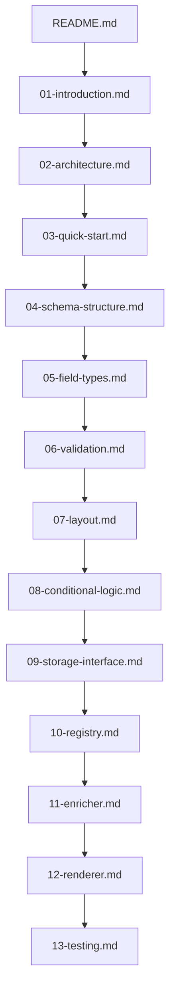

# Schema System Documentation

> **Project Type:** JSON-driven UI schema system for enterprise forms  
> **Language:** Go 1.21+ with templ templates  
> **Framework:** Fiber v2, HTMX 1.9+, Alpine.js 3.x  
> **Purpose:** Backend developers define complete UIs using only JSON schemas

---

## 📋 Project Context for AI Assistants

**What This System Does:**
- Converts JSON schemas into fully functional HTML forms
- Server-side rendering with templ (Go templates)
- Progressive enhancement (works without JS, enhanced with HTMX/Alpine.js)
- Multi-tenant with permission-based field access

**Key Design Decisions:**
- Backend is source of truth for all security
- Schemas are pure data (no logic)
- Type-safe Go structs with compile-time validation
- Flexible storage (Redis, PostgreSQL, filesystem, S3/Minio)

**Request Flow:**
```
Browser → Fiber Handler → Registry.Get() → Enricher.Enrich() → Renderer.Render() → HTML
```

---

## 📁 Documentation Structure

| # | File | Purpose | Lines | Key Topics |
|---|------|---------|-------|------------|
| 1 | **[Introduction](docs/schema/01-introduction.md)** | Core concepts | 292 | SSR vs SPA, principles, benefits |
| 2 | **[Architecture](docs/schema/02-architecture.md)** | System design | 408 | 3-layer architecture, components, Fiber middleware |
| 3 | **[Quick Start](docs/schema/03-quick-start.md)** | Tutorial | 452 | Installation, first form, handlers, templates |
| 4 | **[Schema Structure](docs/schema/04-schema-structure.md)** | JSON reference | 147 | Schema format, field struct, config |
| 5 | **[Field Types](docs/schema/05-field-types.md)** | Field catalog | 168 | 40+ types: text, date, select, file, etc. |
| 6 | **[Validation](docs/schema/06-validation.md)** | Validation rules | 130 | HTML5 + server, cross-field validation |
| 7 | **[Layout System](docs/schema/07-layout.md)** | Layout options | 96 | Grid, tabs, steps, sections, responsive |
| 8 | **[Conditional Logic](docs/schema/08-conditional-logic.md)** | Dynamic behavior | 88 | Show/hide, permissions, conditional required |
| 9 | **[Storage Interface](docs/schema/09-storage-interface.md)** ⭐ | Storage backends | 654 | PostgreSQL, Redis, filesystem, S3 implementations |
| 10 | **[Registry](docs/schema/10-registry.md)** | Schema management | 72 | Loading, caching, versioning |
| 11 | **[Enricher](docs/schema/11-enricher.md)** | Runtime data | 96 | Permissions, tenant customization, defaults |
| 12 | **[Renderer](docs/schema/12-renderer.md)** | HTML generation | 110 | templ components, HTMX integration |
| 13 | **[Testing](docs/schema/13-testing.md)** | Testing | 123 | Unit tests, integration tests, mocks |
| 14 | **[Extended features](docs/schema/14-extended_components.md)** | Testing | 123 | Unit tests, integration tests, mocks |


**Total:** 2,998 lines across 14 files

---

## 🔍 Quick Reference for Common Tasks

| Task | Relevant Files | Key Concepts |
|------|----------------|--------------|
| **Create new schema** | 03-quick-start.md, 04-schema-structure.md | JSON format, field definitions |
| **Add field type** | 05-field-types.md, 12-renderer.md | Type mapping, templ components |
| **Implement validation** | 06-validation.md | HTML5 + server-side rules |
| **Set up storage** | 09-storage-interface.md | Interface, PostgreSQL/Redis/S3 |
| **Handle permissions** | 11-enricher.md | User/tenant-based field visibility |
| **Create layouts** | 07-layout.md | Grid, tabs, steps, sections |
| **Add conditionals** | 08-conditional-logic.md | Show/hide logic, dynamic required |
| **Write tests** | 13-testing.md | Unit, integration, mock storage |

---

## 🏗️ Technology Stack

```yaml
Backend:
  - Go: 1.21+
  - Web Framework: Fiber v2
  - Templates: templ (type-safe Go templates)
  - Validation: go-playground/validator
  
Frontend:
  - HTMX: 1.9+ (HTML over the wire)
  - Alpine.js: 3.x (client-side reactivity)
  - Validation: HTML5 native
  
Storage:
  - Primary: PostgreSQL 14+
  - Caching: Redis 7+
  - Optional: S3/Minio, Filesystem
```

---

## 📝 Minimal Schema Example

```json
{
  "id": "user-form",
  "type": "form",
  "title": "Create User",
  "fields": [
    {
      "name": "email",
      "type": "email",
      "label": "Email Address",
      "required": true,
      "validation": {
        "pattern": "^[a-z0-9._%+-]+@[a-z0-9.-]+\\.[a-z]{2,}$"
      }
    },
    {
      "name": "role",
      "type": "select",
      "label": "Role",
      "options": ["admin", "user", "viewer"],
      "default": "user"
    }
  ]
}
```

---

## 🎯 File Dependencies & Reading Order



**Suggested Reading Order:**
1. **Understand:** 01-introduction.md (concepts)
2. **Architecture:** 02-architecture.md (how it works)
3. **Hands-On:** 03-quick-start.md (build first form)
4. **Deep Dive:** 04→05→06→07→08 (schema details)
5. **Storage:** 09-storage-interface.md (backends)
6. **Implementation:** 10→11→12 (registry, enricher, renderer)
7. **Quality:** 13-testing.md (testing strategies)

---

## 🔑 Key Interfaces (for AI code generation)

### Storage Interface
```go
type Storage interface {
    Get(ctx context.Context, key string) ([]byte, error)
    Set(ctx context.Context, key string, value []byte, ttl time.Duration) error
    Delete(ctx context.Context, key string) error
    List(ctx context.Context, prefix string) ([]string, error)
}
```
**Implementations:** PostgreSQL, Redis, Filesystem, S3/Minio  
**Details:** See 09-storage-interface.md

### Schema Structure
```go
type Schema struct {
    ID          string   `json:"id"`
    Type        string   `json:"type"`
    Title       string   `json:"title"`
    Fields      []Field  `json:"fields"`
    TenantID    string   `json:"tenant_id,omitempty"`
}

type Field struct {
    Name       string      `json:"name"`
    Type       string      `json:"type"`
    Label      string      `json:"label"`
    Required   bool        `json:"required"`
    Validation *Validation `json:"validation,omitempty"`
}
```
**Details:** See 04-schema-structure.md

---

## 🚀 Getting Started (5-minute quickstart)

1. **Install dependencies:**
   ```bash
   go get github.com/gofiber/fiber/v2
   go get github.com/a-h/templ
   ```

2. **Create schema JSON:**
   ```json
   {"id": "test-form", "type": "form", "title": "Test", "fields": [...]}
   ```

3. **Create Fiber handler:**
   ```go
   app.Get("/form/:id", func(c *fiber.Ctx) error {
       schema := registry.Get(c.Params("id"))
       enriched := enricher.Enrich(schema, user, tenant)
       return renderer.Render(c, enriched)
   })
   ```

**Full Tutorial:** See 03-quick-start.md

---

## 🧪 Testing Approach

- **Unit Tests:** Schema parsing, validation, storage operations
- **Integration Tests:** End-to-end form rendering and submission
- **Mock Storage:** In-memory implementation for testing

**Details:** See 13-testing.md

---

## 📊 Design Principles

1. **Backend is Source of Truth** - All security decisions on server
2. **Schema is Pure Data** - Describes WHAT, not HOW
3. **Progressive Enhancement** - HTML works without JS
4. **Type Safety** - Compile-time validation prevents runtime errors
5. **Flexible Storage** - Choose the backend that fits your needs

---

## 🔗 External Resources

- **templ Documentation:** https://templ.guide
- **Fiber Documentation:** https://docs.gofiber.io
- **HTMX Documentation:** https://htmx.org/docs
- **Alpine.js Documentation:** https://alpinejs.dev

---

**Version:** 1.0.0  
**Status:** Production Ready  
**Last Updated:** 2025-11-02  
**License:** [Add license here]  
