# Theme & Token System Integration Architecture
## A Complete Guide to Understanding How Everything Works Together

---

## 📖 Table of Contents

1. [Introduction: The Big Picture](#introduction)
2. [Core Foundation: The Three Pillars](#core-foundation)
3. [Theme Engine: Making Things Beautiful](#theme-engine)
4. [Schema Engine: Building Forms & UI](#schema-engine)
5. [Advanced Schema Features](#advanced-schema-features)
6. [The Magic Pipeline: How Components Work Together](#the-magic-pipeline)
7. [Fiscal Localization: Multi-Country Compliance](#fiscal-localization)
8. [Tenant Preferences: Per-Tenant Customization](#tenant-preferences)
9. [Big ERP Systems: Real-World Architecture](#big-erp-systems)
10. [Runtime Execution: Bringing It All to Life](#runtime-execution)
11. [Real-World Examples](#real-world-examples)

---

## Introduction: The Big Picture

Think of our ERP system like a modern car factory:

- **The Theme Engine** is like the paint shop - it determines colors, styles, and visual appearance
- **The Schema Engine** is like the assembly line - it defines structure and what gets built
- **The Runtime Engine** is like the factory floor - it coordinates everything and makes it work
- **Storage & Cache** are like the warehouse - they keep everything organized and fast

These systems work together seamlessly to create beautiful, functional forms and interfaces for your ERP.

### Why This Architecture Matters

**Without Themes:**
```json
{
  "field": "customer_name",
  "label": "Customer Name",
  "color": "#3b82f6",  // Hardcoded everywhere!
  "fontSize": "14px",   // Repeated in every form!
  "spacing": "16px"     // Nightmare to maintain!
}
```

**With Themes:**
```json
{
  "field": "customer_name",
  "label": "Customer Name",
  "style": "input.default"  // One source of truth! No {} needed!
}
```

When you change the theme, **everything updates automatically**. No more hunting through hundreds of forms to update colors!

---

## Core Foundation: The Three Pillars

This is the heart of the system. Three managers work together like a well-coordinated team.

```mermaid
graph TB
    subgraph "🏗️ Core System Foundation"
        direction TB
        
        %% Core Management Components
        TM[🎨 ThemeManager<br/>Style management & caching<br/>GetTheme(), RegisterTheme()]
        TR[🗂️ ThemeRegistry<br/>Theme storage<br/>Thread-safe operations]
        TKR[🎯 TokenRegistry<br/>Token resolution engine<br/>ResolveToken(), O(1) lookups]
        BLD[🏗️ Builder<br/>Schema construction<br/>Fluent API pattern]
        
        %% Core Models
        THM[🎨 Theme<br/>Complete theme definition<br/>Tokens + metadata]
        SCH[📋 Schema<br/>Form structure<br/>Fields, actions, layout]
        CTX[📡 Context<br/>Request context<br/>Tenant, user, theme info]
        
        %% Global Access Points
        GLOBAL[🌍 Global Singletons<br/>GetGlobalThemeManager()<br/>GetDefaultRegistry()]
        
        %% Connections
        GLOBAL -->|provides| TM
        GLOBAL -->|provides| TKR
        TM -->|uses| TR
        TM -->|coordinates with| TKR
        TR -->|stores| THM
        TKR -->|resolves from| THM
        BLD -->|creates| SCH
        SCH -->|applies via| TM
        SCH -->|resolves tokens via| TKR
        TM -.->|uses| CTX
        TKR -.->|uses| CTX
        BLD -.->|uses| CTX
    end
    
    style TM fill:#1e40af,stroke:#1e3a8a,stroke-width:3px,color:#fff
    style TKR fill:#1e40af,stroke:#1e3a8a,stroke-width:3px,color:#fff
    style TR fill:#6366f1,stroke:#4f46e5,stroke-width:2px,color:#fff
    style BLD fill:#1e40af,stroke:#1e3a8a,stroke-width:3px,color:#fff
    style THM fill:#7e22ce,stroke:#6b21a8,stroke-width:2px,color:#fff
    style SCH fill:#059669,stroke:#047857,stroke-width:2px,color:#fff
    style CTX fill:#d97706,stroke:#b45309,stroke-width:2px,color:#fff
    style GLOBAL fill:#8b5cf6,stroke:#7c3aed,stroke-width:2px,color:#fff
```

### Understanding Each Component

#### 🗂️ **Global Registries** - The Orchestrators
**What they do:** Multiple specialized registries work together to manage different aspects of the system.

**Real-world analogy:** Think of it as different departments in a city hall - each handles specific services but they coordinate together.

**Key registries:**
- **ThemeRegistry**: Stores and manages themes
- **TokenRegistry**: Handles token resolution and compilation
- **MixinRegistry**: Manages reusable component mixins
- **SchemaRegistry**: Stores schema definitions (interface)

**Example usage:**
```go
// Get global instances
themeManager := GetGlobalThemeManager()
tokenRegistry := GetDefaultRegistry()

// Register a theme through ThemeManager
err := themeManager.RegisterTheme(corporateTheme)

// Resolve tokens through TokenRegistry
resolved, err := tokenRegistry.ResolveToken(ctx, TokenReference("{semantic.colors.primary}"))
```

**Technical Implementation:**
```go
// Actual types in the codebase
type ThemeManager struct {
    registry    *ThemeRegistry
    tokenManager *TokenRegistry
    cache       *ThemeCache
}

type ThemeRegistry struct {
    themes map[string]*Theme
    mu     sync.RWMutex
}

type TokenRegistry struct {
    tokens     *DesignTokens
    resolver   TokenResolver
    compiled   *CompiledTokenMap
    cache      map[string]string
    mu         sync.RWMutex
}
```

---

#### 🎨 **ThemeManager** - The Style Director
**What it does:** Manages everything related to visual appearance - colors, fonts, spacing, shadows, etc.

**Real-world analogy:** Like a fashion designer's wardrobe system - you have a collection of outfits (themes) and you pick which one to wear.

**Key responsibilities:**
- Load themes from files or database
- Compile theme tokens (turn `input.default` into actual values)
- Cache compiled themes for speed
- Handle theme switching
- Manage theme inheritance (child themes extending parent themes)

**Example workflow:**
```go
// Get theme manager
themeManager := GetGlobalThemeManager()

// Retrieve a theme by ID
theme, err := themeManager.GetTheme(ctx, "corporate-blue")

// Apply theme to a schema
err = schema.ApplyTheme(ctx, "corporate-blue")

// Resolve tokens through TokenRegistry (not Theme)
tokenRegistry := GetDefaultRegistry()
primaryColor, err := tokenRegistry.ResolveToken(ctx, TokenReference("{semantic.colors.primary}"))
// Internally resolves: {semantic.colors.primary} -> primitive value -> "#3b82f6"
```

**Technical Details:**
```go
// Actual ThemeManager methods
func (tm *ThemeManager) RegisterTheme(theme *Theme) error
func (tm *ThemeManager) GetTheme(ctx context.Context, themeID string) (*Theme, error)
func (tm *ThemeManager) GetThemeWithOverrides(ctx context.Context, themeID string, overrides *ThemeOverrides) (*Theme, error)
func (tm *ThemeManager) ListThemes(ctx context.Context) ([]*Theme, error)

// Schema theme application
func (s *Schema) ApplyTheme(ctx context.Context, themeID string) error
func (s *Schema) ApplyThemeWithOverrides(ctx context.Context, themeID string, overrides *ThemeOverrides) error
```

---

#### 📋 **Schema System** - The Structure Director
**What it does:** Manages the structure of forms, tables, dashboards - basically any UI component through builders and registries.

**Real-world analogy:** Like an architect's blueprint system - you have builders to create designs and registries to store them.

**Key components:**
- **Builder**: Programmatically creates schemas with fluent API
- **SchemaRegistry**: Interface for storing/retrieving schemas (implementation varies)
- **Validation**: Built-in validation system
- **Parser**: Handles JSON schema definitions

**Example workflow:**
```go
// Build a schema programmatically
schema, err := NewBuilder("invoice-form").
    WithTitle("Invoice Creation").
    WithDescription("Create customer invoices").
    AddField(&Field{
        Name:     "customer_name",
        Type:     FieldTypeText,
        Label:    "Customer Name",
        Required: true,
    }).
    Build()

// Validate the schema
if err := schema.Validate(ctx); err != nil {
    log.Fatal(err)
}

// Apply theme
err = schema.ApplyTheme(ctx, "corporate-v2")
```

**Technical Details:**
```go
// Actual Builder methods
func NewBuilder(id string) *Builder
func (b *Builder) WithTitle(title string) *Builder
func (b *Builder) AddField(field *Field) *Builder
func (b *Builder) Build() (*Schema, error)

// Schema validation and theming
func (s *Schema) Validate(ctx context.Context) error
func (s *Schema) ApplyTheme(ctx context.Context, themeID string) error
```

---

## Advanced Schema Features

### Part 1: Mixins - Reusable Schema Components

Mixins are like LEGO blocks for schemas - create once, reuse everywhere.

```mermaid
graph TB
    subgraph "🧩 Mixin System - Reusable Components"
        direction TB
        
        LIBRARY[📚 Mixin Library<br/>Reusable components]
        
        %% Common Mixins
        ADDR[🏠 Address Mixin<br/>street, city, country]
        AUDIT[📝 Audit Mixin<br/>created_by, updated_at]
        CONTACT[📞 Contact Mixin<br/>phone, email, website]
        MONEY[💰 Money Mixin<br/>amount, currency, tax]
        
        %% Usage
        FORM1[📋 Customer Form<br/>Uses: Address + Contact]
        FORM2[📋 Invoice Form<br/>Uses: Address + Money + Audit]
        FORM3[📋 Supplier Form<br/>Uses: Address + Contact + Audit]
        
        LIBRARY --> ADDR
        LIBRARY --> AUDIT
        LIBRARY --> CONTACT
        LIBRARY --> MONEY
        
        ADDR --> FORM1
        CONTACT --> FORM1
        
        ADDR --> FORM2
        MONEY --> FORM2
        AUDIT --> FORM2
        
        ADDR --> FORM3
        CONTACT --> FORM3
        AUDIT --> FORM3
    end
    
    style LIBRARY fill:#8b5cf6,stroke:#7c3aed,stroke-width:3px,color:#fff
    style ADDR fill:#3b82f6,stroke:#2563eb,stroke-width:2px,color:#fff
    style AUDIT fill:#3b82f6,stroke:#2563eb,stroke-width:2px,color:#fff
    style CONTACT fill:#3b82f6,stroke:#2563eb,stroke-width:2px,color:#fff
    style MONEY fill:#3b82f6,stroke:#2563eb,stroke-width:2px,color:#fff
    style FORM1 fill:#10b981,stroke:#059669,stroke-width:2px,color:#fff
    style FORM2 fill:#10b981,stroke:#059669,stroke-width:2px,color:#fff
    style FORM3 fill:#10b981,stroke:#059669,stroke-width:2px,color:#fff
```

**Defining a Mixin:**

```json
{
  "id": "address-mixin",
  "type": "mixin",
  "description": "Standard address fields for any entity",
  "fields": [
    {
      "name": "street_address",
      "type": "text",
      "label": "Street Address",
      "required": true,
      "style": "input.default"
    },
    {
      "name": "city",
      "type": "text",
      "label": "City",
      "required": true,
      "style": "input.default"
    },
    {
      "name": "state_province",
      "type": "text",
      "label": "State/Province",
      "style": "input.default"
    },
    {
      "name": "postal_code",
      "type": "text",
      "label": "Postal Code",
      "required": true,
      "style": "input.default"
    },
    {
      "name": "country",
      "type": "select",
      "label": "Country",
      "required": true,
      "options": "countries",
      "style": "select.default"
    }
  ]
}
```

**Using Mixins in Your Schema:**

```json
{
  "id": "customer-form",
  "title": "Customer Registration",
  "mixins": [
    "address-mixin",
    "contact-mixin",
    "audit-mixin"
  ],
  "fields": [
    {
      "name": "customer_name",
      "type": "text",
      "label": "Customer Name",
      "required": true,
      "style": "input.default"
    },
    {
      "name": "tax_id",
      "type": "text",
      "label": "Tax ID",
      "style": "input.default"
    }
  ]
}
```

**Or Using the Builder:**

```go
customerForm := NewSchemaBuilder("customer-form").
    WithTitle("Customer Registration").
    WithMixin("address-mixin").         // Adds all address fields
    WithMixin("contact-mixin").         // Adds phone, email, website
    WithMixin("audit-mixin").           // Adds created_by, updated_at
    AddTextField("customer_name", "Customer Name").
        Required().
    AddTextField("tax_id", "Tax ID").
    Build()
```

**What Happens at Compile Time:**

```go
// Before mixin resolution:
Schema {
    Fields: [customer_name, tax_id],
    Mixins: [address-mixin, contact-mixin, audit-mixin]
}

// After mixin resolution:
Schema {
    Fields: [
        customer_name,
        tax_id,
        street_address,    // From address-mixin
        city,              // From address-mixin
        state_province,    // From address-mixin
        postal_code,       // From address-mixin
        country,           // From address-mixin
        phone,             // From contact-mixin
        email,             // From contact-mixin
        website,           // From contact-mixin
        created_by,        // From audit-mixin
        created_at,        // From audit-mixin
        updated_by,        // From audit-mixin
        updated_at         // From audit-mixin
    ]
}
```

**Benefits:**
- ✅ **DRY Principle**: Define once, use everywhere
- ✅ **Consistency**: Same address format across all forms
- ✅ **Maintainability**: Update mixin, all forms update
- ✅ **Compliance**: Ensure required fields are always present

---

### Part 2: Repeatable Components - Dynamic Field Groups

Repeatable components allow users to add multiple instances of a field group dynamically.

```mermaid
graph LR
    subgraph "🔁 Repeatable Components"
        direction LR
        
        SINGLE[📝 Single Instance<br/>One phone number]
        REPEAT[🔄 Make Repeatable<br/>repeatable: true]
        MULTI[📝📝📝 Multiple Instances<br/>Many phone numbers]
        CONTROLS[➕ Add / ➖ Remove<br/>User controls]
        
        SINGLE --> REPEAT
        REPEAT --> MULTI
        MULTI --> CONTROLS
    end
    
    style SINGLE fill:#64748b,stroke:#475569,stroke-width:2px,color:#fff
    style REPEAT fill:#f59e0b,stroke:#d97706,stroke-width:2px,color:#000
    style MULTI fill:#10b981,stroke:#059669,stroke-width:2px,color:#fff
    style CONTROLS fill:#3b82f6,stroke:#2563eb,stroke-width:2px,color:#fff
```

**Example: Contact Information with Multiple Phone Numbers**

```json
{
  "id": "contact-form",
  "title": "Contact Information",
  "fields": [
    {
      "name": "phone_numbers",
      "type": "group",
      "label": "Phone Numbers",
      "repeatable": true,
      "min_items": 1,
      "max_items": 5,
      "add_button_label": "Add Another Phone",
      "fields": [
        {
          "name": "phone_type",
          "type": "select",
          "label": "Type",
          "options": [
            {"value": "mobile", "label": "Mobile"},
            {"value": "work", "label": "Work"},
            {"value": "home", "label": "Home"}
          ],
          "style": "select.compact"
        },
        {
          "name": "phone_number",
          "type": "text",
          "label": "Number",
          "placeholder": "+254 700 000 000",
          "validation": "phone",
          "style": "input.default"
        },
        {
          "name": "is_primary",
          "type": "checkbox",
          "label": "Primary Contact",
          "style": "checkbox.default"
        }
      ]
    }
  ]
}
```

**Using Builder:**

```go
contactForm := NewSchemaBuilder("contact-form").
    WithTitle("Contact Information").
    AddRepeatableGroup("phone_numbers", "Phone Numbers").
        MinItems(1).
        MaxItems(5).
        AddButtonLabel("Add Another Phone").
        
        // Fields within the repeatable group
        AddSelectField("phone_type", "Type").
            WithOptions([]Option{
                {Value: "mobile", Label: "Mobile"},
                {Value: "work", Label: "Work"},
                {Value: "home", Label: "Home"},
            }).
            WithStyle("select.compact").
        
        AddTextField("phone_number", "Number").
            WithPlaceholder("+254 700 000 000").
            WithValidation("phone").
            WithStyle("input.default").
        
        AddCheckboxField("is_primary", "Primary Contact").
            WithStyle("checkbox.default").
    
    EndGroup().
    Build()
```

**What Users See:**

```
╔═══════════════════════════════════════════════╗
║           Contact Information                 ║
╠═══════════════════════════════════════════════╣
║ 📞 Phone Numbers                              ║
║                                               ║
║ ┌─────────────────────────────────────────┐  ║
║ │ Phone #1                          [✕]    │  ║
║ │ ┌─────────┐  ┌──────────────────┐       │  ║
║ │ │ Type    │  │ Number            │       │  ║
║ │ │ [Mobile]│  │ [+254 700 123 456]│       │  ║
║ │ └─────────┘  └──────────────────┘       │  ║
║ │ ☑ Primary Contact                        │  ║
║ └─────────────────────────────────────────┘  ║
║                                               ║
║ ┌─────────────────────────────────────────┐  ║
║ │ Phone #2                          [✕]    │  ║
║ │ ┌─────────┐  ┌──────────────────┐       │  ║
║ │ │ Type    │  │ Number            │       │  ║
║ │ │ [Work]  │  │ [+254 722 987 654]│       │  ║
║ │ └─────────┘  └──────────────────┘       │  ║
║ │ ☐ Primary Contact                        │  ║
║ └─────────────────────────────────────────┘  ║
║                                               ║
║           [➕ Add Another Phone]              ║
╚═══════════════════════════════════════════════╝
```

**Common Use Cases:**

| Scenario | Repeatable Component |
|----------|---------------------|
| **Invoice Line Items** | Product, Quantity, Price, Total |
| **Family Members** | Name, Age, Relationship |
| **Education History** | School, Degree, Year, GPA |
| **Work Experience** | Company, Position, Duration |
| **Bank Accounts** | Bank Name, Account Number, Type |
| **Addresses** | Street, City, Type (Billing/Shipping) |

**Data Structure:**

```json
{
  "phone_numbers": [
    {
      "phone_type": "mobile",
      "phone_number": "+254 700 123 456",
      "is_primary": true
    },
    {
      "phone_type": "work",
      "phone_number": "+254 722 987 654",
      "is_primary": false
    }
  ]
}
```

---

## The Magic Pipeline: How Components Work Together

This is where the real magic happens. Five components work in perfect harmony to transform your schema definition into a working, themed UI.


### Step 1: Parser - Understanding Your Intent

```mermaid
graph LR
    subgraph "🔍 Parser Stage"
        direction LR
        
        JSON[📄 JSON Schema<br/>Raw text]
        CODE[💻 Go Builder<br/>Method calls]
        
        PARSER[🔍 Parser<br/>Syntax analysis]
        
        AST[🌳 Abstract Syntax Tree<br/>Internal representation]
        
        JSON --> PARSER
        CODE --> PARSER
        PARSER --> AST
    end
    
    style JSON fill:#a855f7,stroke:#9333ea,stroke-width:2px,color:#fff
    style CODE fill:#a855f7,stroke:#9333ea,stroke-width:2px,color:#fff
    style PARSER fill:#8b5cf6,stroke:#7c3aed,stroke-width:3px,color:#fff
    style AST fill:#10b981,stroke:#059669,stroke-width:2px,color:#fff
```

**What the Parser Does:**

1. **Reads Input** - Whether JSON or Go code
2. **Tokenizes** - Breaks down into meaningful pieces
3. **Syntax Check** - Ensures proper structure
4. **Creates AST** - Internal representation for processing

**Example Input (JSON):**
```json
{
  "id": "customer-form",
  "fields": [
    {
      "name": "customer_name",
      "type": "text",
      "style": "input.default"
    }
  ]
}
```

**Parser Output (Internal AST):**
```go
SchemaAST{
    ID: "customer-form",
    Fields: []FieldAST{
        {
            Name: "customer_name",
            Type: TextField,
            StyleToken: "input.default",  // Not yet resolved
            Metadata: FieldMetadata{},
        },
    },
}
```

---

### Step 2: Builder - Constructing the Schema

```mermaid
graph TB
    subgraph "🏗️ Builder Stage"
        direction TB
        
        AST[🌳 AST Input]
        
        BUILDER[🏗️ Builder<br/>Construction logic]
        
        %% Builder Actions
        MIXINS[🧩 Resolve Mixins<br/>Merge reusable components]
        INHERIT[⬇️ Apply Inheritance<br/>Parent schema properties]
        DEFAULTS[⚙️ Set Defaults<br/>Fill missing values]
        STRUCTURE[🏗️ Build Structure<br/>Create object graph]
        
        SCHEMA[📋 Schema Object<br/>Complete structure]
        
        AST --> BUILDER
        BUILDER --> MIXINS
        MIXINS --> INHERIT
        INHERIT --> DEFAULTS
        DEFAULTS --> STRUCTURE
        STRUCTURE --> SCHEMA
    end
    
    style AST fill:#10b981,stroke:#059669,stroke-width:2px,color:#fff
    style BUILDER fill:#3b82f6,stroke:#2563eb,stroke-width:3px,color:#fff
    style MIXINS fill:#8b5cf6,stroke:#7c3aed,stroke-width:2px,color:#fff
    style INHERIT fill:#8b5cf6,stroke:#7c3aed,stroke-width:2px,color:#fff
    style DEFAULTS fill:#8b5cf6,stroke:#7c3aed,stroke-width:2px,color:#fff
    style STRUCTURE fill:#8b5cf6,stroke:#7c3aed,stroke-width:2px,color:#fff
    style SCHEMA fill:#10b981,stroke:#059669,stroke-width:2px,color:#fff
```

**What the Builder Does:**

**2.1 Resolve Mixins:**
```go
// Schema references mixins
schema.Mixins = ["address-mixin", "contact-mixin"]

// Builder loads and merges them
addressFields := LoadMixin("address-mixin")
contactFields := LoadMixin("contact-mixin")

schema.Fields = append(schema.Fields, addressFields...)
schema.Fields = append(schema.Fields, contactFields...)
```

**2.2 Apply Inheritance:**
```go
// If schema extends a parent
if schema.Extends != "" {
    parent := LoadSchema(schema.Extends)
    
    // Merge parent properties
    schema.Metadata = MergeMetadata(parent.Metadata, schema.Metadata)
    schema.Validation = MergeValidation(parent.Validation, schema.Validation)
    
    // Inherit fields (unless overridden)
    for _, field := range parent.Fields {
        if !schema.HasField(field.Name) {
            schema.Fields = append(schema.Fields, field)
        }
    }
}
```

**2.3 Set Defaults:**
```go
// Apply system defaults where not specified
for i := range schema.Fields {
    field := &schema.Fields[i]
    
    // Default style if not specified
    if field.Style == "" {
        field.Style = GetDefaultStyleForType(field.Type)
        // TextField -> "input.default"
        // SelectField -> "select.default"
    }
    
    // Default validation if not specified
    if field.Required && field.Validation == nil {
        field.Validation = &Validation{
            Required: true,
            Message: fmt.Sprintf("%s is required", field.Label),
        }
    }
}
```

**2.4 Build Complete Structure:**
```go
// Create the final schema object with all relationships
schema := &Schema{
    ID: ast.ID,
    Title: ast.Title,
    Fields: resolvedFields,
    Actions: resolvedActions,
    Sections: organizedSections,
    Metadata: compiledMetadata,
    Version: "1.0.0",
    CompiledAt: time.Now(),
}
```

---

### Step 3: Validator - Ensuring Integrity

```mermaid
graph TB
    subgraph "✅ Validation Stage"
        direction TB
        
        SCHEMA[📋 Schema Object]
        
        VALIDATOR[✅ Validator<br/>Rule engine]
        
        %% Validation Checks
        STRUCT[🏗️ Structure Check<br/>Required fields present?]
        REFS[🔗 Reference Check<br/>Mixins & parents exist?]
        TOKENS[🔤 Token Check<br/>Style references valid?]
        CIRCULAR[🔄 Circular Check<br/>No infinite loops?]
        RULES[📋 Business Rules<br/>Custom validations pass?]
        
        RESULT[✅ Validation Result<br/>Pass or detailed errors]
        
        SCHEMA --> VALIDATOR
        VALIDATOR --> STRUCT
        STRUCT --> REFS
        REFS --> TOKENS
        TOKENS --> CIRCULAR
        CIRCULAR --> RULES
        RULES --> RESULT
    end
    
    style SCHEMA fill:#10b981,stroke:#059669,stroke-width:2px,color:#fff
    style VALIDATOR fill:#dc2626,stroke:#b91c1c,stroke-width:3px,color:#fff
    style STRUCT fill:#ef4444,stroke:#dc2626,stroke-width:2px,color:#fff
    style REFS fill:#ef4444,stroke:#dc2626,stroke-width:2px,color:#fff
    style TOKENS fill:#ef4444,stroke:#dc2626,stroke-width:2px,color:#fff
    style CIRCULAR fill:#ef4444,stroke:#dc2626,stroke-width:2px,color:#fff
    style RULES fill:#ef4444,stroke:#dc2626,stroke-width:2px,color:#fff
    style RESULT fill:#10b981,stroke:#059669,stroke-width:2px,color:#fff
```

**Validation Checks Explained:**

**3.1 Structure Validation:**
```go
func (v *Validator) ValidateStructure(schema *Schema) []ValidationError {
    errors := []ValidationError{}
    
    // Must have ID
    if schema.ID == "" {
        errors = append(errors, ValidationError{
            Field: "id",
            Message: "Schema must have an ID",
            Severity: "error",
        })
    }
    
    // Must have at least one field
    if len(schema.Fields) == 0 {
        errors = append(errors, ValidationError{
            Field: "fields",
            Message: "Schema must have at least one field",
            Severity: "error",
        })
    }
    
    // Check each field
    for _, field := range schema.Fields {
        if field.Name == "" {
            errors = append(errors, ValidationError{
                Field: fmt.Sprintf("fields[%d]", i),
                Message: "Field must have a name",
                Severity: "error",
            })
        }
        
        if field.Type == "" {
            errors = append(errors, ValidationError{
                Field: field.Name,
                Message: "Field must have a type",
                Severity: "error",
            })
        }
    }
    
    return errors
}
```

**3.2 Reference Validation:**
```go
func (v *Validator) ValidateReferences(schema *Schema) []ValidationError {
    errors := []ValidationError{}
    
    // Check mixin references
    for _, mixinID := range schema.Mixins {
        if !v.mixinRegistry.Exists(mixinID) {
            errors = append(errors, ValidationError{
                Field: "mixins",
                Message: fmt.Sprintf("Mixin '%s' not found", mixinID),
                Severity: "error",
            })
        }
    }
    
    // Check parent schema reference
    if schema.Extends != "" {
        if !v.schemaRegistry.Exists(schema.Extends) {
            errors = append(errors, ValidationError{
                Field: "extends",
                Message: fmt.Sprintf("Parent schema '%s' not found", schema.Extends),
                Severity: "error",
            })
        }
    }
    
    return errors
}
```

**3.3 Token Validation:**
```go
func (v *Validator) ValidateTokens(schema *Schema, theme *Theme) []ValidationError {
    errors := []ValidationError{}
    
    // Check all style references
    for _, field := range schema.Fields {
        if field.Style != "" {
            // System automatically adds prefix, so we validate the final token
            fullToken := v.resolveTokenPrefix(field.Style)
            
            if !theme.TokenRegistry.Exists(fullToken) {
                errors = append(errors, ValidationError{
                    Field: field.Name,
                    Token: field.Style,
                    Message: fmt.Sprintf("Token '%s' not found in theme", field.Style),
                    Severity: "error",
                    Suggestion: v.suggestSimilarTokens(field.Style, theme),
                })
            }
        }
    }
    
    return errors
}

// Resolves "input.default" to "components.input.default"
func (v *Validator) resolveTokenPrefix(token string) string {
    // If already has a prefix, return as-is
    if strings.HasPrefix(token, "primitives.") ||
       strings.HasPrefix(token, "semantic.") ||
       strings.HasPrefix(token, "components.") {
        return token
    }
    
    // Check which layer it belongs to
    if v.isComponentToken(token) {
        return "components." + token
    }
    if v.isSemanticToken(token) {
        return "semantic." + token
    }
    
    // Default to components
    return "components." + token
}
```

**3.4 Circular Reference Detection:**
```go
func (v *Validator) ValidateCircularReferences(schema *Schema) []ValidationError {
    errors := []ValidationError{}
    visited := make(map[string]bool)
    stack := []string{}
    
    // Check schema inheritance chain
    if err := v.checkSchemaInheritance(schema.ID, visited, stack); err != nil {
        errors = append(errors, err)
    }
    
    // Check mixin dependency chain
    for _, mixinID := range schema.Mixins {
        if err := v.checkMixinDependencies(mixinID, visited, stack); err != nil {
            errors = append(errors, err)
        }
    }
    
    return errors
}

func (v *Validator) checkSchemaInheritance(
    schemaID string,
    visited map[string]bool,
    stack []string,
) *ValidationError {
    // If we've seen this before in current path, circular!
    for _, id := range stack {
        if id == schemaID {
            return &ValidationError{
                Field: "extends",
                Message: fmt.Sprintf("Circular inheritance detected: %s", 
                    strings.Join(append(stack, schemaID), " -> ")),
                Severity: "error",
            }
        }
    }
    
    // If already fully validated, skip
    if visited[schemaID] {
        return nil
    }
    
    // Add to stack and continue
    stack = append(stack, schemaID)
    visited[schemaID] = true
    
    // Check parent
    schema := v.schemaRegistry.Get(schemaID)
    if schema.Extends != "" {
        return v.checkSchemaInheritance(schema.Extends, visited, stack)
    }
    
    return nil
}
```

**3.5 Business Rule Validation:**
```go
func (v *Validator) ValidateBusinessRules(schema *Schema) []ValidationError {
    errors := []ValidationError{}
    
    // Check custom validation rules
    for _, rule := range schema.ValidationRules {
        if err := v.validateRule(rule, schema); err != nil {
            errors = append(errors, *err)
        }
    }
    
    // Check fiscal localization rules (if applicable)
    if schema.Metadata.RequiresFiscalCompliance {
        if err := v.validateFiscalCompliance(schema); err != nil {
            errors = append(errors, err...)
        }
    }
    
    return errors
}
```

**Validation Result:**
```go
type ValidationResult struct {
    Valid    bool
    Errors   []ValidationError
    Warnings []ValidationError
    Duration time.Duration
}

type ValidationError struct {
    Field      string
    Message    string
    Severity   string  // "error", "warning", "info"
    Suggestion string  // Helpful hint for fixing
    Token      string  // If token-related
}
```

---

### Step 4: Enricher - Applying Themes & Resolving Tokens

```mermaid
graph TB
    subgraph "🎨 Enrichment Stage"
        direction TB
        
        VALIDATED[✅ Validated Schema]
        THEME[🎨 Theme Object]
        
        ENRICHER[🎨 Enricher<br/>Apply styling]
        
        %% Enrichment Steps
        RESOLVE[🔍 Resolve Tokens<br/>input.default -> actual CSS]
        META[📋 Add Metadata<br/>Computed properties]
        HIERARCHY[⬇️ Apply Hierarchy<br/>Page → Tenant → System]
        OPTIMIZE[⚡ Optimize<br/>Flatten & cache]
        
        ENRICHED[✨ Enriched Schema<br/>Ready for rendering]
        
        VALIDATED --> ENRICHER
        THEME --> ENRICHER
        ENRICHER --> RESOLVE
        RESOLVE --> META
        META --> HIERARCHY
        HIERARCHY --> OPTIMIZE
        OPTIMIZE --> ENRICHED
    end
    
    style VALIDATED fill:#10b981,stroke:#059669,stroke-width:2px,color:#fff
    style THEME fill:#7e22ce,stroke:#6b21a8,stroke-width:2px,color:#fff
    style ENRICHER fill:#7e22ce,stroke:#6b21a8,stroke-width:3px,color:#fff
    style RESOLVE fill:#a855f7,stroke:#9333ea,stroke-width:2px,color:#fff
    style META fill:#a855f7,stroke:#9333ea,stroke-width:2px,color:#fff
    style HIERARCHY fill:#a855f7,stroke:#9333ea,stroke-width:2px,color:#fff
    style OPTIMIZE fill:#a855f7,stroke:#9333ea,stroke-width:2px,color:#fff
    style ENRICHED fill:#10b981,stroke:#059669,stroke-width:3px,color:#fff
```

**What the Enricher Does:**

**4.1 Token Resolution:**

The most important thing to understand: **You never write `{component.input.default}` or `{semantic.colors.primary}` in your schemas!**

Instead, you write simplified references, and the system intelligently figures out the correct token path:

```json
{
  "fields": [
    {
      "name": "customer_name",
      "style": "input.default"  // ← No prefix, no braces!
    },
    {
      "name": "email",
      "style": "input.default"
    },
    {
      "name": "save_button",
      "style": "button.primary"
    }
  ]
}
```

**The enricher automatically:**
```go
func (e *Enricher) ResolveTokens(schema *Schema, theme *Theme) error {
    for i := range schema.Fields {
        field := &schema.Fields[i]
        
        if field.Style != "" {
            // Original: "input.default"
            originalToken := field.Style
            
            // Step 1: Determine token type and add prefix
            fullToken := e.addTokenPrefix(originalToken)
            // Result: "components.input.default"
            
            // Step 2: Resolve the full token chain
            resolved, err := theme.ResolveToken(fullToken)
            if err != nil {
                return fmt.Errorf("failed to resolve token %s: %w", originalToken, err)
            }
            
            // Step 3: Store both for reference
            field.StyleToken = originalToken  // Keep simple reference
            field.ResolvedStyle = resolved    // Actual CSS values
        }
    }
    return nil
}

func (e *Enricher) addTokenPrefix(token string) string {
    // Already has prefix? Return as-is
    if strings.Contains(token, ".") {
        parts := strings.Split(token, ".")
        if parts[0] == "primitives" || parts[0] == "semantic" || parts[0] == "components" {
            return token
        }
    }
    
    // Smart detection based on token structure
    if e.looksLikeComponent(token) {
        return "components." + token
    }
    if e.looksLikeSemantic(token) {
        return "semantic." + token
    }
    if e.looksLikePrimitive(token) {
        return "primitives." + token
    }
    
    // Default: assume it's a component token
    return "components." + token
}

func (e *Enricher) looksLikeComponent(token string) bool {
    // Component tokens typically start with UI element names
    componentPrefixes := []string{
        "button.", "input.", "select.", "checkbox.", 
        "radio.", "textarea.", "card.", "table.",
        "modal.", "dropdown.", "tabs.", "badge.",
    }
    
    for _, prefix := range componentPrefixes {
        if strings.HasPrefix(token, prefix) {
            return true
        }
    }
    
    return false
}

func (e *Enricher) looksLikeSemantic(token string) bool {
    // Semantic tokens typically have meaning-based prefixes
    semanticPrefixes := []string{
        "colors.", "spacing.", "typography.", 
        "shadows.", "borders.", "radius.",
    }
    
    for _, prefix := range semanticPrefixes {
        if strings.HasPrefix(token, prefix) {
            return true
        }
    }
    
    return false
}
```

**Token Resolution Chain Example:**

```
User writes: "input.default"

Step 1: Add prefix
    → "components.input.default"

Step 2: Look up in component tokens
    → Found: {
        "background": "colors.background",
        "border": "borders.default",
        "padding": "spacing.md"
      }

Step 3: Resolve nested tokens
    colors.background     → semantic.colors.background → primitives.white → "#ffffff"
    borders.default       → semantic.borders.default   → "1px solid #e5e7eb"
    spacing.md           → semantic.spacing.md         → primitives.space-4 → "16px"

Step 4: Final resolved style
    → {
        "background": "#ffffff",
        "border": "1px solid #e5e7eb",
        "padding": "16px"
      }
```

**4.2 Metadata & Style Hierarchy:**

This is a critical feature: **three-level fallback system** for metadata and styling.

```mermaid
graph TB
    subgraph "📋 Metadata & Style Hierarchy"
        direction TB
        
        PAGE[📄 Page Schema<br/>Most specific]
        TENANT[🏢 Tenant Preset<br/>Organization defaults]
        SYSTEM[⚙️ System Default<br/>Fallback]
        
        CHECK1{Defined in<br/>Page Schema?}
        CHECK2{Defined in<br/>Tenant Preset?}
        
        USE_PAGE[✅ Use Page Value]
        USE_TENANT[✅ Use Tenant Value]
        USE_SYSTEM[✅ Use System Default]
        
        PAGE --> CHECK1
        CHECK1 -->|Yes| USE_PAGE
        CHECK1 -->|No| TENANT
        TENANT --> CHECK2
        CHECK2 -->|Yes| USE_TENANT
        CHECK2 -->|No| SYSTEM
        SYSTEM --> USE_SYSTEM
    end
    
    style PAGE fill:#3b82f6,stroke:#2563eb,stroke-width:2px,color:#fff
    style TENANT fill:#8b5cf6,stroke:#7c3aed,stroke-width:2px,color:#fff
    style SYSTEM fill:#64748b,stroke:#475569,stroke-width:2px,color:#fff
    style USE_PAGE fill:#10b981,stroke:#059669,stroke-width:2px,color:#fff
    style USE_TENANT fill:#10b981,stroke:#059669,stroke-width:2px,color:#fff
    style USE_SYSTEM fill:#10b981,stroke:#059669,stroke-width:2px,color:#fff
```

**Real-World Example:**

**System Default (global):**
```json
{
  "defaults": {
    "input_style": "input.default",
    "button_style": "button.primary",
    "page_size": 20,
    "date_format": "YYYY-MM-DD",
    "currency_symbol": "$"
  }
}
```

**Tenant Preset (Shell Nairobi):**
```json
{
  "tenant_id": "shell_nairobi",
  "presets": {
    "input_style": "input.shell-branded",  // Override
    "button_style": "button.shell-yellow", // Override
    "currency_symbol": "KES",              // Override
    // page_size: not specified, will use system default
    // date_format: not specified, will use system default
  }
}
```

**Page Schema (invoice-form):**
```json
{
  "id": "invoice-form",
  "metadata": {
    "page_size": 50  // Override for this specific form
    // Other values will fall through hierarchy
  },
  "fields": [
    {
      "name": "customer_name",
      // style: not specified, will go through hierarchy
    }
  ]
}
```

**Resolution Logic:**
```go
func (e *Enricher) ResolveMetadataAndStyle(
    schema *Schema,
    tenantPreset *TenantPreset,
    systemDefaults *SystemDefaults,
) {
    for i := range schema.Fields {
        field := &schema.Fields[i]
        
        // Resolve style
        field.Style = e.resolveStyle(
            field.Style,           // Page level
            tenantPreset.Presets,  // Tenant level
            systemDefaults.Defaults, // System level
        )
        
        // Resolve other metadata
        field.PageSize = e.resolveValue(
            schema.Metadata.PageSize,
            tenantPreset.Presets.PageSize,
            systemDefaults.Defaults.PageSize,
        )
        
        field.DateFormat = e.resolveValue(
            schema.Metadata.DateFormat,
            tenantPreset.Presets.DateFormat,
            systemDefaults.Defaults.DateFormat,
        )
    }
}

func (e *Enricher) resolveStyle(
    pageStyle string,
    tenantStyle string,
    systemStyle string,
) string {
    // Page schema takes precedence
    if pageStyle != "" {
        return pageStyle
    }
    
    // Then tenant preset
    if tenantStyle != "" {
        return tenantStyle
    }
    
    // Finally system default
    return systemStyle
}
```

**Final Result for customer_name field:**
```go
Field{
    Name: "customer_name",
    
    // Style from tenant preset (Shell branding)
    Style: "input.shell-branded",
    ResolvedStyle: {
        Background: "#FBCE07",  // Shell yellow
        Border: "2px solid #DD1D21",  // Shell red
        Padding: "16px",
    },
    
    // PageSize from page schema
    PageSize: 50,
    
    // DateFormat from system default (not overridden)
    DateFormat: "YYYY-MM-DD",
    
    // CurrencySymbol from tenant preset
    CurrencySymbol: "KES",
}
```

**4.3 Add Computed Metadata:**
```go
func (e *Enricher) AddMetadata(schema *Schema) {
    for i := range schema.Fields {
        field := &schema.Fields[i]
        
        // Add HTML attributes
        field.Metadata.HTMLAttributes = e.generateHTMLAttributes(field)
        
        // Add accessibility attributes
        field.Metadata.A11yAttributes = e.generateA11yAttributes(field)
        
        // Add validation attributes
        field.Metadata.ValidationAttributes = e.generateValidationAttributes(field)
        
        // Compute dependent field paths
        if field.DependsOn != nil {
            field.Metadata.DependencyPaths = e.resolveDependencies(field)
        }
        
        // Add help text lookup keys for i18n
        if field.HelpText == "" {
            field.Metadata.HelpTextKey = fmt.Sprintf("help.%s.%s", 
                schema.ID, field.Name)
        }
    }
}
```

**4.4 Optimization:**
```go
func (e *Enricher) Optimize(schema *Schema) {
    // Flatten nested structures for faster runtime access
    schema.FieldMap = make(map[string]*Field)
    for i := range schema.Fields {
        field := &schema.Fields[i]
        schema.FieldMap[field.Name] = field
    }
    
    // Pre-compute validation rules
    schema.ValidationIndex = e.buildValidationIndex(schema)
    
    // Pre-compile regular expressions
    for _, field := range schema.Fields {
        if field.Validation != nil && field.Validation.Pattern != "" {
            field.Validation.CompiledRegex = regexp.MustCompile(field.Validation.Pattern)
        }
    }
    
    // Cache frequently accessed properties
    schema.Cache = &SchemaCache{
        RequiredFields: e.getRequiredFields(schema),
        ConditionalFields: e.getConditionalFields(schema),
        CalculatedFields: e.getCalculatedFields(schema),
    }
}
```

---

### Step 5: Registry - Storage & Indexing

```mermaid
graph TB
    subgraph "📋 Registry Stage"
        direction TB
        
        ENRICHED[✨ Enriched Schema]
        
        REGISTRY[📋 Registry<br/>Central storage]
        
        %% Storage & Indexing
        STORE[💾 Store<br/>Save to storage]
        INDEX[🗂️ Index<br/>Create lookups]
        CACHE[⚡ Cache<br/>Memory & Redis]
        VERSION[🔀 Version<br/>Track changes]
        
        READY[✅ Ready<br/>Available for use]
        
        ENRICHED --> REGISTRY
        REGISTRY --> STORE
        STORE --> INDEX
        INDEX --> CACHE
        CACHE --> VERSION
        VERSION --> READY
    end
    
    style ENRICHED fill:#10b981,stroke:#059669,stroke-width:2px,color:#fff
    style REGISTRY fill:#10b981,stroke:#059669,stroke-width:3px,color:#fff
    style STORE fill:#64748b,stroke:#475569,stroke-width:2px,color:#fff
    style INDEX fill:#8b5cf6,stroke:#7c3aed,stroke-width:2px,color:#fff
    style CACHE fill:#ef4444,stroke:#dc2626,stroke-width:2px,color:#fff
    style VERSION fill:#3b82f6,stroke:#2563eb,stroke-width:2px,color:#fff
    style READY fill:#10b981,stroke:#059669,stroke-width:3px,color:#fff
```

**What the Registry Does:**

**5.1 Store Schema:**
```go
func (r *Registry) Register(schema *Schema) error {
    // Generate unique version ID
    versionID := fmt.Sprintf("%s:v%s", schema.ID, schema.Version)
    
    // Store in database
    if err := r.db.SaveSchema(schema); err != nil {
        return fmt.Errorf("failed to save schema: %w", err)
    }
    
    // Store in file system (for backup)
    if err := r.fs.SaveSchema(schema); err != nil {
        log.Warn("Failed to save schema to filesystem:", err)
    }
    
    return nil
}
```

**5.2 Create Indexes:**
```go
func (r *Registry) Index(schema *Schema) {
    // Index by ID
    r.indexes.byID[schema.ID] = schema
    
    // Index by type
    r.indexes.byType[schema.Type] = append(
        r.indexes.byType[schema.Type],
        schema,
    )
    
    // Index by tenant (for multi-tenancy)
    if schema.TenantID != "" {
        r.indexes.byTenant[schema.TenantID] = append(
            r.indexes.byTenant[schema.TenantID],
            schema,
        )
    }
    
    // Index by tags
    for _, tag := range schema.Tags {
        r.indexes.byTag[tag] = append(
            r.indexes.byTag[tag],
            schema,
        )
    }
    
    // Full-text search index
    r.searchIndex.Add(schema.ID, schema.Title, schema.Description)
}
```

**5.3 Cache at Multiple Levels:**
```go
func (r *Registry) Cache(schema *Schema) {
    key := fmt.Sprintf("schema:%s", schema.ID)
    
    // L1: Memory cache (fastest)
    r.memoryCache.Set(key, schema, 15*time.Minute)
    
    // L2: Redis cache (shared across servers)
    data, _ := json.Marshal(schema)
    r.redis.Set(context.Background(), key, data, 1*time.Hour)
    
    // Pre-warm common queries
    if schema.IsFrequentlyAccessed() {
        r.prewarmCache(schema)
    }
}
```

**5.4 Version Management:**
```go
func (r *Registry) VersionControl(schema *Schema) error {
    // Check if this is an update
    existing := r.Get(schema.ID)
    if existing != nil {
        // Create new version
        schema.Version = r.incrementVersion(existing.Version)
        schema.PreviousVersion = existing.Version
        
        // Store version history
        history := &SchemaHistory{
            SchemaID: schema.ID,
            Version: schema.Version,
            Changes: r.computeDiff(existing, schema),
            UpdatedBy: schema.UpdatedBy,
            UpdatedAt: time.Now(),
        }
        
        r.db.SaveHistory(history)
        
        // Invalidate old caches
        r.invalidateCache(schema.ID)
    }
    
    return nil
}
```

---

### The Complete Flow in Action

**Example: Creating and Using a Customer Form**

```go
// ============================================
// STEP 1: Developer writes schema
// ============================================

customerForm := NewSchemaBuilder("customer-form").
    WithTitle("Customer Registration").
    WithTheme("corporate-blue").
    WithMixin("address-mixin").
    WithMixin("contact-mixin").
    AddTextField("customer_name", "Customer Name").
        Required().
        WithStyle("input.default").  // No prefix needed!
    AddEmailField("email", "Email").
        Required().
        WithStyle("input.default").
    AddButton("save", "Save Customer").
        WithStyle("button.primary").
    Build()

// ============================================
// STEP 2: Parser processes the builder calls
// ============================================
// Converts builder method calls into internal AST
// AST created with unresolved references

// ============================================
// STEP 3: Builder constructs complete schema
// ============================================
// - Loads and merges address-mixin fields
// - Loads and merges contact-mixin fields
// - Sets defaults for any missing values
// - Creates complete schema structure

// ============================================
// STEP 4: Validator checks everything
// ============================================
validator := NewValidator(registry)
result := validator.Validate(customerForm)

if !result.Valid {
    for _, err := range result.Errors {
        log.Printf("Validation error in %s: %s", err.Field, err.Message)
    }
    return
}

// ============================================
// STEP 5: Enricher applies theme & resolves
// ============================================
theme := themeManager.Get("corporate-blue")
tenantPreset := tenantManager.GetPreset("shell_nairobi")
systemDefaults := configManager.GetDefaults()

enricher := NewEnricher()
enricher.Enrich(customerForm, theme, tenantPreset, systemDefaults)

// What happens inside enricher:
// 1. "input.default" → "components.input.default"
// 2. Resolve: components.input.default → actual CSS
// 3. Apply hierarchy: Page → Tenant → System
// 4. Add metadata and compute properties
// 5. Optimize for runtime

// ============================================
// STEP 6: Registry stores and indexes
// ============================================
registry.Register(customerForm)

// Now the schema is:
// ✅ Validated
// ✅ Themed
// ✅ Cached
// ✅ Indexed
// ✅ Ready for use!

// ============================================
// RUNTIME: User opens the form
// ============================================
func HandleCustomerFormRequest(w http.ResponseWriter, r *http.Request) {
    // Super fast lookup (from cache)
    schema := registry.Get("customer-form")
    
    // Render using pre-resolved styles
    html := renderer.Render(schema, context.FromRequest(r))
    
    w.Write(html)
    // Total time: ~5ms (mostly from rendering)
}
```

---

## Fiscal Localization: Multi-Country Compliance

Fiscal localization ensures your ERP is legally compliant in every country where your tenants operate.

```mermaid
graph TB
    subgraph "🌍 Fiscal Localization System"
        direction TB
        
        TENANT[🏢 Tenant<br/>Multi-national company]
        
        %% Country-Specific Adapters
        ADAPTER[🔌 Fiscal Adapter<br/>Country-specific logic]
        
        KE[🇰🇪 Kenya Adapter<br/>KRA compliance]
        US[🇺🇸 USA Adapter<br/>IRS compliance]
        EU[🇪🇺 EU Adapter<br/>VAT compliance]
        BR[🇧🇷 Brazil Adapter<br/>NF-e compliance]
        
        %% Core Functions
        TAX[💰 Tax Calculation<br/>VAT, GST, Sales Tax]
        DOC[📄 Document Generation<br/>E-invoicing formats]
        REPORT[📊 Regulatory Reporting<br/>Government submissions]
        VALIDATE[✅ Compliance Validation<br/>Legal requirements]
        
        TENANT --> ADAPTER
        ADAPTER --> KE
        ADAPTER --> US
        ADAPTER --> EU
        ADAPTER --> BR
        
        KE --> TAX
        KE --> DOC
        KE --> REPORT
        KE --> VALIDATE
    end
    
    style TENANT fill:#3b82f6,stroke:#2563eb,stroke-width:2px,color:#fff
    style ADAPTER fill:#8b5cf6,stroke:#7c3aed,stroke-width:3px,color:#fff
    style KE fill:#10b981,stroke:#059669,stroke-width:2px,color:#fff
    style US fill:#10b981,stroke:#059669,stroke-width:2px,color:#fff
    style EU fill:#10b981,stroke:#059669,stroke-width:2px,color:#fff
    style BR fill:#10b981,stroke:#059669,stroke-width:2px,color:#fff
    style TAX fill:#f59e0b,stroke:#d97706,stroke-width:2px,color:#000
    style DOC fill:#f59e0b,stroke:#d97706,stroke-width:2px,color:#000
    style REPORT fill:#f59e0b,stroke:#d97706,stroke-width:2px,color:#000
    style VALIDATE fill:#f59e0b,stroke:#d97706,stroke-width:2px,color:#000
```

### Fiscal Localization Components

**1. Tax Engine - Country-Specific Tax Calculation**

```go
// Core interface that all countries implement
type FiscalAdapter interface {
    // Calculate taxes for a transaction
    CalculateTax(tx Transaction) ([]TaxLine, error)
    
    // Validate invoice compliance
    ValidateInvoice(inv Invoice) error
    
    // Generate e-invoice format
    GenerateEInvoice(inv Invoice) ([]byte, error)
    
    // Submit to government portal
    ReportPeriod(period FiscalPeriod) error
    
    // Get required fields for this jurisdiction
    GetRequiredFields() []string
}

// Kenya-specific implementation
type KenyaFiscalAdapter struct {
    kraAPI      *KRAAPIClient
    taxRates    *TaxRateTable
    validator   *KenyaValidator
}

func (k *KenyaFiscalAdapter) CalculateTax(tx Transaction) ([]TaxLine, error) {
    var taxLines []TaxLine
    
    // Kenya uses VAT (Value Added Tax)
    for _, item := range tx.LineItems {
        // Determine tax rate based on product category
        rate := k.taxRates.GetRate(item.ProductCategory)
        
        // Standard VAT in Kenya is 16%
        if rate == nil {
            rate = &TaxRate{
                Code: "VAT-STD",
                Rate: 0.16,  // 16%
                Name: "Standard VAT",
            }
        }
        
        // Calculate tax amount
        taxAmount := item.Amount * rate.Rate
        
        taxLines = append(taxLines, TaxLine{
            ItemID:    item.ID,
            TaxCode:   rate.Code,
            TaxRate:   rate.Rate,
            BaseAmount: item.Amount,
            TaxAmount: taxAmount,
            TotalAmount: item.Amount + taxAmount,
        })
    }
    
    return taxLines, nil
}

func (k *KenyaFiscalAdapter) GenerateEInvoice(inv Invoice) ([]byte, error) {
    // Kenya requires TIMS (Tax Invoice Management System) format
    tims := &TIMSInvoice{
        InvoiceNumber: inv.Number,
        Date:          inv.Date.Format("2006-01-02"),
        SellerPIN:     inv.Seller.TaxID,  // KRA PIN number
        BuyerPIN:      inv.Buyer.TaxID,
        Items:         k.convertToTIMSItems(inv.LineItems),
        TaxSummary:    k.calculateTIMSTaxSummary(inv),
        QRCode:        k.generateQRCode(inv),
    }
    
    // Generate XML in TIMS format
    return xml.Marshal(tims)
}

// USA-specific implementation
type USAFiscalAdapter struct {
    irsAPI      *IRSAPIClient
    taxRates    *StateTaxTable
}

func (u *USAFiscalAdapter) CalculateTax(tx Transaction) ([]TaxLine, error) {
    var taxLines []TaxLine
    
    // USA uses sales tax, varies by state/county/city
    // Need to determine jurisdiction
    taxRate := u.taxRates.GetRateForAddress(tx.ShippingAddress)
    
    for _, item := range tx.LineItems {
        // Check if item is taxable in this jurisdiction
        if !u.isTaxableItem(item, tx.ShippingAddress.State) {
            continue
        }
        
        taxAmount := item.Amount * taxRate.CombinedRate
        
        taxLines = append(taxLines, TaxLine{
            ItemID:    item.ID,
            TaxCode:   fmt.Sprintf("SALES-%s", tx.ShippingAddress.State),
            TaxRate:   taxRate.CombinedRate,
            BaseAmount: item.Amount,
            TaxAmount: taxAmount,
            Jurisdiction: taxRate.Jurisdiction,
        })
    }
    
    return taxLines, nil
}

// EU-specific implementation  
type EUFiscalAdapter struct {
    vatAPI      *VIESAPIClient
    taxRates    *VATRateTable
}

func (e *EUFiscalAdapter) CalculateTax(tx Transaction) ([]TaxLine, error) {
    // EU uses VAT with complex cross-border rules
    
    // Determine if this is B2B or B2C
    isB2B := tx.Buyer.VATNumber != ""
    
    // Determine if this is cross-border
    isCrossBorder := tx.Seller.Country != tx.Buyer.Country
    
    if isB2B && isCrossBorder {
        // Reverse charge mechanism - no VAT charged
        return []TaxLine{
            {
                TaxCode: "VAT-RC",
                Note: "Reverse charge applies - buyer must self-assess VAT",
            },
        }, nil
    }
    
    // Regular VAT calculation
    country := tx.Buyer.Country
    rate := e.taxRates.GetRate(country, tx.LineItems[0].ProductCategory)
    
    // Calculate VAT
    var taxLines []TaxLine
    for _, item := range tx.LineItems {
        taxAmount := item.Amount * rate.Rate
        taxLines = append(taxLines, TaxLine{
            ItemID:    item.ID,
            TaxCode:   rate.Code,
            TaxRate:   rate.Rate,
            BaseAmount: item.Amount,
            TaxAmount: taxAmount,
        })
    }
    
    return taxLines, nil
}
```

**2. Currency & Monetary Formatting**

```go
type CurrencyFormatter struct {
    locale   string
    currency string
}

func (f *CurrencyFormatter) Format(amount float64) string {
    // Get currency configuration
    config := GetCurrencyConfig(f.currency)
    
    // Format based on locale
    switch f.locale {
    case "en-KE":
        // Kenya: KES 1,234.56
        return fmt.Sprintf("%s %s", 
            config.Symbol, 
            formatNumber(amount, config.Decimals, ",", "."))
    
    case "en-US":
        // USA: $1,234.56
        return fmt.Sprintf("%s%s",
            config.Symbol,
            formatNumber(amount, config.Decimals, ",", "."))
    
    case "de-DE":
        // Germany: 1.234,56 €
        return fmt.Sprintf("%s %s",
            formatNumber(amount, config.Decimals, ".", ","),
            config.Symbol)
    
    case "fr-FR":
        // France: 1 234,56 €
        return fmt.Sprintf("%s %s",
            formatNumber(amount, config.Decimals, " ", ","),
            config.Symbol)
    
    case "ja-JP":
        // Japan: ¥1,235 (no decimals)
        return fmt.Sprintf("%s%s",
            config.Symbol,
            formatNumber(amount, 0, ",", ""))
    }
    
    // Default format
    return fmt.Sprintf("%s %.2f", config.Symbol, amount)
}

type CurrencyConfig struct {
    Code     string  // ISO 4217 code
    Symbol   string
    Decimals int
    Name     string
}

var currencies = map[string]CurrencyConfig{
    "KES": {Code: "KES", Symbol: "KES", Decimals: 2, Name: "Kenyan Shilling"},
    "USD": {Code: "USD", Symbol: "$", Decimals: 2, Name: "US Dollar"},
    "EUR": {Code: "EUR", Symbol: "€", Decimals: 2, Name: "Euro"},
    "GBP": {Code: "GBP", Symbol: "£", Decimals: 2, Name: "British Pound"},
    "JPY": {Code: "JPY", Symbol: "¥", Decimals: 0, Name: "Japanese Yen"},
    "BRL": {Code: "BRL", Symbol: "R$", Decimals: 2, Name: "Brazilian Real"},
}
```

**3. Document Compliance & E-Invoicing**

```go
// Document validator ensures compliance
type DocumentValidator struct {
    country string
    rules   *ComplianceRules
}

func (v *DocumentValidator) ValidateInvoice(inv *Invoice) error {
    rules := v.rules.GetInvoiceRules(v.country)
    
    var errors []error
    
    // Check mandatory fields
    for _, field := range rules.MandatoryFields {
        if !inv.HasField(field) {
            errors = append(errors, fmt.Errorf(
                "missing mandatory field: %s", field))
        }
    }
    
    // Check invoice numbering
    if err := v.validateInvoiceNumber(inv.Number, rules); err != nil {
        errors = append(errors, err)
    }
    
    // Check tax ID formats
    if err := v.validateTaxIDs(inv, rules); err != nil {
        errors = append(errors, err)
    }
    
    // Check digital signature (if required)
    if rules.RequiresDigitalSignature {
        if err := v.validateSignature(inv); err != nil {
            errors = append(errors, err)
        }
    }
    
    if len(errors) > 0 {
        return fmt.Errorf("invoice validation failed: %v", errors)
    }
    
    return nil
}

// Compliance rules per country
type ComplianceRules struct {
    Country                  string
    MandatoryFields          []string
    InvoiceNumberFormat      string
    RequiresDigitalSignature bool
    RequiresQRCode          bool
    EInvoiceFormat          string
    ArchivePeriod           int  // years
}

var complianceRules = map[string]ComplianceRules{
    "KE": {
        Country: "Kenya",
        MandatoryFields: []string{
            "seller_pin",           // KRA PIN
            "buyer_pin",
            "date",
            "invoice_number",
            "vat_breakdown",
        },
        InvoiceNumberFormat: "sequential",  // Must be sequential
        RequiresDigitalSignature: true,     // TIMS requirement
        RequiresQRCode: true,
        EInvoiceFormat: "TIMS-XML",
        ArchivePeriod: 5,
    },
    
    "US": {
        Country: "United States",
        MandatoryFields: []string{
            "seller_ein",           // Employer Identification Number
            "date",
            "invoice_number",
            "sales_tax_breakdown",  // If applicable
        },
        InvoiceNumberFormat: "flexible",
        RequiresDigitalSignature: false,
        RequiresQRCode: false,
        EInvoiceFormat: "PDF",  // No standard e-invoice format
        ArchivePeriod: 7,
    },
    
    "IT": {
        Country: "Italy",
        MandatoryFields: []string{
            "seller_vat",
            "buyer_vat",
            "date",
            "progressive_number",
            "digital_signature",
        },
        InvoiceNumberFormat: "progressive",
        RequiresDigitalSignature: true,
        RequiresQRCode: false,
        EInvoiceFormat: "FatturaPA-XML",  // Required format
        ArchivePeriod: 10,
    },
    
    "BR": {
        Country: "Brazil",
        MandatoryFields: []string{
            "seller_cnpj",
            "buyer_cnpj",
            "date",
            "nfe_key",              // 44-digit NF-e key
            "danfe_barcode",
        },
        InvoiceNumberFormat: "government-assigned",
        RequiresDigitalSignature: true,
        RequiresQRCode: true,
        EInvoiceFormat: "NF-e-XML",
        ArchivePeriod: 5,
    },
}
```

**4. Integration with Schema System**

```json
{
  "id": "invoice-form-kenya",
  "title": "Tax Invoice",
  "fiscal_config": {
    "country": "KE",
    "adapter": "kenya-fiscal-adapter",
    "compliance_level": "strict",
    "e_invoice_format": "TIMS"
  },
  "fields": [
    {
      "name": "seller_pin",
      "type": "text",
      "label": "Seller KRA PIN",
      "required": true,
      "validation": "kenya_pin",
      "style": "input.default"
    },
    {
      "name": "buyer_pin",
      "type": "text",
      "label": "Buyer KRA PIN",
      "required": true,
      "validation": "kenya_pin",
      "style": "input.default"
    },
    {
      "name": "line_items",
      "type": "repeatable_group",
      "label": "Invoice Items",
      "fiscal_calculation": {
        "tax_type": "vat",
        "tax_rate": 0.16,
        "includes_tax": false
      }
    }
  ],
  "actions": [
    {
      "type": "button",
      "label": "Generate E-Invoice",
      "action": "generate_einvoice",
      "fiscal_action": {
        "submit_to_kra": true,
        "generate_qr_code": true
      },
      "style": "button.primary"
    }
  ]
}
```

---

## Tenant Preferences: Per-Tenant Customization

Tenant preferences allow each organization to customize their ERP experience without affecting other tenants.

```mermaid
graph TB
    subgraph "🎨 Tenant Preference System"
        direction TB
        
        TENANT[🏢 Tenant Profile]
        
        %% Preference Categories
        BRAND[🎨 Branding<br/>Logo, colors, fonts]
        NAV[🧭 Navigation<br/>Menu, layout, defaults]
        LOCALE[🌍 Localization<br/>Language, formats]
        FUNC[⚙️ Functionality<br/>Features, behaviors]
        
        %% Storage
        PREFS[💾 Preference Store<br/>Tenant-specific config]
        
        %% Application
        SCHEMA[📋 Schema Engine]
        THEME[🎨 Theme Engine]
        UI[🖥️ UI Rendering]
        
        TENANT --> BRAND
        TENANT --> NAV
        TENANT --> LOCALE
        TENANT --> FUNC
        
        BRAND --> PREFS
        NAV --> PREFS
        LOCALE --> PREFS
        FUNC --> PREFS
        
        PREFS --> SCHEMA
        PREFS --> THEME
        PREFS --> UI
    end
    
    style TENANT fill:#3b82f6,stroke:#2563eb,stroke-width:3px,color:#fff
    style BRAND fill:#8b5cf6,stroke:#7c3aed,stroke-width:2px,color:#fff
    style NAV fill:#8b5cf6,stroke:#7c3aed,stroke-width:2px,color:#fff
    style LOCALE fill:#8b5cf6,stroke:#7c3aed,stroke-width:2px,color:#fff
    style FUNC fill:#8b5cf6,stroke:#7c3aed,stroke-width:2px,color:#fff
    style PREFS fill:#64748b,stroke:#475569,stroke-width:2px,color:#fff
    style SCHEMA fill:#10b981,stroke:#059669,stroke-width:2px,color:#fff
    style THEME fill:#7e22ce,stroke:#6b21a8,stroke-width:2px,color:#fff
    style UI fill:#f59e0b,stroke:#d97706,stroke-width:2px,color:#000
```

### Tenant Preference Structure

```go
type TenantPreferences struct {
    TenantID string `json:"tenant_id"`
    
    // Branding
    Branding BrandingPrefs `json:"branding"`
    
    // Navigation & Layout
    Navigation NavigationPrefs `json:"navigation"`
    
    // Localization
    Localization LocalizationPrefs `json:"localization"`
    
    // Functional Preferences
    Functionality FunctionalityPrefs `json:"functionality"`
    
    // Integration Settings
    Integrations IntegrationPrefs `json:"integrations"`
    
    // Updated tracking
    UpdatedAt time.Time `json:"updated_at"`
    UpdatedBy string    `json:"updated_by"`
}

type BrandingPrefs struct {
    // Logo & Assets
    LogoURL        string `json:"logo_url"`
    FaviconURL     string `json:"favicon_url"`
    LoginBannerURL string `json:"login_banner_url"`
    
    // Theme
    ThemeID        string `json:"theme_id"`
    PrimaryColor   string `json:"primary_color"`
    SecondaryColor string `json:"secondary_color"`
    AccentColor    string `json:"accent_color"`
    
    // Typography
    FontFamily     string `json:"font_family"`
    FontSize       string `json:"font_size"`  // "small", "medium", "large"
    
    // Layout
    LayoutDensity  string `json:"layout_density"`  // "compact", "normal", "comfortable"
    DarkMode       string `json:"dark_mode"`       // "auto", "light", "dark"
}

type NavigationPrefs struct {
    // Menu Structure
    MenuStyle       string   `json:"menu_style"`  // "sidebar", "topbar", "hybrid"
    MenuCollapsed   bool     `json:"menu_collapsed"`
    MenuItems       []string `json:"menu_items"`  // Custom menu ordering
    
    // Feature Visibility
    EnabledModules  []string `json:"enabled_modules"`
    HiddenModules   []string `json:"hidden_modules"`
    
    // Default Views
    DefaultLanding  string   `json:"default_landing"`  // First page users see
    DefaultListView string   `json:"default_list_view"`  // "table", "cards", "kanban"
}

type LocalizationPrefs struct {
    // Language & Region
    Language        string `json:"language"`  // "en", "sw", "fr"
    Locale          string `json:"locale"`    // "en-KE", "sw-KE"
    Timezone        string `json:"timezone"`  // "Africa/Nairobi"
    
    // Formats
    DateFormat      string `json:"date_format"`      // "DD/MM/YYYY", "MM/DD/YYYY"
    TimeFormat      string `json:"time_format"`      // "12h", "24h"
    NumberFormat    string `json:"number_format"`    // "1,234.56", "1.234,56"
    
    // Currency
    Currency        string `json:"currency"`         // "KES", "USD"
    CurrencyDisplay string `json:"currency_display"` // "symbol", "code"
    
    // Business Calendar
    WeekStart       string `json:"week_start"`       // "monday", "sunday"
    FiscalYearStart string `json:"fiscal_year_start"` // "2025-01-01"
}

type FunctionalityPrefs struct {
    // Pagination
    DefaultPageSize    int  `json:"default_page_size"`
    AllowPageSizeChange bool `json:"allow_page_size_change"`
    
    // Notifications
    EmailNotifications bool `json:"email_notifications"`
    InAppNotifications bool `json:"in_app_notifications"`
    SlackIntegration  bool `json:"slack_integration"`
    
    // Data Entry
    AutoSave          bool `json:"auto_save"`
    AutoSaveInterval  int  `json:"auto_save_interval"`  // seconds
    RequireConfirmation bool `json:"require_confirmation"`
    
    // Accessibility
    HighContrast      bool `json:"high_contrast"`
    KeyboardShortcuts bool `json:"keyboard_shortcuts"`
    ScreenReaderMode  bool `json:"screen_reader_mode"`
}

type IntegrationPrefs struct {
    // SSO
    SSOProvider       string `json:"sso_provider"`
    SSODomain         string `json:"sso_domain"`
    
    // Custom Domain
    CustomDomain      string `json:"custom_domain"`
    
    // External Systems
    ERPIntegration    string `json:"erp_integration"`
    CRMIntegration    string `json:"crm_integration"`
    
    // Webhooks
    WebhookURLs       []string `json:"webhook_urls"`
}
```

**Example: Shell Nairobi Preferences**

```json
{
  "tenant_id": "shell_nairobi",
  "branding": {
    "logo_url": "https://cdn.shell.com/logos/nairobi-station.png",
    "favicon_url": "https://cdn.shell.com/favicons/shell-icon.ico",
    "theme_id": "shell-yellow-theme",
    "primary_color": "#FBCE07",
    "secondary_color": "#DD1D21",
    "font_family": "Inter",
    "font_size": "medium",
    "layout_density": "comfortable",
    "dark_mode": "auto"
  },
  "navigation": {
    "menu_style": "sidebar",
    "menu_collapsed": false,
    "menu_items": [
      "dashboard",
      "sales",
      "inventory",
      "reports",
      "settings"
    ],
    "enabled_modules": [
      "sales",
      "inventory",
      "accounting",
      "hr"
    ],
    "default_landing": "dashboard",
    "default_list_view": "table"
  },
  "localization": {
    "language": "en",
    "locale": "en-KE",
    "timezone": "Africa/Nairobi",
    "date_format": "DD/MM/YYYY",
    "time_format": "24h",
    "number_format": "1,234.56",
    "currency": "KES",
    "currency_display": "code",
    "week_start": "monday",
    "fiscal_year_start": "2025-01-01"
  },
  "functionality": {
    "default_page_size": 50,
    "allow_page_size_change": true,
    "email_notifications": true,
    "in_app_notifications": true,
    "slack_integration": true,
    "auto_save": true,
    "auto_save_interval": 30,
    "require_confirmation": true,
    "high_contrast": false,
    "keyboard_shortcuts": true,
    "screen_reader_mode": false
  },
  "integrations": {
    "sso_provider": "okta",
    "sso_domain": "shell-nairobi.okta.com",
    "custom_domain": "erp.shellnairobi.co.ke",
    "webhook_urls": [
      "https://api.shellnairobi.co.ke/webhooks/erp"
    ]
  }
}
```

### How Preferences Are Applied

```go
func (r *Renderer) RenderWithTenantPreferences(
    schema *Schema,
    ctx Context,
) (*RenderedPage, error) {
    // Get tenant preferences
    prefs := r.tenantManager.GetPreferences(ctx.TenantID)
    
    // Apply branding
    theme := r.themeManager.Get(prefs.Branding.ThemeID)
    schema.ApplyTheme(theme)
    
    // Apply navigation preferences
    schema.Navigation = r.buildNavigation(
        schema.Navigation,
        prefs.Navigation,
    )
    
    // Apply localization
    schema.Metadata.Locale = prefs.Localization.Locale
    schema.Metadata.Timezone = prefs.Localization.Timezone
    schema.Metadata.DateFormat = prefs.Localization.DateFormat
    schema.Metadata.Currency = prefs.Localization.Currency
    
    // Apply functional preferences
    for i := range schema.Fields {
        field := &schema.Fields[i]
        
        // Apply page size
        if field.Type == "table" {
            field.PageSize = prefs.Functionality.DefaultPageSize
        }
        
        // Apply auto-save
        if prefs.Functionality.AutoSave {
            field.AutoSave = true
            field.AutoSaveInterval = prefs.Functionality.AutoSaveInterval
        }
    }
    
    // Render with all preferences applied
    return r.render(schema, ctx)
}
```

---

## Big ERP Systems: Real-World Architecture

ERP systems like ours consist of layered components that work together to create complex, data-driven interfaces.

```mermaid
graph TB
    subgraph "🏢 ERP System Architecture"
        direction TB
        
        %% Application Layer
        APP[🎯 Application<br/>Top-level container]
        
        %% Page Layer
        PAGE[📄 Page<br/>Specific functionality]
        
        %% Layout Layer
        LAYOUT[📐 Layout<br/>Visual structure]
        
        %% Layout Components
        NAV[🧭 Navigation<br/>Menu, sidebar]
        HEADER[📌 Header<br/>Page title, actions]
        BREAD[🍞 Breadcrumbs<br/>Location trail]
        TABS[📑 Tabs<br/>Sub-sections]
        
        %% Content Layer
        CONTENT[📋 Content<br/>Main data display]
        
        %% Content Types
        DATATABLE[📊 DataTable<br/>List/grid view]
        FORM[📝 Form<br/>Data entry]
        DASHBOARD[📈 Dashboard<br/>Analytics]
        
        %% Data Layer
        API[🌐 API<br/>Backend data]
        
        APP --> PAGE
        PAGE --> LAYOUT
        LAYOUT --> NAV
        LAYOUT --> HEADER
        LAYOUT --> BREAD
        LAYOUT --> TABS
        LAYOUT --> CONTENT
        
        CONTENT --> DATATABLE
        CONTENT --> FORM
        CONTENT --> DASHBOARD
        
        DATATABLE --> API
        FORM --> API
        DASHBOARD --> API
    end
    
    style APP fill:#3b82f6,stroke:#2563eb,stroke-width:3px,color:#fff
    style PAGE fill:#8b5cf6,stroke:#7c3aed,stroke-width:2px,color:#fff
    style LAYOUT fill:#10b981,stroke:#059669,stroke-width:2px,color:#fff
    style NAV fill:#64748b,stroke:#475569,stroke-width:2px,color:#fff
    style HEADER fill:#64748b,stroke:#475569,stroke-width:2px,color:#fff
    style BREAD fill:#64748b,stroke:#475569,stroke-width:2px,color:#fff
    style TABS fill:#64748b,stroke:#475569,stroke-width:2px,color:#fff
    style CONTENT fill:#f59e0b,stroke:#d97706,stroke-width:2px,color:#000
    style DATATABLE fill:#7e22ce,stroke:#6b21a8,stroke-width:2px,color:#fff
    style FORM fill:#7e22ce,stroke:#6b21a8,stroke-width:2px,color:#fff
    style DASHBOARD fill:#7e22ce,stroke:#6b21a8,stroke-width:2px,color:#fff
    style API fill:#dc2626,stroke:#b91c1c,stroke-width:2px,color:#fff
```

### Example: Transaction List Page

**API Endpoint:** `GET /api/v1/transactions`

**Returns:** DataTable schema with rows and actions

```json
{
  "type": "datatable",
  "id": "transactions-list",
  "title": "All Transactions",
  
  "layout": {
    "navigation": {
      "type": "sidebar",
      "items": ["dashboard", "sales", "transactions", "reports"],
      "active": "transactions"
    },
    "header": {
      "title": "Transactions",
      "subtitle": "View and manage all financial transactions",
      "actions": [
        {
          "type": "button",
          "label": "New Transaction",
          "icon": "plus",
          "action": "navigate:/transactions/new",
          "style": "button.primary"
        },
        {
          "type": "button",
          "label": "Export",
          "icon": "download",
          "action": "export:csv",
          "style": "button.secondary"
        }
      ]
    },
    "breadcrumbs": [
      {"label": "Home", "link": "/"},
      {"label": "Finance", "link": "/finance"},
      {"label": "Transactions", "active": true}
    ],
    "tabs": [
      {"id": "all", "label": "All", "active": true},
      {"id": "pending", "label": "Pending", "count": 12},
      {"id": "completed", "label": "Completed"},
      {"id": "cancelled", "label": "Cancelled"}
    ]
  },
  
  "table": {
    "columns": [
      {
        "name": "transaction_id",
        "label": "ID",
        "type": "text",
        "sortable": true,
        "filterable": true,
        "style": "text.monospace"
      },
      {
        "name": "date",
        "label": "Date",
        "type": "date",
        "sortable": true,
        "filterable": true,
        "format": "DD/MM/YYYY HH:mm",
        "style": "text.default"
      },
      {
        "name": "customer_name",
        "label": "Customer",
        "type": "text",
        "sortable": true,
        "filterable": true,
        "link": "/customers/{customer_id}",
        "style": "link.primary"
      },
      {
        "name": "type",
        "label": "Type",
        "type": "badge",
        "sortable": true,
        "filterable": true,
        "options": {
          "sale": {"label": "Sale", "style": "badge.success"},
          "refund": {"label": "Refund", "style": "badge.warning"},
          "payment": {"label": "Payment", "style": "badge.info"}
        }
      },
      {
        "name": "amount",
        "label": "Amount",
        "type": "currency",
        "sortable": true,
        "filterable": true,
        "align": "right",
        "style": "text.currency"
      },
      {
        "name": "status",
        "label": "Status",
        "type": "badge",
        "sortable": true,
        "filterable": true,
        "options": {
          "pending": {"label": "Pending", "style": "badge.warning"},
          "completed": {"label": "Completed", "style": "badge.success"},
          "failed": {"label": "Failed", "style": "badge.error"},
          "cancelled": {"label": "Cancelled", "style": "badge.neutral"}
        }
      },
      {
        "name": "actions",
        "label": "Actions",
        "type": "actions",
        "actions": [
          {
            "type": "button",
            "label": "View",
            "icon": "eye",
            "action": "navigate:/transactions/{id}",
            "style": "button.ghost",
            "visible_if": "true"
          },
          {
            "type": "button",
            "label": "Edit",
            "icon": "edit",
            "action": "navigate:/transactions/{id}/edit",
            "style": "button.ghost",
            "visible_if": "status == 'pending'"
          },
          {
            "type": "button",
            "label": "Delete",
            "icon": "trash",
            "action": "delete:/api/v1/transactions/{id}",
            "style": "button.ghost-danger",
            "visible_if": "can_delete",
            "confirm": {
              "title": "Delete Transaction?",
              "message": "This action cannot be undone.",
              "confirm_label": "Delete",
              "cancel_label": "Cancel"
            }
          }
        ]
      }
    ],
    
    "data": [
      {
        "id": "TXN-2025-001",
        "transaction_id": "TXN-2025-001",
        "date": "2025-11-06T14:30:00Z",
        "customer_id": "CUST-123",
        "customer_name": "John Kamau",
        "type": "sale",
        "amount": 15000.00,
        "status": "completed",
        "can_delete": false
      },
      {
        "id": "TXN-2025-002",
        "transaction_id": "TXN-2025-002",
        "date": "2025-11-06T15:45:00Z",
        "customer_id": "CUST-456",
        "customer_name": "Mary Wanjiku",
        "type": "sale",
        "amount": 8500.00,
        "status": "pending",
        "can_delete": true
      }
    ],
    
    "pagination": {
      "page": 1,
      "page_size": 20,
      "total": 1247,
      "total_pages": 63
    },
    
    "filters": {
      "active": [
        {"field": "status", "operator": "eq", "value": "pending"}
      ],
      "available": [
        {
          "field": "date",
          "type": "date_range",
          "label": "Date Range"
        },
        {
          "field": "type",
          "type": "multi_select",
          "label": "Transaction Type",
          "options": ["sale", "refund", "payment"]
        },
        {
          "field": "amount",
          "type": "number_range",
          "label": "Amount Range"
        }
      ]
    },
    
    "bulk_actions": [
      {
        "type": "button",
        "label": "Export Selected",
        "icon": "download",
        "action": "export_selected",
        "style": "button.secondary"
      },
      {
        "type": "button",
        "label": "Mark as Complete",
        "icon": "check",
        "action": "bulk_update:status=completed",
        "style": "button.primary",
        "visible_if": "selected_status_all_pending"
      },
      {
        "type": "button",
        "label": "Delete Selected",
        "icon": "trash",
        "action": "bulk_delete",
        "style": "button.danger",
        "confirm": true
      }
    ]
  }
}
```

**What Users See:**

```
╔═══════════════════════════════════════════════════════════════════════════╗
║ 🧭 SIDEBAR                    ║  📋 TRANSACTIONS                          ║
║                               ║                                           ║
║ 🏠 Dashboard                  ║  Home > Finance > Transactions            ║
║ 💰 Sales                      ║                                           ║
║ 📊 Transactions    [ACTIVE]   ║  ┌─────────────────────────────────────┐ ║
║ 📈 Reports                    ║  │ [📊 All] [⏳ Pending (12)]           │ ║
║ ⚙️ Settings                   ║  │ [✅ Completed] [❌ Cancelled]        │ ║
║                               ║  └─────────────────────────────────────┘ ║
║                               ║                                           ║
║                               ║  [🔍 Search...] [🗓️ Date] [💲 Amount]   ║
║                               ║             [➕ New Transaction] [⬇️ Export]║
║                               ║                                           ║
║                               ║  ☑️ Select  Date            Customer      ║
║                               ║  ┌───────────────────────────────────┐   ║
║                               ║  │ ☐  06/11/2025 14:30  John Kamau   │   ║
║                               ║  │    [🏷️ Sale] [✅ Completed]        │   ║
║                               ║  │    KES 15,000.00                   │   ║
║                               ║  │    [👁️ View]                        │   ║
║                               ║  ├───────────────────────────────────┤   ║
║                               ║  │ ☐  06/11/2025 15:45  Mary Wanjiku │   ║
║                               ║  │    [🏷️ Sale] [⏳ Pending]          │   ║
║                               ║  │    KES 8,500.00                    │   ║
║                               ║  │    [👁️ View] [✏️ Edit] [🗑️ Delete] │   ║
║                               ║  └───────────────────────────────────┘   ║
║                               ║                                           ║
║                               ║  ☑️ With Selected: [⬇️ Export]           ║
║                               ║                                           ║
║                               ║  Page 1 of 63 (1,247 total)              ║
║                               ║  [◀️ Prev] [1] [2] [3] ... [63] [Next ▶️]  ║
╚═══════════════════════════════════════════════════════════════════════════╝
```

### Dynamic Layout Assembly

```go
func (r *Renderer) AssemblePageLayout(
    schema *Schema,
    ctx Context,
) (*PageLayout, error) {
    layout := &PageLayout{}
    
    // 1. Determine which layout components to include
    // Based on tenant preferences
    prefs := r.tenantManager.GetPreferences(ctx.TenantID)
    
    // Add navigation if enabled
    if prefs.Navigation.MenuStyle != "none" {
        layout.Navigation = r.buildNavigation(
            prefs.Navigation,
            schema.Metadata.CurrentSection,
        )
    }
    
    // Add header (always included)
    layout.Header = r.buildHeader(
        schema.Title,
        schema.Actions,
        prefs,
    )
    
    // Add breadcrumbs if enabled
    if prefs.Navigation.ShowBreadcrumbs {
        layout.Breadcrumbs = r.buildBreadcrumbs(
            ctx.URL.Path,
            prefs,
        )
    }
    
    // Add tabs if schema defines them
    if len(schema.Tabs) > 0 {
        layout.Tabs = r.buildTabs(
            schema.Tabs,
            ctx.Query.Get("tab"),
        )
    }
    
    // 2. Assemble main content
    layout.Content = r.renderContent(schema, ctx)
    
    // 3. Apply tenant-specific styling
    layout.ApplyTheme(prefs.Branding.ThemeID)
    
    return layout, nil
}
```

---

## Runtime Execution: Bringing It All to Life

Now let's see how a complete request flows through the system.

### Complete Request Flow


---

## Real-World Examples

### Example: Complete Invoice System with All Features

This example shows how everything comes together: schemas, themes, mixins, repeatables, fiscal localization, and tenant preferences.

**1. Define Mixins (Reusable Components)**

```json
// address-mixin.json
{
  "id": "address-mixin",
  "type": "mixin",
  "fields": [
    {
      "name": "street_address",
      "type": "text",
      "label": "Street Address",
      "required": true,
      "style": "input.default"
    },
    {
      "name": "city",
      "type": "text",
      "label": "City",
      "required": true,
      "style": "input.default"
    },
    {
      "name": "postal_code",
      "type": "text",
      "label": "Postal Code",
      "required": true,
      "style": "input.default"
    },
    {
      "name": "country",
      "type": "select",
      "label": "Country",
      "required": true,
      "options": "countries",
      "style": "select.default"
    }
  ]
}

// tax-info-mixin.json
{
  "id": "tax-info-mixin",
  "type": "mixin",
  "fields": [
    {
      "name": "tax_id",
      "type": "text",
      "label": "Tax ID",
      "required": true,
      "validation": "tax_id_format",
      "style": "input.default"
    },
    {
      "name": "tax_regime",
      "type": "select",
      "label": "Tax Regime",
      "options": ["standard", "reduced", "exempt"],
      "style": "select.default"
    }
  ]
}
```

**2. Define Theme (Shell Branding)**

```json
{
  "id": "shell-kenya-theme",
  "name": "Shell Kenya Theme",
  "primitives": {
    "shell-yellow": "#FBCE07",
    "shell-red": "#DD1D21",
    "gray-50": "#f9fafb",
    "gray-900": "#111827",
    "white": "#ffffff",
    "space-4": "16px"
  },
  "semantic": {
    "colors": {
      "primary": "shell-yellow",
      "danger": "shell-red",
      "background": "white",
      "text": "gray-900"
    },
    "spacing": {
      "md": "space-4"
    }
  },
  "components": {
    "input": {
      "default": {
        "background": "colors.background",
        "color": "colors.text",
        "padding": "spacing.md",
        "border": "1px solid #e5e7eb"
      }
    },
    "button": {
      "primary": {
        "background": "colors.primary",
        "color": "colors.text",
        "padding": "spacing.md"
      }
    }
  }
}
```

**3. Create Invoice Schema**

```json
{
  "id": "invoice-form",
  "title": "Create Invoice",
  "theme": "shell-kenya-theme",
  "mixins": ["address-mixin", "tax-info-mixin"],
  
  "fiscal_config": {
    "country": "KE",
    "adapter": "kenya-fiscal-adapter",
    "requires_einvoice": true
  },
  
  "fields": [
    {
      "name": "invoice_number",
      "type": "text",
      "label": "Invoice Number",
      "readonly": true,
      "generated": true,
      "style": "input.readonly"
    },
    
    {
      "name": "customer_section",
      "type": "section",
      "label": "Customer Information",
      "fields": [
        {
          "name": "customer_name",
          "type": "text",
          "label": "Customer Name",
          "required": true
        }
      ]
    },
    
    {
      "name": "line_items",
      "type": "repeatable_group",
      "label": "Invoice Items",
      "min_items": 1,
      "add_button_label": "Add Item",
      "fields": [
        {
          "name": "product",
          "type": "select",
          "label": "Product",
          "required": true,
          "options": "products"
        },
        {
          "name": "quantity",
          "type": "number",
          "label": "Quantity",
          "required": true,
          "min": 1
        },
        {
          "name": "unit_price",
          "type": "currency",
          "label": "Unit Price",
          "required": true,
          "currency": "KES"
        },
        {
          "name": "vat_rate",
          "type": "select",
          "label": "VAT Rate",
          "options": [
            {"value": 0.00, "label": "Exempt (0%)"},
            {"value": 0.16, "label": "Standard (16%)"}
          ],
          "default": 0.16
        },
        {
          "name": "total",
          "type": "currency",
          "label": "Total",
          "readonly": true,
          "calculated": "quantity * unit_price * (1 + vat_rate)",
          "currency": "KES"
        }
      ]
    },
    
    {
      "name": "summary_section",
      "type": "section",
      "label": "Summary",
      "fields": [
        {
          "name": "subtotal",
          "type": "currency",
          "label": "Subtotal",
          "readonly": true,
          "calculated": "SUM(line_items.total)",
          "currency": "KES"
        },
        {
          "name": "vat_total",
          "type": "currency",
          "label": "VAT Total",
          "readonly": true,
          "calculated": "SUM(line_items.quantity * line_items.unit_price * line_items.vat_rate)",
          "currency": "KES"
        },
        {
          "name": "grand_total",
          "type": "currency",
          "label": "Grand Total",
          "readonly": true,
          "calculated": "subtotal",
          "currency": "KES",
          "style": "text.currency-large"
        }
      ]
    }
  ],
  
  "actions": [
    {
      "type": "button",
      "label": "Save Draft",
      "action": "save_draft",
      "style": "button.secondary"
    },
    {
      "type": "button",
      "label": "Generate Invoice",
      "action": "generate_invoice",
      "style": "button.primary",
      "fiscal_action": {
        "submit_to_kra": true,
        "generate_qr_code": true,
        "create_einvoice": true
      }
    }
  ]
}
```

**4. Tenant Preferences (Shell Nairobi)**

```json
{
  "tenant_id": "shell_nairobi",
  "presets": {
    "currency": "KES",
    "date_format": "DD/MM/YYYY",
    "theme": "shell-kenya-theme",
    "fiscal_country": "KE"
  }
}
```

**5. System Default Values**

```json
{
  "defaults": {
    "input_style": "input.default",
    "button_style": "button.primary",
    "page_size": 20,
    "currency": "USD"
  }
}
```

**6. What Happens at Runtime**

```go
func HandleInvoiceFormRequest(w http.ResponseWriter, r *http.Request) {
    ctx := context.FromRequest(r)
    
    // 1. Load schema (from cache - fast!)
    schema := registry.Get("invoice-form")
    
    // 2. Schema already has mixins merged (address, tax info)
    // 3. Schema already has theme applied with all tokens resolved
    // 4. Apply three-level hierarchy:
    
    for i := range schema.Fields {
        field := &schema.Fields[i]
        
        // Check page schema first
        if field.Style != "" {
            // Already defined at page level - use it
            continue
        }
        
        // Check tenant preset next
        tenantPreset := tenantManager.GetPreset(ctx.TenantID)
        if tenantPreset.Presets.InputStyle != "" {
            field.Style = tenantPreset.Presets.InputStyle
            continue
        }
        
        // Fall back to system default
        systemDefaults := configManager.GetDefaults()
        field.Style = systemDefaults.Defaults.InputStyle
    }
    
    // 5. Apply fiscal localization
    fiscalAdapter := fiscalManager.GetAdapter("KE")
    schema.FiscalConfig.TaxEngine = fiscalAdapter
    
    // 6. Render with all preferences
    html := renderer.Render(schema, ctx)
    
    w.Write(html)
}
```

**Result:** A fully functional, fiscally compliant, beautifully themed invoice form that works perfectly for Shell Nairobi with Kenyan tax requirements!

---

## Key Takeaways

### ✅ **What This System Gives You:**

1. **🎨 Smart Token System**: No need to write `component.input.default` - just write `input.default` and the system handles the rest
2. **⚡ Three-Level Hierarchy**: Page → Tenant → System for maximum flexibility
3. **🧩 Reusable Components**: Mixins let you build once, use everywhere
4. **🔁 Repeatable Fields**: Dynamic field groups for line items, contacts, etc.
5. **🌍 Fiscal Compliance**: Built-in support for multi-country tax systems
6. **🏢 Tenant Customization**: Each organization gets their own branded experience
7. **📊 Real ERP Architecture**: Proper separation of concerns with layouts, pages, and components
8. **🚀 Blazing Performance**: Multi-level caching makes everything fast
9. **✅ Rock-Solid Validation**: Five-stage pipeline ensures everything is correct
10. **🎯 Production-Ready**: Built for real-world enterprise use

### 🎯 **Remember:**

- **Schemas define WHAT** (structure and data)
- **Themes define HOW** (colors, fonts, spacing)
- **Mixins provide REUSABILITY** (DRY principle)
- **Repeatables provide FLEXIBILITY** (dynamic forms)
- **Fiscal adapters ensure COMPLIANCE** (legal requirements)
- **Tenant preferences enable CUSTOMIZATION** (branded experiences)
- **The Pipeline ensures QUALITY** (parse, build, validate, enrich, register)
- **Runtime brings it ALL TOGETHER** (fast, cached, perfect)

---

## 🔧 Technical Implementation Details

This section provides deep technical insights for developers working with the actual codebase.

### **Performance Architecture**

#### **Token Resolution Pipeline (Sub-millisecond Performance)**

```go
// Actual implementation with O(1) lookups
type TokenRegistry struct {
    tokens      *DesignTokens          // Source token definitions
    resolver    TokenResolver          // Reference resolution engine
    compiled    *CompiledTokenMap      // O(1) precompiled lookups
    cache       map[string]string      // Resolution cache
    mu          sync.RWMutex           // Thread safety
    needsRecompile bool                // Invalidation flag
}

// Performance benchmarks from actual tests:
// - Token Resolution: ~95ns/op (0 allocations)
// - Concurrent Resolution: ~1.6μs/op (0 allocations)  
// - P95 latency: 77ns (130x better than 1ms target)
```

#### **Multi-Level Caching Strategy**

```go
// 1. Theme-level caching with LRU + TTL
type ThemeCache struct {
    entries  map[string]*ThemeCacheEntry
    order    []string              // LRU order (most recent first)
    maxSize  int                   // Bounded cache (100 themes default)
    ttl      time.Duration         // 10min TTL default
    mu       sync.RWMutex
}

// 2. Token compilation caching
type CompiledTokenMap struct {
    tokenMap map[string]string     // Precompiled token paths
    mu       sync.RWMutex
}

// 3. Resolution result caching
cache map[string]string           // Final resolved values
```

### **Thread Safety & Concurrency**

#### **Concurrent Access Patterns**

```go
// All managers are thread-safe with proper locking
func (tm *ThemeManager) GetTheme(ctx context.Context, themeID string) (*Theme, error) {
    // Check cache first (read lock)
    if cached, exists := tm.cache.Get(themeID); exists {
        return cached, nil
    }
    
    // Registry access (internal locking)
    theme, err := tm.registry.Get(themeID)
    if err != nil {
        return nil, err
    }
    
    // Cache with write lock
    tm.cache.Set(themeID, theme)
    return theme, nil
}

// Token resolution with concurrent compilation
func (tr *TokenRegistry) ResolveToken(ctx context.Context, reference TokenReference) (string, error) {
    path := reference.Path()
    
    // O(1) compiled lookup (read lock)
    if compiled, exists := tr.compiled.Get(path); exists {
        return compiled, nil
    }
    
    // Fallback to resolver with proper locking
    return tr.resolver.Resolve(ctx, reference, tr.tokens)
}
```

#### **Circular Reference Detection**

```go
// Recursive resolution with visited tracking
func (r *DefaultTokenResolver) resolveWithTracking(
    ctx context.Context, 
    reference TokenReference, 
    tokens *DesignTokens, 
    visited map[string]bool, 
    depth int) (string, error) {
    
    if depth > r.maxDepth {
        return "", NewValidationError("max_depth_exceeded", 
            fmt.Sprintf("maximum resolution depth exceeded for token: %s", reference.String()))
    }
    
    path := reference.Path()
    
    // Circular reference detection
    if visited[path] {
        return "", NewValidationError("circular_reference", 
            fmt.Sprintf("circular reference detected in token path: %s", path))
    }
    
    visited[path] = true
    defer delete(visited, path) // Backtrack for other branches
    
    // Continue resolution...
}
```

### **Memory Management & Optimization**

#### **Deep Copy Implementation for Immutability**

```go
// JSON-based deep copying for thread safety
func deepCopyTheme(source *Theme) (*Theme, error) {
    data, err := json.Marshal(source)
    if err != nil {
        return nil, WrapError(err, "deep_copy_marshal_failed", 
            "failed to marshal theme for deep copy")
    }
    
    var copied Theme
    err = json.Unmarshal(data, &copied)
    if err != nil {
        return nil, WrapError(err, "deep_copy_unmarshal_failed", 
            "failed to unmarshal theme for deep copy")
    }
    
    // Reset timestamps for new instance
    copied.createdAt = time.Now()
    copied.updatedAt = time.Now()
    
    return &copied, nil
}
```

#### **Zero-Allocation Hot Paths**

```go
// Optimized token lookup with no allocations in happy path
func (cm *CompiledTokenMap) Get(key string) (string, bool) {
    cm.mu.RLock()
    defer cm.mu.RUnlock()
    
    value, exists := cm.tokenMap[key]  // O(1) map lookup
    return value, exists               // No allocations
}

// Benchmarked at 0 allocations/op for cached lookups
```

### **Enterprise Multi-Tenancy Architecture**

#### **Tenant Context Propagation**

```go
// Context keys for tenant information
type contextKey string

const (
    tenantIDKey contextKey = "tenant_id"
    themeIDKey  contextKey = "theme_id"
    userIDKey   contextKey = "user_id"
)

// Middleware extracts tenant from request
func WithTenantContext(ctx context.Context, tenantID string) context.Context {
    return context.WithValue(ctx, tenantIDKey, tenantID)
}

// Theme resolution with tenant isolation
func (ttm *TenantThemeManager) GetTenantTheme(ctx context.Context, tenantID string) (*Theme, error) {
    // Verify tenant context matches request
    contextTenant := ctx.Value(tenantIDKey)
    if contextTenant != tenantID {
        return nil, NewTenantError("tenant_mismatch", 
            "tenant context does not match requested tenant")
    }
    
    // Load tenant-specific configuration
    config, exists := ttm.tenantConfigs[tenantID]
    if !exists {
        return ttm.themeManager.GetTheme(ctx, "default")
    }
    
    // Apply tenant overrides
    return ttm.themeManager.GetThemeWithOverrides(ctx, config.BaseThemeID, config.Overrides)
}
```

#### **Tenant Theme Isolation**

```go
// Per-tenant theme configurations stored securely
type TenantThemeConfig struct {
    TenantID     string                 `json:"tenantId"`
    BaseThemeID  string                 `json:"baseThemeId"`
    Overrides    *ThemeOverrides        `json:"overrides"`
    Permissions  map[string]bool        `json:"permissions"`
    CreatedAt    time.Time              `json:"createdAt"`
    UpdatedAt    time.Time              `json:"updatedAt"`
}

// Thread-safe tenant configuration management
type TenantThemeManager struct {
    themeManager   *ThemeManager
    tenantConfigs  map[string]*TenantThemeConfig
    mu             sync.RWMutex
}
```

### **Validation & Error Handling**

#### **Comprehensive Error System**

```go
// Production-ready error handling with context
type SchemaError interface {
    error
    Code() string
    Type() ErrorType
    Field() string
    Details() map[string]any
    WithField(field string) SchemaError
    WithDetail(key string, value any) SchemaError
}

// Specific error types for different scenarios
var (
    ErrInvalidSchemaID    = NewValidationError("schema_id", "schema ID is required and must be valid")
    ErrInvalidFieldName   = NewValidationError("field_name", "field name is required and must be valid")
    ErrThemeNotFound      = NewNotFoundError("theme", "theme not found")
    ErrCircularReference  = NewValidationError("circular_reference", "circular reference detected")
)

// Multi-error collection for validation
type ValidationErrorCollection struct {
    errors []SchemaError
}

func (vec *ValidationErrorCollection) ErrorsByField() map[string][]string {
    fieldErrors := make(map[string][]string)
    
    for _, err := range vec.errors {
        field := err.Field()
        if field == "" {
            field = "general"
        }
        
        if _, exists := fieldErrors[field]; !exists {
            fieldErrors[field] = make([]string, 0)
        }
        
        fieldErrors[field] = append(fieldErrors[field], err.Error())
    }
    
    return fieldErrors
}
```

### **Integration Points & APIs**

#### **Global Singleton Access**

```go
// Thread-safe singleton pattern for global access
var (
    globalThemeRegistry     *ThemeRegistry
    globalThemeManager      *ThemeManager
    globalTenantManager     *TenantThemeManager
    themeRegistryOnce       sync.Once
    themeManagerOnce        sync.Once
    tenantManagerOnce       sync.Once
)

func GetGlobalThemeManager() *ThemeManager {
    themeManagerOnce.Do(func() {
        themeRegistry := GetGlobalThemeRegistry()
        tokenManager := GetDefaultRegistry()
        globalThemeManager = NewThemeManager(themeRegistry, tokenManager)
    })
    return globalThemeManager
}
```

#### **Schema Integration API**

```go
// Clean integration with existing schema system
func (s *Schema) ApplyTheme(ctx context.Context, themeID string) error {
    if themeID == "" {
        return NewValidationError("theme_id_required", "theme ID is required")
    }
    
    themeManager := GetGlobalThemeManager()
    theme, err := themeManager.GetTheme(ctx, themeID)
    if err != nil {
        return WrapError(err, "theme_application_failed", "failed to apply theme to schema")
    }
    
    // Store theme reference in schema metadata
    if s.Meta == nil {
        s.Meta = &Meta{}
    }
    if s.Meta.Theme == nil {
        s.Meta.Theme = &ThemeConfig{}
    }
    s.Meta.Theme.ID = themeID
    
    // Apply theme to layout components
    if s.Layout != nil {
        s.Layout.ApplyTheme(theme)
    }
    
    return nil
}
```

### **Production Deployment Considerations**

#### **Configuration Management**

```go
// Environment-specific theme loading
func CreateDefaultThemes() error {
    themes := []struct {
        id       string
        filename string
        env      []string  // environments where this theme is available
    }{
        {"default", "themes/default.json", []string{"dev", "staging", "prod"}},
        {"corporate", "themes/corporate.json", []string{"staging", "prod"}},
        {"dark", "themes/dark.json", []string{"dev", "staging", "prod"}},
    }
    
    currentEnv := os.Getenv("APP_ENV")
    manager := GetGlobalThemeManager()
    
    for _, themeConfig := range themes {
        // Only load themes appropriate for current environment
        if !contains(themeConfig.env, currentEnv) {
            continue
        }
        
        theme, err := LoadThemeFromFile(themeConfig.filename)
        if err != nil {
            return fmt.Errorf("failed to load theme %s: %w", themeConfig.id, err)
        }
        
        err = manager.RegisterTheme(theme)
        if err != nil {
            return fmt.Errorf("failed to register theme %s: %w", themeConfig.id, err)
        }
    }
    
    return nil
}
```

#### **Monitoring & Observability**

```go
// Built-in metrics for monitoring
type ThemeMetrics struct {
    ThemeLoads       int64  `json:"theme_loads"`
    TokenResolutions int64  `json:"token_resolutions"`
    CacheHits        int64  `json:"cache_hits"`
    CacheMisses      int64  `json:"cache_misses"`
    ValidationErrors int64  `json:"validation_errors"`
    LastUpdated      time.Time `json:"last_updated"`
}

// Expose metrics for monitoring systems
func (tm *ThemeManager) GetMetrics() *ThemeMetrics {
    return &ThemeMetrics{
        ThemeLoads:       atomic.LoadInt64(&tm.metrics.themeLoads),
        TokenResolutions: atomic.LoadInt64(&tm.metrics.tokenResolutions),
        CacheHits:        atomic.LoadInt64(&tm.metrics.cacheHits),
        CacheMisses:      atomic.LoadInt64(&tm.metrics.cacheMisses),
        ValidationErrors: atomic.LoadInt64(&tm.metrics.validationErrors),
        LastUpdated:      time.Now(),
    }
}
```

This technical implementation demonstrates enterprise-grade architecture with:
- **Sub-millisecond performance** through intelligent caching
- **Thread-safe concurrent access** with proper locking strategies  
- **Memory-efficient operations** with zero-allocation hot paths
- **Comprehensive error handling** with structured error types
- **Multi-tenant isolation** with secure context management
- **Production monitoring** with built-in metrics and observability

